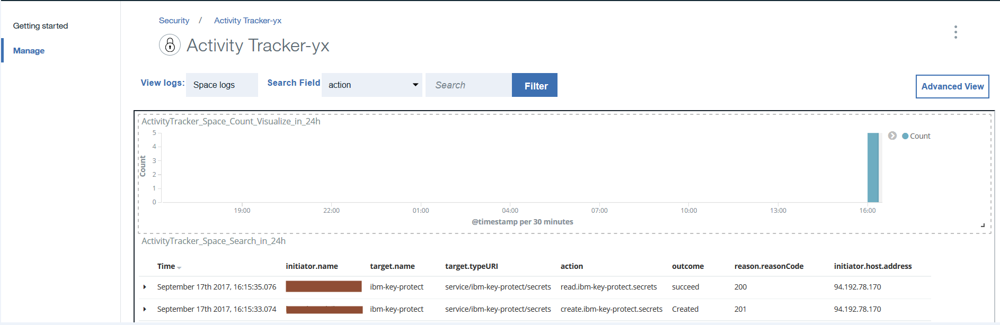

---

copyright:
  years: 2016, 2017
lastupdated: "2017-09-17"

---

{:new_window: target="_blank"}
{:shortdesc: .shortdesc}
{:screen: .screen}
{:codeblock: .codeblock}
{:pre: .pre}

# Getting started tutorial
{: #getting-started-with-cla}

The {{site.data.keyword.cloudaccesstrailfull}} service records user-initiated activities that change the state of a service in the {{site.data.keyword.IBM}} cloud. Use this tutorial to learn how to use the {{site.data.keyword.cloudaccesstrailfull}} service to monitor a user's interaction with a Cloud service. 
{:shortdesc}

The objectives of this getting started tutorial are the following:

1. Show how to provision the {{site.data.keyword.cloudaccesstrailshort}} service.
2. Show how to use a Cloud service to generate activity events that are automatically collected by the {{site.data.keyword.cloudaccesstrailshort}} service. Events comply with the Cloud Auditing Data Federation (CADF) standard.
3. Show how to monitor the Cloud activity of a service by using the pre-defined {{site.data.keyword.cloudaccesstrailshort}} dashboards.

The following figure shows the different components and actions that occur when a user-initiated activity changes the state of a service:

## Before you begin
{: #prereqs}

Create a [{{site.data.keyword.Bluemix_notm}} account](https://console.bluemix.net/registration/). Your user ID must be a member or an owner of a {{site.data.keyword.Bluemix_notm}} account, with developer permissions in the space where you plan to use the {{site.data.keyword.cloudaccesstrailshort}} service.

## Step 1: Provision Activity Tracker
{: #step1}

You must provision the {{site.data.keyword.cloudaccesstrailshort}} service in the same region and space where the Cloud service whose activity you want to monitor is provisioned. After the {{site.data.keyword.cloudaccesstrailshort}} service is provisioned, events are collected automatically from selected Cloud services that are provisioned in that space. See [Supported cloud services](/docs/services/cloud-activity-tracker/cloud_services.html#cloud_services) for a list of services whose activity you can monitor through {{site.data.keyword.cloudaccesstrailshort}}.

**Note:** This tutorial shows how to use the {{site.data.keyword.cloudaccesstrailshort}} service to monitor a user's interaction with the Cloud service {{site.data.keyword.keymanagementservicelong_notm}}. The {{site.data.keyword.keymanagementserviceshort}} service is available in US South. Therefore, you must provision {{site.data.keyword.cloudaccesstrailshort}} in the US South region, in the same space where the  {{site.data.keyword.keymanagementserviceshort}} service is available. To see information on which region a service is available, see [Services by region](/docs/services/services_region.html#services_region).

Complete the following steps to provision an instance of the {{site.data.keyword.cloudaccesstraillong_notm}} service in {{site.data.keyword.Bluemix_notm}}:

1. Log in to your {{site.data.keyword.Bluemix_notm}} account.

    The {{site.data.keyword.Bluemix_notm}} dashboard can be found at: [http://bluemix.net ](http://bluemix.net){:new_window}.
    
	After you log in with your user ID and password, the {{site.data.keyword.Bluemix_notm}} UI opens.

2. Click **Catalog**. The list of the services that are available on {{site.data.keyword.Bluemix_notm}} opens.

3. Select the **Security** category to filter the list of services that is displayed.

4. Click the **Activity Tracker** tile. 

5. Configure the information that defines where the service is going to be provisioned. 

    Enter the data as indicated in the following table: 

    <table>
	  <caption>Table 1. Fields that are required to provision the {{site.data.keyword.cloudaccesstrailshort}} service</caption>
	  <tr>
	    <th width="50%">Field</th>
		<th width="50%">Value</th>
	  </tr>
	  <tr>
	    <td>Select region to deploy in:</td>
		<td>US South</td>
	  </tr>
	  <tr>
	    <td>Choose an organization:</td>
		<td>Select the organization where you plan to monitor activity.</td>
	  </tr>
	  <tr>
	    <td>Choose a space:</td>
		<td>Select the space in the organization that you have selected where you plan to monitor activity.</td>
	  </tr>
	</table>

6. Click **Create** to provision the {{site.data.keyword.cloudaccesstrailshort}} service in the {{site.data.keyword.Bluemix_notm}} space where you are logged in.
   

## Step 2:  Provision a cloud service 
{: #step2}
	
Complete the following steps to provision an instance of the {{site.data.keyword.keymanagementserviceshort}} service in the {{site.data.keyword.Bluemix_notm}} US South region:

1. Log in to your {{site.data.keyword.Bluemix_notm}} account.

    The {{site.data.keyword.Bluemix_notm}} dashboard can be found at: [http://bluemix.net ](http://bluemix.net){:new_window}
	
	After you log in with your user ID and password, the {{site.data.keyword.Bluemix_notm}} UI opens.

2. Click **Catalog**. The list of the services that are available on {{site.data.keyword.Bluemix_notm}} opens.

    Select the **Security** category to filter the list of services that is displayed.

3. Select the **Key Protect** tile.

4. Configure the information that defines where the service is going to be provisioned. 

    Enter the data as indicated in the following table: 

    <table>
	  <caption>Table 2. Fields that are required to provision the {{site.data.keyword.keymanagementserviceshort}} service</caption>
	  <tr>
	    <th width="50%">Field</th>
		<th width="50%">Value</th>
	  </tr>
	  <tr>
	    <td>Select region to deploy in:</td>
		<td>US South</td>
	  </tr>
	  <tr>
	    <td>Choose an organization:</td>
		<td>Select the organization that you chose to provision the {{site.data.keyword.cloudaccesstrailshort}} service.</td>
	  </tr>
	  <tr>
	    <td>Choose a space:</td>
		<td>Select the space that you chose to provision the {{site.data.keyword.cloudaccesstrailshort}} service.</td>
	  </tr>
	</table>

5. Click **Create** to provision the {{site.data.keyword.keymanagementserviceshort}} service in the {{site.data.keyword.Bluemix_notm}} space where you are logged in.

## Step 3: Generate an Activity Tracker event
{: # step3}

In this step, create a security key by using the {{site.data.keyword.keymanagementserviceshort}} service to generate {{site.data.keyword.cloudaccesstrailshort}} event data. 

Complete the following steps to generate an {{site.data.keyword.cloudaccesstrailshort}} event:

1. From the {{site.data.keyword.Bluemix_notm}} dashboard, select the **Key Protect** service, The {{site.data.keyword.keymanagementserviceshort}} dashboard opens. Then, select the **Manage** tab.

2. Click **Add Key**. A new window opens.

3. Select **Generate key**, and complete the following steps:

    * Enter a name for the key, for example, *MyFirstKey*.

    * Choose an algorith for the key.

    * Click **Add key**. 
	
{{site.data.keyword.cloudaccesstrailshort}} events are generated as a result of creating a key.

## Step 4: Monitor an Activity Tracker event
{: #step4}

In this step, verify through the {{site.data.keyword.Bluemix_notm}} UI that {{site.data.keyword.cloudaccesstrailshort}} events are generated.

Complete the following steps to verify that an event has been created:

1. From the {{site.data.keyword.Bluemix_notm}} Dashboard, select the {{site.data.keyword.cloudaccesstrailshort}} service. The service dashboard opens.

2. Configure the view to search for the {{site.data.keyword.keymanagementserviceshort}} events that have been generated when you provisioned the service and added a key.

    * Select **Space logs** for the field *View logs*.
    * Select **target.name** for the field *Search field*.
    * Enter **ibm-key-protect** in the *Filter* field.
	
    The data that is displayed shows {{site.data.keyword.keymanagementserviceshort}} events that are available for the last 24 hours. 
	
	

## Next steps
{: #next_steps}

Next, use the {{site.data.keyword.cloudaccesstrailshort}} pre-defined Kibana dashboard to monitor and analyze event logs. To launch Kibana, see [Navigating to the Kibana dashboard](/docs/services/cloud-activity-tracker/how-to/manage-events-ui/launch_kibana.html#launch_kibana). 

By default in Kibana, the space activity logs are displayed through the **ActivityTracker_Space_Search_in_24h** dashboard:

                                                                                                                      

