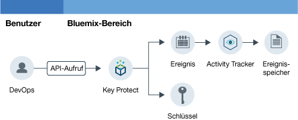

---

copyright:
  years: 2016, 2017

lastupdated: "2017-09-19"

---

{:shortdesc: .shortdesc}
{:new_window: target="_blank"}
{:codeblock: .codeblock}
{:screen: .screen}
{:pre: .pre}

# Key Protect-Aktivitäten überwachen
{: #kp_at}

Verwenden Sie den {{site.data.keyword.cloudaccesstrailfull}}-Service, um zu verfolgen, wie
Anwendungen mit dem {{site.data.keyword.keymanagementservicelong_notm}}-Service in {{site.data.keyword.Bluemix}} interagieren.
{:shortdesc}

## Informationen zu Key Protect
{: #about}

{{site.data.keyword.keymanagementserviceshort}} ist ein Management-Service für Verschlüsselungsschlüssel. Sie können den {{site.data.keyword.keymanagementserviceshort}}-Service verwenden, um verschlüsselte Schlüssel für Apps in {{site.data.keyword.Bluemix_notm}} bereitzustellen. Weitere Informationen finden Sie in [Einführung in Key Protect](/docs/services/keymgmt/index.html#getting-started-with-key-protect).

Zum Verwalten von verschlüsselten Schlüsseln können Sie über die {{site.data.keyword.Bluemix_notm}}-Benutzerschnittstelle oder programmgesteuert über die [IBM Key Protect-API](https://docs-api-keyprotect.ng.bluemix.net/#/){: new_window} Schlüssel erstellen und löschen.

## Funktionsweise
{: #how}

Um in {{site.data.keyword.Bluemix_notm}} die Aktivitätenprüfliste für den {{site.data.keyword.keymanagementserviceshort}}-Service zu überwachen, müssen Sie den {{site.data.keyword.cloudaccesstrailshort}}-Service im selben Bereich bereitstellen, in dem der {{site.data.keyword.keymanagementserviceshort}}-Service verfügbar ist. Nachdem beide Services bereitgestellt wurden und aktiv sind, werden Aktivitätsereignisse generiert und automatisch im {{site.data.keyword.cloudaccesstrailshort}}-Protokoll erfasst, wenn Sie einen Schlüssel erstellen, lesen oder löschen. 

Aufgrund der Vertraulichkeitsstufe der Informationen für einen verschlüsselten Schlüssel enthält ein Ereignis, das als Ergebnis eines API-Aufrufs an den {{site.data.keyword.keymanagementserviceshort}}-Service generiert wurde, keine ausführlichen Informationen zu dem Schlüssel. Das Ereignis enthält eine Korrelations-ID, die verwendet werden kann, um den Schlüssel intern in Ihrer Cloudumgebung zu identifizieren. Die Korrelations-ID ist ein Feld, das als Teil des Felds **responseHeader.content** zurückgegeben wird. Mithilfe dieser Informationen können Sie die sensiblen Daten des verschlüsselten Schlüssels mit den Informationen zu der in dem Ereignis gemeldeten Aktion korrelieren.

Die folgende Abbildung zeigt die verschiedenen Komponenten und Aktionen, die ausgeführt werden, wenn ein Benutzer einen API-Aufruf zum Erstellen eines Schlüssels absetzt:

## API-Methoden
{: #methods}

In der folgenden Tabelle sind die {{site.data.keyword.keymanagementserviceshort}}-API-Methoden aufgelistet, die ein Ereignis generieren, wenn sie aufgerufen werden:

<table>
  <caption>Tabelle 1. API-Methoden</caption>
  <tr>
    <th>Methode</th>
	<th>Beschreibung</th>
  <tr>
  <tr>
    <td>GET /secrets </td>
	<td>Geheime Schlüssel abrufen</td>
  </tr>
  <tr>
    <td>POST /secrets </td>
	<td>Geheimen Schlüssel erstellen</td>
  </tr>
  <tr>
    <td>DELETE /secrets/{id}</td>
	<td>Geheimen Schlüssel anhand der ID löschen</td>
  </tr>
  <tr>
    <td>GET /secrets/{id} </td>
	<td>Geheimen Schlüssel anhand der ID abrufen</td>
  </tr>  
</table>

**Anmerkung:** Bei einem geheimen Schlüssel handelt es sich um einen verschlüsselten Schlüssel.

 	
 	
## Lernprogramm: IBM Key Protect-Aktivitäten in der Cloud überwachen
{: #tutorial1}

In diesem Lernprogramm erfahren Sie, wie Sie die Interaktionen eines Benutzers mit dem Cloud-Service {{site.data.keyword.keymanagementservicelong_notm}} überwachen können. 

In diesem Lernprogramm erstellen Sie einen Sicherheitsschlüssel in {{site.data.keyword.keymanagementserviceshort}} (KP). Der Cloud-Service KP wurde so eingerichtet, dass Ereignisse an {{site.data.keyword.cloudaccesstrailshort}} gesendet werden, wenn ein Benutzer einen Schlüssel in der Benutzerschnittstelle, über die CLI oder mit der API erstellt. Nachdem der Schlüssel erstellt wurde, können Sie die Ereignisse über die {{site.data.keyword.cloudaccesstrailshort}}-Benutzerschnittstelle und in Kibana überwachen.

In diesem Lernprogramm wird Folgendes erläutert:

1. [{{site.data.keyword.keymanagementserviceshort}}-Service](/docs/services/cloud-activity-tracker/tutorials/key_protect.html#step1) bereitstellen
2. [In {{site.data.keyword.keymanagementserviceshort}} einen Sicherheitsschlüssel zum Generieren von {{site.data.keyword.cloudaccesstrailshort}}-Ereignisdaten erstellen](/docs/services/cloud-activity-tracker/tutorials/key_protect.html#step2)
3. [Mithilfe der {{site.data.keyword.Bluemix_notm}}-Benutzerschnittstelle überprüfen, dass {{site.data.keyword.cloudaccesstrailshort}}-Ereignisse generiert werden](/docs/services/cloud-activity-tracker/tutorials/key_protect.html#step3)

### Voraussetzungen
{: #assumptions}

Sie verfügen über eine {{site.data.keyword.Bluemix_notm}}-Benutzer-ID mit Entwicklerberechtigungen zum Arbeiten in einem Bereich eines {{site.data.keyword.Bluemix_notm}}-Kontos, in dem der {{site.data.keyword.cloudaccesstrailshort}}-Service bereitgestellt ist. 

### Schritt 1: Activity Tracker bereitstellen
{: #step1}

Sie müssen den {{site.data.keyword.cloudaccesstrailshort}}-Service in derselben Region und im selben Bereich bereitstellen wie den Cloud-Service, dessen Aktivität Sie überwachen möchten. Nachdem der {{site.data.keyword.cloudaccesstrailshort}}-Service bereitgestellt wurde, werden automatisch Ereignisse von den ausgewählten Cloud-Services erfasst, die in dem betreffenden Bereich bereitgestellt sind. In [Unterstützte Cloud-Services](/docs/services/cloud-activity-tracker/cloud_services.html#cloud_services) finden Sie eine Liste der Services, deren Aktivitäten Sie mit {{site.data.keyword.cloudaccesstrailshort}} überwachen können.

**Anmerkung:** In diesem Lernprogramm erfahren Sie, wie Sie mit dem {{site.data.keyword.cloudaccesstrailshort}}-Service die Interaktion eines Benutzers mit dem Cloud-Service {{site.data.keyword.keymanagementservicelong_notm}} überwachen können. Der {{site.data.keyword.keymanagementserviceshort}}-Service ist in der Region 'Vereinigte Staaten (Süden)' verfügbar. Daher müssen Sie {{site.data.keyword.cloudaccesstrailshort}} in der Region 'Vereinigte Staaten (Süden) in demselben Bereich bereitstellen, in dem der {{site.data.keyword.keymanagementserviceshort}}-Service verfügbar ist. Informationen dazu, in welcher Region ein Service verfügbar ist, finden Sie in [Services nach Region](/docs/services/services_region.html#services_region).

Führen Sie die folgenden Schritte aus, um eine Instanz des {{site.data.keyword.cloudaccesstraillong_notm}}-Service in {{site.data.keyword.Bluemix_notm}} bereitzustellen:

1. Melden Sie sich bei Ihrem {{site.data.keyword.Bluemix_notm}}-Konto an.

    Das {{site.data.keyword.Bluemix_notm}}-Dashboard finden Sie unter [http://bluemix.net ](http://bluemix.net){:new_window}.
    
	Nachdem Sie sich mit Ihrer Benutzer-ID und Ihrem Kennwort angemeldet haben, wird die {{site.data.keyword.Bluemix_notm}}-Benutzerschnittstelle geöffnet.

2. Klicken Sie auf **Katalog**. Die Liste der in {{site.data.keyword.Bluemix_notm}} verfügbaren Services wird geöffnet.

3. Wählen Sie die Kategorie **Sicherheit** aus, um die Liste der angezeigten Services zu filtern.

4. Klicken Sie auf die Kachel **Activity Tracker**. 

5. Konfigurieren Sie die entsprechenden Informationen, um zu definieren, wo der Service bereitgestellt werden soll. 

    Geben Sie die Daten ein, wie in der folgenden Tabelle angegeben: 

    <table>
	  <caption>Tabelle 1. Erforderliche Felder zum Bereitstellen des {{site.data.keyword.cloudaccesstrailshort}}-Service</caption>
	  <tr>
	    <th width="50%">Feld</th>
		<th width="50%">Wert</th>
	  </tr>
	  <tr>
	    <td>Region für die Bereitstellung auswählen:</td>
		<td>Vereinigte Staaten (Süden)</td>
	  </tr>
	  <tr>
	    <td>Organisation auswählen:</td>
		<td>Wählen Sie die Organisation aus, in der Sie Aktivitäten überwachen möchten.</td>
	  </tr>
	  <tr>
	    <td>Bereich auswählen</td>
		<td>Wählen Sie den Bereich in der ausgewählten Organisation aus, in dem Sie Aktivitäten überwachen möchten.</td>
	  </tr>
	</table>

6. Klicken Sie auf **Erstellen**, um den {{site.data.keyword.cloudaccesstrailshort}}-Service in dem {{site.data.keyword.Bluemix_notm}}-Bereich bereitzustellen, bei dem Sie angemeldet sind.
   

### Schritt 2: Key Protect bereitstellen 
{: #step2}
	
Führen Sie die folgenden Schritte aus, um eine Instanz des {{site.data.keyword.keymanagementserviceshort}}-Service in der {{site.data.keyword.Bluemix_notm}}-Region 'Vereinigte Staaten (Süden)' bereitzustellen:

1. Melden Sie sich bei Ihrem {{site.data.keyword.Bluemix_notm}}-Konto an.

    Das {{site.data.keyword.Bluemix_notm}}-Dashboard finden Sie unter [http://bluemix.net ](http://bluemix.net){:new_window}.
	
	Nachdem Sie sich mit Ihrer Benutzer-ID und Ihrem Kennwort angemeldet haben, wird die {{site.data.keyword.Bluemix_notm}}-Benutzerschnittstelle geöffnet.

2. Klicken Sie auf **Katalog**. Die Liste der in {{site.data.keyword.Bluemix_notm}} verfügbaren Services wird geöffnet.

    Wählen Sie die Kategorie **Sicherheit** aus, um die Liste der angezeigten Services zu filtern.

3. Wählen Sie die Kachel **Key Protect** aus.

4. Konfigurieren Sie die entsprechenden Informationen, um zu definieren, wo der Service bereitgestellt werden soll. 

    Geben Sie die Daten ein, wie in der folgenden Tabelle angegeben: 

    <table>
	  <caption>Tabelle 2. Erforderliche Felder zum Bereitstellen des {{site.data.keyword.keymanagementserviceshort}}-Service</caption>
	  <tr>
	    <th width="50%">Feld</th>
		<th width="50%">Wert</th>
	  </tr>
	  <tr>
	    <td>Region für die Bereitstellung auswählen:</td>
		<td>Vereinigte Staaten (Süden)</td>
	  </tr>
	  <tr>
	    <td>Organisation auswählen:</td>
		<td>Wählen Sie die Organisation aus, in der Sie den {{site.data.keyword.cloudaccesstrailshort}}-Service bereitstellen möchten.</td>
	  </tr>
	  <tr>
	    <td>Bereich auswählen</td>
		<td>Wählen Sie den Bereich aus, in dem Sie den {{site.data.keyword.cloudaccesstrailshort}}-Service bereitstellen möchten.</td>
	  </tr>
	</table>

5. Klicken Sie auf **Erstellen**, um den {{site.data.keyword.keymanagementserviceshort}}-Service in dem {{site.data.keyword.Bluemix_notm}}-Bereich bereitzustellen, bei dem Sie angemeldet sind.

### Schritt 3: In Key Protect einen Sicherheitsschlüssel zum Generieren von Activity Tracker-Ereignisdaten erstellen 
{: # step3}

Führen Sie die folgenden Schritte aus, um ein {{site.data.keyword.cloudaccesstrailshort}}-Ereignis zu generieren:

1. Wählen Sie im {{site.data.keyword.Bluemix_notm}}-Dashboard den **Key Protect**-Service aus. Das {{site.data.keyword.keymanagementserviceshort}}-Dashboard wird geöffnet. Wählen Sie anschließend die Registerkarte **Verwalten** aus.

2. Klicken Sie auf **Schlüssel hinzufügen**. Ein neues Fenster wird geöffnet.

    

3. Wählen Sie **Schlüssel generieren** aus und führen Sie die folgenden Schritte aus:

    * Geben Sie einen Namen für den Schlüssel ein (z. B. *MeinErsterSchlüssel*).

    * Wählen Sie den Algorithmus für den Schlüssel aus.

    * Klicken Sie auf **Schlüssel hinzufügen**. 

### Schritt 4: Überprüfen Sie mit der Bluemix-Benutzerschnittstelle, dass Activity Tracker-Ereignisse generiert werden 
{: #step4}

Überprüfen Sie, dass ein Ereignis erstellt wurde:

1. Wählen Sie im {{site.data.keyword.Bluemix_notm}}-Dashboard den {{site.data.keyword.cloudaccesstrailshort}}-Service aus. Das Service-Dashboard wird geöffnet.

2. Konfigurieren Sie die Ansicht, in der nach den {{site.data.keyword.keymanagementserviceshort}}-Ereignissen gesucht werden soll, die beim Bereitstellen des Service und Hinzufügen eines Schlüssels generiert wurden.

    * Wählen Sie **Bereichsprotokolle** für das Feld *Protokolle anzeigen* aus.
    * Wählen Sie **target.name** für das Feld *Suchfeld* aus.
    * Geben Sie **ibm-key-protect** in das Feld *Filter* ein.
	
    Die angezeigten Daten enthalten verfügbare {{site.data.keyword.keymanagementserviceshort}}-Ereignisse für die letzten 24 Stunden. 

    Verwaltungsregisterkarte in 

 	
 	
 	
 	

