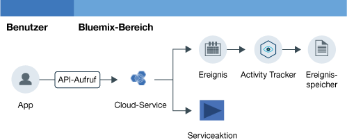

---

copyright:
  years: 2016, 2019
lastupdated: "2019-03-06"

keywords: IBM Cloud, Activity Tracker, monitoring activity, tutorial

subcollection: cloud-activity-tracker

---

{:new_window: target="_blank"}
{:shortdesc: .shortdesc}
{:screen: .screen}
{:pre: .pre}
{:table: .aria-labeledby="caption"}
{:codeblock: .codeblock}
{:tip: .tip}
{:download: .download}
{:important: .important}
{:note: .note}

# {{site.data.keyword.keymanagementserviceshort}}-Aktivität mit {{site.data.keyword.cloudaccesstrailshort}} überwachen
{: #kp}

In diesem Lernprogramm erfahren Sie, wie Sie mit dem {{site.data.keyword.cloudaccesstrailfull}}-Service die Interaktion eines Benutzers mit dem {{site.data.keyword.keymanagementserviceshort}}-Service überwachen. 
{:shortdesc}

1. Lernen Sie, wie der {{site.data.keyword.cloudaccesstrailshort}}-Service bereitgestellt wird. 
2. Lernen Sie, wie ein Cloud-Service zum Generieren von Aktivitätsereignissen verwendet wird, die automatisch vom {{site.data.keyword.cloudaccesstrailshort}}-Service erfasst werden. Ereignisse entsprechen dem [Standard der Cloud Auditing Data Federation (CADF) ](https://www.dmtf.org/sites/default/files/standards/documents/DSP0262_1.0.0.pdf){: new_window}.
3.Lernen Sie, wie die Cloud-Aktivität eines Service mithilfe vordefinierter {{site.data.keyword.cloudaccesstrailshort}}-Dashboards überwacht wird. 

Die folgende Abbildung zeigt die verschiedenen Komponenten und Aktionen, die ausgeführt werden, wenn eine vom Benutzer eingeleitete Aktivität den Status eines Service ändert:

## Vorbereitungen
{: #kp_prereqs}

Erstellen Sie ein [{{site.data.keyword.cloud_notm}}-Konto](https://cloud.ibm.com/login). Ihre Benutzer-ID muss ein Mitglied oder Eigner eines {{site.data.keyword.cloud_notm}}-Kontos mit Entwicklerberechtigungen in dem Bereich sein, in dem Sie beabsichtigen, den {{site.data.keyword.cloudaccesstrailshort}}-Service zu verwenden.

## Schritt 1. Activity Tracker bereitstellen
{: #kp_step1}

Sie müssen den {{site.data.keyword.cloudaccesstrailshort}}-Service in derselben Region bereitstellen wie der Cloud-Service, dessen Aktivität Sie überwachen möchten. Nachdem der {{site.data.keyword.cloudaccesstrailshort}}-Service bereitgestellt worden ist, werden automatisch Ereignisse von den ausgewählten Cloud-Services erfasst. 

**Hinweis:** In diesem Lernprogramm erfahren Sie, wie Sie mit dem {{site.data.keyword.cloudaccesstrailshort}}-Service die Interaktion eines Benutzers mit dem Cloud-Service {{site.data.keyword.keymanagementservicelong_notm}} in der Region 'Vereinigte Staaten (Süden)' überwachen können. Daher müssen Sie {{site.data.keyword.cloudaccesstrailshort}} in der Region 'Vereinigte Staaten (Süden)' bereitstellen. Informationen dazu, in welcher Region ein Service verfügbar ist, finden Sie in [Services nach Region](/docs/resources?topic=resources-services_region#services_region).

Führen Sie die folgenden Schritte aus, um eine Instanz des {{site.data.keyword.cloudaccesstraillong_notm}}-Service in der {{site.data.keyword.cloud_notm}} bereitzustellen:

1. [Melden Sie sich bei {{site.data.keyword.cloud_notm}} ](https://cloud.ibm.com/login){:new_window} an. 
    
	Nachdem Sie sich mit Ihrer Benutzer-ID und Ihrem Kennwort angemeldet haben, wird die {{site.data.keyword.cloud_notm}}-Benutzerschnittstelle geöffnet.

2. Klicken Sie auf **Katalog**. Die Liste der in der {{site.data.keyword.cloud_notm}} verfügbaren Services wird geöffnet.

3. Wählen Sie die Kategorie **Sicherheit und Identität** aus, um die Liste der angezeigten Services zu filtern.

    **Hinweis:** Der Service ist auch über die Kategorie **Entwicklertools** verfügbar. 

4. Klicken Sie auf die Kachel **Activity Tracker**. 

5. Konfigurieren Sie die entsprechenden Informationen, um zu definieren, wo der Service bereitgestellt werden soll. 

    Geben Sie die Daten ein, wie in der folgenden Tabelle angegeben: 

    <table>
	  <caption>Tabelle 1. Erforderliche Felder zum Bereitstellen des {{site.data.keyword.cloudaccesstrailshort}}-Service</caption>
	  <tr>
	    <th width="50%">Feld</th>
		<th width="50%">Wert</th>
	  </tr>
	  <tr>
	    <td>Region für die Bereitstellung auswählen:</td>
		<td>Vereinigte Staaten (Süden)</td>
	  </tr>
	  <tr>
	    <td>Organisation auswählen:</td>
		<td>Wählen Sie die Organisation aus, in der Sie beabsichtigen, den {{site.data.keyword.cloudaccesstrailshort}}-Service bereitzustellen.</td>
	  </tr>
	  <tr>
	    <td>Bereich auswählen</td>
		<td>Wählen Sie den Bereich (Space) in der Organisation aus, in dem der {{site.data.keyword.cloudaccesstrailshort}}-Service bereitgestellt werden soll. </td>
	  </tr>
	</table>

6. Klicken Sie auf **Erstellen**, um den {{site.data.keyword.cloudaccesstrailshort}}-Service in dem Bereich, in dem Sie angemeldet sind, bereitzustellen.
   

## Schritt 2. Cloud-Service konfigurieren  
{: #kp_step2}

In diesem Lernprogramm erfahren Sie, wie Sie die API-Aktivität für den {{site.data.keyword.keymanagementserviceshort}}-Service in der {{site.data.keyword.cloud_notm}} überwachen.

Führen Sie die folgenden Schritte aus, um den {{site.data.keyword.keymanagementserviceshort}}-Service in der {{site.data.keyword.cloud_notm}} bereitzustellen:

1. Stellen Sie eine Instanz des {{site.data.keyword.keymanagementserviceshort}}-Service in der Region 'Vereinigte Staaten (Süden)' bereit. Weitere Informationen finden Sie in [Bereitstellung über IBM Cloud-Konsole durchführen](/docs/services/key-protect?topic=key-protect-provision#provision).

2. Definieren Sie die {{site.data.keyword.cloud_notm}}-Berechtigungen für den Benutzer, der künftig mit Schlüsseln arbeiten soll. 

    Damit ein Benutzer Schlüssel erstellen kann, ist für ihn eine IAM-Richtlinie erforderlich, bei der für die Servicerolle der Wert *Manager* (Manager) oder *Schreibberechtigter* (Writer) festgelegt ist.

    Damit ein Benutzer Schlüssel löschen kann, ist für ihn eine IAM-Richtlinie erforderlich, bei der für die Servicerolle der Wert *Manager* (Manager) festgelegt ist.

    Damit ein Benutzer Schlüssel anzeigen kann, ist für ihn eine IAM-Richtlinie erforderlich, bei der für die Servicerolle der Wert *Leseberechtigter* (Reader) festgelegt ist. 

## Schritt 3. Activity Tracker-Ereignis generieren
{: #kp_step3}

In diesem Schritt erstellen Sie mit dem {{site.data.keyword.keymanagementserviceshort}}-Service einen Sicherheitsschlüssel, um {{site.data.keyword.cloudaccesstrailshort}}-Ereignisdaten zu generieren. Weitere Informationen finden Sie in [Neue Schlüssel erstellen](/docs/services/key-protect?topic=key-protect-create-standard-keys#create-standard-keys).

* {{site.data.keyword.cloudaccesstrailshort}}-Ereignisse werden als Ergebnis der Erstellung eines Schlüssels generiert.
* {{site.data.keyword.cloudaccesstrailshort}}-Ereignisse sind in derjenigen {{site.data.keyword.cloudaccesstrailshort}}-**Kontodomäne** verfügbar, die in der {{site.data.keyword.cloud_notm}}-Region verfügbar ist, in der die Ereignisse generiert werden. 

## Schritt 4. Activity Tracker-Ereignis überwachen
{: #kp_step4}

In diesem Schritt überprüfen Sie mithilfe der {{site.data.keyword.cloud_notm}}-Benutzerschnittstelle, dass {{site.data.keyword.cloudaccesstrailshort}}-Ereignisse generiert wurden.

Führen Sie die folgenden Schritte aus, um zu überprüfen, dass ein Ereignis erstellt wurde: 

1. Erteilen Sie dem Benutzer Berechtigungen zum Anzeigen von Ereignissen für ein Konto. Weitere Informationen finden Sie in [Ereignisse für ein Konto anzeigen](/docs/services/cloud-activity-tracker/how-to/manage-events-ui?topic=cloud-activity-tracker-view_acc_events#view_acc_events_account_events) und [Berechtigungen zum Anzeigen von Kontoereignissen erteilen](/docs/services/cloud-activity-tracker/how-to?topic=cloud-activity-tracker-grant_permissions#grant_acc_events). 

2. Wählen Sie im {{site.data.keyword.cloud_notm}}-Dashboard den {{site.data.keyword.cloudaccesstrailshort}}-Service aus. Das Service-Dashboard wird geöffnet.

3. Konfigurieren Sie die Ansicht, in der nach den {{site.data.keyword.keymanagementserviceshort}}-Ereignissen gesucht werden soll, die generiert wurden, als Sie den Service bereitgestellt und einen Schlüssel hinzugefügt haben. 

    * Wähle Sie für das Feld *Protokolle anzeigen* die Option **Kontoprotokolle** aus.
    * Wählen Sie für das Feld *Suche* den Wert **target.typeURI_str** ein und geben Sie im Feld *Filtern* den Wert `kms/secrets` ein.
	
    Die angezeigten Daten enthalten verfügbare {{site.data.keyword.keymanagementserviceshort}}-Ereignisse für die letzten 24 Stunden. 
	

## Nächste Schritte
{: #kp_next_steps}

Verwenden Sie anschließend das vordefinierte Kibana-Dashboard in {{site.data.keyword.cloudaccesstrailshort}}, um Ereignisprotokolle zu überwachen und zu analysieren. Informationen zum Starten von Kibana finden Sie in [Zum Kibana-Dashboard](/docs/services/cloud-activity-tracker/how-to/manage-events-ui?topic=cloud-activity-tracker-launch_kibana#launch_kibana) navigieren. In Kibana werden die Protokolle für Bereichsaktivitäten standardmäßig im Dashboard **ActivityTracker_Space_Dashboard_in_24h** angezeigt:

Sie können auch die {{site.data.keyword.cloudaccesstrailshort}}-CLI verwenden, um Ihre Ereignisse über die Befehlszeile zu verwalten. Weitere Informationen finden Sie in [Ereignisinformationen anzeigen](/docs/services/cloud-activity-tracker/how-to?topic=cloud-activity-tracker-viewing_event_status#viewing_event_status).

