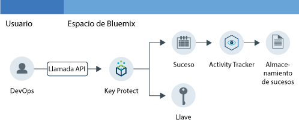
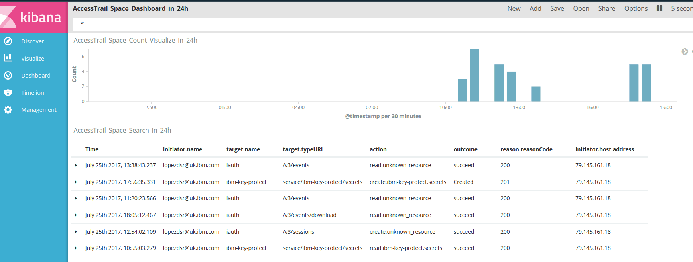

---

copyright:
  years: 2016, 2017

lastupdated: "2017-09-19"

---

{:shortdesc: .shortdesc}
{:new_window: target="_blank"}
{:codeblock: .codeblock}
{:screen: .screen}
{:pre: .pre}

# Supervisión de la actividad de Key Protect
{: #kp_at}

Utilice el servicio {{site.data.keyword.cloudaccesstrailfull}} para hacer un seguimiento de la forma en que interactúan las aplicaciones con el servicio {{site.data.keyword.keymanagementservicelong_notm}} en {{site.data.keyword.Bluemix}}. {:shortdesc}

## Sobre Key Protect
{: #about}

{{site.data.keyword.keymanagementserviceshort}} es un servicio de gestión de claves de cifrado. Puede utilizar el servicio {{site.data.keyword.keymanagementserviceshort}} para facilitar claves cifradas para apps en {{site.data.keyword.Bluemix_notm}}. Para obtener más información, consulte [Iniciación a Key Protect](/docs/services/keymgmt/index.html#getting-started-with-key-protect).

Para gestionar las claves cifradas, puede crear y suprimir claves mediante la interfaz de usuario de {{site.data.keyword.Bluemix_notm}} o mediante programación utilizando la [API de IBM Key Protect](https://docs-api-keyprotect.ng.bluemix.net/#/){: new_window}.

## Funcionamiento
{: #how}

En {{site.data.keyword.Bluemix_notm}}, para supervisar la actividad del servicio {{site.data.keyword.keymanagementserviceshort}}, debe suministrar el servicio {{site.data.keyword.cloudaccesstrailshort}} en el mismo espacio donde se suministra el servicio {{site.data.keyword.keymanagementserviceshort}}. Después se suministran y ejecutar ambos servicios, los sucesos de actividad se generan y recopilan automáticamente en el registro de {{site.data.keyword.cloudaccesstrailshort}} cuando se crea, se lee o se suprime una clave. 

Debido a la confidencialidad de la información correspondiente a una clave cifrada, cuando se genera un suceso como resultado de una llamada de API al servicio {{site.data.keyword.keymanagementserviceshort}}, el suceso que se genera no incluye información detallada sobre la clave. El suceso incluye un ID de correlación que sirve para identificar la clave internamente en el entorno de nube. El ID de correlación es un campo que se devuelve como parte del campo **responseHeader.content**. Utilice esta información para correlacionar datos confidenciales de la clave cifrada con la información de la acción notificada mediante el suceso. 

En la siguiente figura se muestran los distintos componentes y acciones que se producen cuando un usuario realiza una llamada de API para crear una clave: 

## Métodos de API
{: #methods}

La tabla siguiente contiene los métodos de la API de {{site.data.keyword.keymanagementserviceshort}} que generan un suceso cuando se les llama:

<table>
  <caption>Tabla 1. Métodos de API</caption>
  <tr>
    <th>Método</th>
	<th>Descripción</th>
  <tr>
  <tr>
    <td>GET /secrets</td>
	<td>Recuperar secretos</td>
  </tr>
  <tr>
    <td>POST /secrets</td>
	<td>Crear un secreto</td>
  </tr>
  <tr>
    <td>DELETE /secrets/{id}</td>
	<td>Suprimir un secreto por ID</td>
  </tr>
  <tr>
    <td>GET /secrets/{id}</td>
	<td>Recuperar un secreto por ID</td>
  </tr>  
</table>

**Nota:** Un secreto es una clave cifrada.

 	
 	
## Guía de aprendizaje: Supervisar la actividad de IBM Key Protect en la nube
{: #tutorial1}

Utilice esta guía de aprendizaje para aprender a supervisar la interacción de un usuario con el servicio en la nube {{site.data.keyword.keymanagementservicelong_notm}}Cloud. 

En esta guía de aprendizaje, se crea una clave de seguridad en {{site.data.keyword.keymanagementserviceshort}} (KP). El servicio KP Cloud se ha habilitado para enviar sucesos a {{site.data.keyword.cloudaccesstrailshort}} cuando un usuario crea una clave a través de la interfaz de usuario, la CLI o la API. Una vez creada la clave, puede supervisar los sucesos mediante la interfaz de usuario de {{site.data.keyword.cloudaccesstrailshort}} y mediante Kibana.

Esta guía de aprendizaje le mostrará cómo:

1. [Suministrar el servicio {{site.data.keyword.keymanagementserviceshort}}](/docs/services/cloud-activity-tracker/tutorials/key_protect.html#step1)
2. [Crear una clave de seguridad en datos de sucesos de {{site.data.keyword.keymanagementserviceshort}}{{site.data.keyword.cloudaccesstrailshort}} datos de suceso ](/docs/services/cloud-activity-tracker/tutorials/key_protect.html#step2)
3. [Verificar a través de la interfaz de usuario de {{site.data.keyword.Bluemix_notm}} que se han generado sucesos de {{site.data.keyword.cloudaccesstrailshort}}](/docs/services/cloud-activity-tracker/tutorials/key_protect.html#step3)

### Supuestos
{: #assumptions}

Tiene un ID de usuario de {{site.data.keyword.Bluemix_notm}} con permisos de desarrollador para trabajar en un espacio de una cuenta de {{site.data.keyword.Bluemix_notm}} en la que se suministra el servicio {{site.data.keyword.cloudaccesstrailshort}}. 

### Paso 1: Suministrar Activity Tracker
{: #step1}

Debe suministrar el servicio {{site.data.keyword.cloudaccesstrailshort}} en la misma región y espacio donde se suministra el servicio de nube cuya actividad desea supervisar. Una vez suministrado el servicio {{site.data.keyword.cloudaccesstrailshort}}, los sucesos se recopilan automáticamente de los servicios de la nube seleccionados que se suministran en ese espacio. Consulte [Servicios de nube soportados](/docs/services/cloud-activity-tracker/cloud_services.html#cloud_services) para ver una lista de servicios cuya actividad puede supervisar mediante {{site.data.keyword.cloudaccesstrailshort}}.

**Nota:** En esta guía de aprendizaje se muestra cómo utilizar el servicio {{site.data.keyword.cloudaccesstrailshort}} para supervisar la interacción de un usuario con el servicio de nube {{site.data.keyword.keymanagementservicelong_notm}}. El servicio {{site.data.keyword.keymanagementserviceshort}} está disponible en EE.UU. sur. Por lo tanto, debe suministrar {{site.data.keyword.cloudaccesstrailshort}} en la región EE.UU. sur, en el mismo espacio donde está disponible el servicio {{site.data.keyword.keymanagementserviceshort}}. Para ver información sobre la región en que un servicio está disponible, consulte [Servicios por región](/docs/services/services_region.html#services_region).

Siga los pasos siguientes para suministrar una instancia del servicio {{site.data.keyword.cloudaccesstraillong_notm}} en {{site.data.keyword.Bluemix_notm}}:

1. Inicie sesión en su cuenta de {{site.data.keyword.Bluemix_notm}}.

    El panel de control de {{site.data.keyword.Bluemix_notm}} se encuentra en: [http://bluemix.net ](http://bluemix.net){:new_window}.
    
	Después de iniciar la sesión con su ID de usuario y contraseña, se abre la interfaz de usuario de {{site.data.keyword.Bluemix_notm}}.

2. Pulse **Catálogo**. Se abre la lista de los servicios que están disponibles en {{site.data.keyword.Bluemix_notm}}.  

3. Seleccione la categoría **Seguridad** para filtrar la lista de servicios que se muestran.

4. Pulse el mosaico **Acivity Tracker**. 

5. Configure la información que define dónde se va a suministrar el servicio.  

    Especifique los datos como se indica en la tabla siguiente: 

    <table>
	  <caption>Tabla 1. Campos obligatorios para suministrar el servicio {{site.data.keyword.cloudaccesstrailshort}}</caption>
	  <tr>
	    <th width="50%">Campo</th>
		<th width="50%">Valor</th>
	  </tr>
	  <tr>
	    <td>Seleccione la región de despliegue:</td>
		<td>EE.UU. sur</td>
	  </tr>
	  <tr>
	    <td>Elija una organización:</td>
		<td>Seleccione la organización donde piensa supervisar la actividad.</td>
	  </tr>
	  <tr>
	    <td>Elija un espacio:</td>
		<td>Seleccione el espacio de la organización que ha seleccionado donde piensa supervisar la actividad.</td>
	  </tr>
	</table>

6. Pulse **Crear** para suministrar el servicio {{site.data.keyword.cloudaccesstrailshort}} en el espacio de {{site.data.keyword.Bluemix_notm}} en el que ha iniciado la sesión.
   

### Paso 2: Suministrar Key Protect 
{: #step2}
	
Siga los pasos siguientes para suministrar una instancia del servicio {{site.data.keyword.keymanagementserviceshort}} en la región EE.UU. sur de {{site.data.keyword.Bluemix_notm}}:

1. Inicie sesión en su cuenta de {{site.data.keyword.Bluemix_notm}}.

    El panel de control de {{site.data.keyword.Bluemix_notm}} se encuentra en: [http://bluemix.net ](http://bluemix.net){:new_window}.
	
	Después de iniciar la sesión con su ID de usuario y contraseña, se abre la interfaz de usuario de {{site.data.keyword.Bluemix_notm}}.

2. Pulse **Catálogo**. Se abre la lista de los servicios que están disponibles en {{site.data.keyword.Bluemix_notm}}.  

    Seleccione la categoría **Seguridad** para filtrar la lista de servicios que se muestran.

3. Seleccione el mosaico **Key Protect**.

4. Configure la información que define dónde se va a suministrar el servicio.  

    Especifique los datos como se indica en la tabla siguiente: 

    <table>
	  <caption>Tabla 2. Campos obligatorios para suministrar el servicio {{site.data.keyword.keymanagementserviceshort}}</caption>
	  <tr>
	    <th width="50%">Campo</th>
		<th width="50%">Valor</th>
	  </tr>
	  <tr>
	    <td>Seleccione la región de despliegue:</td>
		<td>EE.UU. sur</td>
	  </tr>
	  <tr>
	    <td>Elija una organización:</td>
		<td>Seleccione la organización que ha elegido para suministrar el servicio {{site.data.keyword.cloudaccesstrailshort}}.</td>
	  </tr>
	  <tr>
	    <td>Elija un espacio:</td>
		<td>Seleccione el espacio que ha elegido para suministrar el servicio {{site.data.keyword.cloudaccesstrailshort}}.</td>
	  </tr>
	</table>

5. Pulse **Crear** para suministrar el servicio {{site.data.keyword.keymanagementserviceshort}} en el espacio de {{site.data.keyword.Bluemix_notm}} en el que ha iniciado la sesión.

### Paso 3: Crear una clave de seguridad en Key Protect para generar datos de sucesos de Activity Tracker 
{: # step3}

Siga los pasos siguientes para generar un suceso de {{site.data.keyword.cloudaccesstrailshort}}: 

1. En el panel de control de {{site.data.keyword.Bluemix_notm}}, seleccione el servicio **Key Protect**; se abrirá el panel de control de {{site.data.keyword.keymanagementserviceshort}}. A continuación, seleccione el separador **Gestionar**. 

2. Pulse **Añadir clave**. Se abrirá una nueva ventana.

    

3. Seleccione **Generar clave** y siga los pasos siguientes:

    * Escriba un nombre para la clave, por ejemplo *MyFirstKey*.

    * Elija un algoritmo para la clave.

    * Pulse **Añadir clave**. 

### Paso 4: Verificar mediante la interfaz de usuario de Bluemix que se generan los sucesos de Activity Tracker 
{: #step4}

Verifique que se ha creado un suceso: 

1. En el panel de control de {{site.data.keyword.Bluemix_notm}}, seleccione el servicio {{site.data.keyword.cloudaccesstrailshort}}. Se abre el panel de control del servicio.

2. Configure la vista para buscar los sucesos de {{site.data.keyword.keymanagementserviceshort}} que se han generado cuando se ha suministrado el servicio y se ha añadido una clave.

    * Seleccione **Registros de espacio** para el campo *Ver registros*.
    * Seleccione **target.name** para el campo *Campo de búsqueda*.
    * Escriba **ibm-key-protect** en el campo *Filtro*. 
	
    Los datos que se muestran corresponden a los sucesos de {{site.data.keyword.keymanagementserviceshort}} que están disponibles durante las últimas 24 horas. 

    

 	
 	
 	
 	

