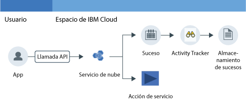

---

copyright:
  years: 2016, 2019
lastupdated: "2019-03-06"

keywords: IBM Cloud, Activity Tracker, monitoring activity, tutorial

subcollection: cloud-activity-tracker

---

{:new_window: target="_blank"}
{:shortdesc: .shortdesc}
{:screen: .screen}
{:pre: .pre}
{:table: .aria-labeledby="caption"}
{:codeblock: .codeblock}
{:tip: .tip}
{:download: .download}
{:important: .important}
{:note: .note}

# Supervisión de la actividad de {{site.data.keyword.keymanagementserviceshort}} con {{site.data.keyword.cloudaccesstrailshort}}
{: #kp}

Utilice esta guía de aprendizaje para aprender a utilizar el servicio {{site.data.keyword.cloudaccesstrailfull}} para supervisar la interacción de un usuario con el servicio {{site.data.keyword.keymanagementserviceshort}}. 
{:shortdesc}

1. Aprenda a suministrar el servicio {{site.data.keyword.cloudaccesstrailshort}}.
2. Aprenda a utilizar un servicio en la nube para generar sucesos de actividad que el servicio {{site.data.keyword.cloudaccesstrailshort}} recopila automáticamente. Los sucesos cumplen con la [normativa de Cloud Auditing Data Federation (CADF)](https://www.dmtf.org/sites/default/files/standards/documents/DSP0262_1.0.0.pdf){: new_window}.
3. Aprenda a supervisar la actividad en la nube de un servicio mediante los paneles de control predefinidos de {{site.data.keyword.cloudaccesstrailshort}}.

En la figura siguiente se muestran los distintos componentes y acciones que se producen cuando una actividad iniciada por el usuario cambia el estado de un servicio:

## Antes de empezar
{: #kp_prereqs}

Cree una [cuenta de {{site.data.keyword.cloud_notm}}](https://cloud.ibm.com/login). El ID de usuario debe ser miembro o propietario de una cuenta de {{site.data.keyword.cloud_notm}}, con permisos de desarrollador en el espacio donde piensa utilizar el servicio {{site.data.keyword.cloudaccesstrailshort}}.

## Paso 1. Suministrar Activity Tracker
{: #kp_step1}

Debe suministrar el servicio {{site.data.keyword.cloudaccesstrailshort}} en la misma región donde se suministra el servicio de nube cuya actividad desea supervisar. Una vez suministrado el servicio {{site.data.keyword.cloudaccesstrailshort}}, los sucesos se recopilan automáticamente de los servicios de la nube seleccionados. 

**Nota:** en esta guía de aprendizaje se muestra cómo utilizar el servicio {{site.data.keyword.cloudaccesstrailshort}} para supervisar la interacción de un usuario con el servicio de nube {{site.data.keyword.keymanagementservicelong_notm}} en la región EE. UU. sur. Por lo tanto, debe suministrar {{site.data.keyword.cloudaccesstrailshort}} en la región EE. UU. sur. Para ver información sobre la región en que un servicio está disponible, consulte [Servicios por región](/docs/resources?topic=resources-services_region#services_region).

Siga estos pasos para suministrar una instancia del servicio {{site.data.keyword.cloudaccesstraillong_notm}} en {{site.data.keyword.cloud_notm}}:

1. [Inicie sesión en {{site.data.keyword.cloud_notm}} ](https://cloud.ibm.com/login){:new_window}.
    
	Después de iniciar la sesión con su ID de usuario y contraseña, se abre la interfaz de usuario de {{site.data.keyword.cloud_notm}}.

2. Pulse **Catálogo**. Se abre la lista de los servicios que están disponibles en {{site.data.keyword.cloud_notm}}.

3. Seleccione la categoría **Seguridad e identidad** para filtrar la lista de servicios que se muestran.

    **Nota:** el servicio también está disponible a través de la categoría **Herramientas del desarrollador**.

4. Pulse el mosaico **Acivity Tracker**. 

5. Configure la información que define dónde se va a suministrar el servicio. 

    Especifique los datos como se indica en la tabla siguiente: 

    <table>
	  <caption>Tabla 1. Campos obligatorios para suministrar el servicio {{site.data.keyword.cloudaccesstrailshort}}</caption>
	  <tr>
	    <th width="50%">Campo</th>
		<th width="50%">Valor</th>
	  </tr>
	  <tr>
	    <td>Seleccione la región de despliegue:</td>
		<td>EE. UU. sur</td>
	  </tr>
	  <tr>
	    <td>Elija una organización:</td>
		<td>Seleccione la organización en la que va a suministrar el servicio {{site.data.keyword.cloudaccesstrailshort}}.</td>
	  </tr>
	  <tr>
	    <td>Elija un espacio:</td>
		<td>Seleccione el espacio en la organización en la que va a suministrar el servicio {{site.data.keyword.cloudaccesstrailshort}}.</td>
	  </tr>
	</table>

6. Pulse **Crear** para suministrar el servicio {{site.data.keyword.cloudaccesstrailshort}} en el espacio en el que ha iniciado la sesión.
   

## Paso 2.  Configurar el servicio de nube  
{: #kp_step2}

En esta guía de aprendizaje se muestra cómo supervisar la actividad de la API para el servicio {{site.data.keyword.keymanagementserviceshort}} en {{site.data.keyword.cloud_notm}}.

Siga estos pasos para configurar el servicio {{site.data.keyword.keymanagementserviceshort}} en {{site.data.keyword.cloud_notm}}:

1. Suministre una instancia del servicio {{site.data.keyword.keymanagementserviceshort}} en la región EE. UU. sur. Para obtener más información, consulte [Suministro desde la consola de IBM Cloud](/docs/services/key-protect?topic=key-protect-provision#provision).

2. Defina los permisos de {{site.data.keyword.cloud_notm}} para el usuario que va a utilizar para trabajar con claves. 

    Un usuario necesita una política de IAM con el rol de servicio *gestor (manager)* o *escritor (writer)* para poder crear claves.

    Un usuario necesita una política de IAM con el rol de servicio *gestor (manager)* para poder suprimir claves.

    Un usuario necesita una política de IAM con el rol de servicio *lector (reader)* para poder ver claves. 

## Paso 3. Generar un suceso de Activity Tracker
{: #kp_step3}

En este paso creará una clave de seguridad utilizando el servicio {{site.data.keyword.keymanagementserviceshort}} para generar datos de sucesos de {{site.data.keyword.cloudaccesstrailshort}}. Para obtener más información, consulte [Creación de claves nuevas](/docs/services/key-protect?topic=key-protect-create-standard-keys#create-standard-keys).

* Como resultado de crear una clave se generan sucesos de {{site.data.keyword.cloudaccesstrailshort}}.
* Los sucesos de {{site.data.keyword.cloudaccesstrailshort}} están disponibles en el **dominio de la cuenta** de {{site.data.keyword.cloudaccesstrailshort}} disponible en la región de {{site.data.keyword.cloud_notm}} donde se han generado los sucesos. 

## Paso 4. Supervisar un suceso de Activity Tracker
{: #kp_step4}

En este paso verificará mediante la interfaz de usuario de {{site.data.keyword.cloud_notm}} que se generan sucesos de {{site.data.keyword.cloudaccesstrailshort}}.

Siga los siguientes pasos para verificar que se ha creado un suceso:

1. Otorgue los permisos de usuario para ver los sucesos de la cuenta. Para obtener más información, consulte [Visualización de sucesos de cuenta](/docs/services/cloud-activity-tracker/how-to/manage-events-ui?topic=cloud-activity-tracker-view_acc_events#view_acc_events_account_events) y [Cómo otorgar permisos para ver sucesos de cuenta](/docs/services/cloud-activity-tracker/how-to?topic=cloud-activity-tracker-grant_permissions#grant_acc_events).

2. En el panel de control de {{site.data.keyword.cloud_notm}}, seleccione el servicio {{site.data.keyword.cloudaccesstrailshort}}. Se abre el panel de control del servicio.

3. Configure la vista para buscar los sucesos de {{site.data.keyword.keymanagementserviceshort}} que se han generado cuando se ha suministrado el servicio y se ha añadido una clave.

    * Seleccione **Registros de cuenta** para el campo *Ver registros*.
    * Seleccione **target.typeURI_str** para el *Campo de búsqueda* y escriba `kms/secrets` en el campo *Filtro*.
	
    Los datos que se visualizan muestran los sucesos de {{site.data.keyword.keymanagementserviceshort}} que están disponibles durante las últimas 24 horas. 
	

## Siguientes pasos
{: #kp_next_steps}

A continuación, utilice el panel de control de Kibana predefinido de {{site.data.keyword.cloudaccesstrailshort}} para supervisar y analizar registros de sucesos. Para iniciar Kibana, consulte [Navegación al panel de control de Kibana](/docs/services/cloud-activity-tracker/how-to/manage-events-ui?topic=cloud-activity-tracker-launch_kibana#launch_kibana). De forma predeterminada, en Kibana los registros de actividad de un espacio se muestran mediante el panel de control **ActivityTracker_Space_Dashboard_in_24h**:

También puede utilizar la CLI de {{site.data.keyword.cloudaccesstrailshort}} para gestionar los sucesos desde la línea de mandatos. Para obtener más información, consulte [Visualización de la información de sucesos](/docs/services/cloud-activity-tracker/how-to?topic=cloud-activity-tracker-viewing_event_status#viewing_event_status).

