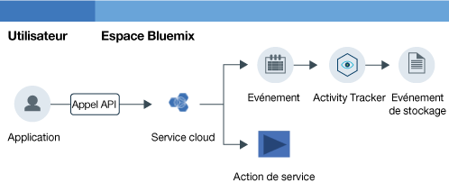

---

copyright:
  years: 2016, 2019
lastupdated: "2019-02-18"

---

{:new_window: target="_blank"}
{:shortdesc: .shortdesc}
{:screen: .screen}
{:pre: .pre}
{:table: .aria-labeledby="caption"}
{:codeblock: .codeblock}
{:tip: .tip}
{:download: .download}

# Initiation
{: #getting-started-with-cla}

Le service {{site.data.keyword.cloudaccesstrailfull}} enregistre des activités initiées par l'utilisateur qui changent l'état d'un service dans {{site.data.keyword.Bluemix}}. Découvrez comment utiliser le service {{site.data.keyword.cloudaccesstrailfull}} pour surveiller l'interaction d'un utilisateur avec un service Cloud.
{:shortdesc}

La figure suivante représente les différents composants et les actions impliqués lorsqu'une activité initiée par un utilisateur modifie l'état d'un service :

**Remarque :** Ce guide d'initiation vous montrera comment expérimenter la surveillance de l'activité sur le cloud dans la région Sud des Etat-Unis (us-south).

## Avant de commencer
{: #index_prereqs}

* Documentez-vous sur le service {{site.data.keyword.cloudaccesstrailshort}}. Pour plus d'informations, voir [A propos d'{{site.data.keyword.cloudaccesstrailshort}}](/docs/services/cloud-activity-tracker/activity_tracker_ov.html#activity_tracker_ov).
* Consultez les régions dans lesquelles le service est disponible. Pour plus d'informations, voir [Régions](/docs/services/cloud-activity-tracker/activity_tracker_ov.html#activity_tracker_ov_regions).
* Obtenez un ID utilisateur membre ou propriétaire d'un compte {{site.data.keyword.cloud_notm}}. 

    Pour obtenir un ID utilisateur {{site.data.keyword.cloud_notm}}, accédez à la page d'[enregistrement ](https://cloud.ibm.com/registration/){:new_window}.

## Etape 1 : Mise à disposition d'{{site.data.keyword.cloudaccesstrailshort}}
{: #index_step1}

Tenez compte des informations suivantes pour choisir où mettre à disposition une instance du service {{site.data.keyword.cloudaccesstrailshort}} :

* {{site.data.keyword.cloudaccesstrailshort}} collecte les événements et les regroupe dans des domaines. Il y a un domaine de compte par région et un domaine d'espace par espace Cloud Foundry (CF). 

* **Pour surveiller les actions de compte globales**, vous devez mettre à disposition une instance du service {{site.data.keyword.cloudaccesstrailshort}} dans un espace de la région Sud des Etats-Unis (us-south). Voici quelques exemples d'actions globales : mise à disposition d'une instance, modification de la règle IAM d'un utilisateur ou invitation d'un utilisateur à rejoindre un compte.

* **Pour surveiller les événements générés par un service mis à disposition dans le contexte d'une organisation et d'un espace CF**, vous devez mettre à disposition une instance du service {{site.data.keyword.cloudaccesstrailshort}} dans la même région et le même espace où est mis à disposition le service dont vous voulez surveiller l'activité. 

* **Pour surveiller les événements générés par un service mis à disposition dans le contexte d'un groupe de ressources**, vous devez mettre à disposition une instance du service {{site.data.keyword.cloudaccesstrailshort}} dans un espace situé dans la même région où est mis à disposition le service dont vous voulez surveiller l'activité. 

* Pour mettre à disposition une instance, votre ID utilisateur doit disposer du **rôle de développeur** dans l'espace où vous envisagez de mettre à disposition le service {{site.data.keyword.cloudaccesstrailshort}}.

Procédez comme suit pour mettre à disposition une instance du service {{site.data.keyword.cloudaccesstraillong_notm}} dans {{site.data.keyword.cloud_notm}} :

1. Connectez-vous à {{site.data.keyword.cloud_notm}}.

    Le tableau de bord {{site.data.keyword.cloud_notm}} se trouve à l'adresse suivante : [https://cloud.ibm.com ](https://cloud.ibm.com){:new_window}.
    
	Après que vous vous êtes connecté avec votre ID utilisateur et votre mot de passe, l'interface utilisateur {{site.data.keyword.cloud_notm}} s'ouvre.

2. Cliquez sur **Catalogue**. La liste des services disponibles dans {{site.data.keyword.cloud_notm}} s'affiche.

3. Sélectionnez la catégorie **Sécurité et identité** pour filtrer la liste de services affichée.

    **Remarque :** Le service est également disponible via la catégorie **Developer Tools**.

4. Cliquez sur la vignette **Activity Tracker**. 

5. Configurez les informations qui définissent où le service va être mis à disposition.

    Par exemple, pour mettre à disposition le service dans la région Sud des Etats-Unis, entrez les données comme indiqué dans le tableau suivant : 

    <table>
	  <caption>Tableau 1. Zones obligatoires pour mise à disposition du service {{site.data.keyword.cloudaccesstrailshort}}</caption>
	  <tr>
	    <th width="50%">Zone</th>
		<th width="50%">Valeur</th>
	  </tr>
	  <tr>
	    <td>Sélectionnez une région dans laquelle effectuer le déploiement :</td>
		<td>Sud des Etats-Unis</td>
	  </tr>
	  <tr>
	    <td>Choisissez une organisation :</td>
		<td>Sélectionnez l'organisation dans laquelle vous prévoyez de mettre le service {{site.data.keyword.cloudaccesstrailshort}} à disposition.</td>
	  </tr>
	  <tr>
	    <td>Choisissez un espace :</td>
		<td>Sélectionnez l'espace de l'organisation sélectionnée dans lequel vous prévoyez de mettre le service {{site.data.keyword.cloudaccesstrailshort}} à disposition.</td>
	  </tr>
	</table>

6. Sélectionnez un plan. 

    Par défaut, le plan **Lite** est sélectionné.

	Pour plus d'informations, voir [Plans de service](/docs/services/cloud-activity-tracker/activity_tracker_ov.html#activity_tracker_ov_plan).

7. Cliquez sur **Créer** pour mettre à disposition l'instance du service {{site.data.keyword.cloudaccesstrailshort}} dans l'espace auquel vous êtes connecté.
   

## Etape 2 : Accorder l'accès des utilisateurs à la surveillance des événements
{: #index_step2}

Pour afficher des événements, vous devez disposer de droits d'accès dans {{site.data.keyword.cloud_notm}}. Ces droits varient suivant que vous souhaitiez voir les événements de compte global, les événements d'un service mis à disposition dans le contexte d'un groupe de ressources ou d'une organisation ou d'un espace CF. 

**Pour surveiller les actions de compte globales** et **un service mis à disposition dans le contexte d'un groupe de ressources**, tenez compte des informations suivantes :

* Vous devez disposer d'une règle IAM pour le service {{site.data.keyword.loganalysisshort}} avec le rôle de **lecteur** sur le service {{site.data.keyword.loganalysisshort}}. 
* Le propriétaire du compte ou un administrateur du service {{site.data.keyword.loganalysisshort}} peut octroyer cette règle.

**Pour surveiller un service mis à disposition dans le contexte d'une organisation ou d'un espace CF**, tenez compte des informations suivantes :

* Vous devez disposer du rôle de **développeur** pour l'espace dans lequel vous avez mis à disposition une instance du service {{site.data.keyword.cloudaccesstrailshort}}.
* Le propriétaire du compte, le responsable de l'organisation ou de l'espace peut vous octroyer le rôle de **développeur** pour cet espace.

**Remarque : Pour octroyer une règle IAM à un utilisateur, vous devez être propriétaire du compte ou administrateur du service {{site.data.keyword.loganalysisshort}}.**

### Accorder l'accès des utilisateurs à la surveillance des événements de domaine de compte
{: #index_acc}

Pour accorder une règle IAM à un utilisateur à partir de l'interface utilisateur d'{{site.data.keyword.cloud_notm}} :

1. Connectez-vous à la console {{site.data.keyword.cloud_notm}}.

    Ouvrez un navigateur Web et lancez le tableau de bord {{site.data.keyword.cloud_notm}} : [https://cloud.ibm.com ](https://cloud.ibm.com){:new_window}

2. Dans la barre de menus, cliquez sur **Gérer** &gt; **Sécurité** &gt; **Identity and Access**, puis sélectionnez **Utilisateurs**.
3. Sur la ligne de l'utilisateur auquel vous voulez affecter un accès, sélectionnez le menu **Actions**, puis cliquez sur **Affecter un accès**.
4. Sélectionnez **Affecter l'accès aux ressources**.
5. Sélectionnez **Log Analysis**.
6. Sélectionnez **Toutes les régions**.
7. Sélectionnez **Toutes les instances de service**.
8. Sélectionnez le rôle de service **Lecteur**.
9. Cliquez sur Affecter.

### Accorder l'accès des utilisateurs à la surveillance des événements de domaine d'espace
{: #index_space}

Pour octroyer un rôle de développeur aux utilisateurs dans un espace à partir de l'interface utilisateur d'{{site.data.keyword.cloud_notm}}, procédez comme suit :

1. Connectez-vous à la console {{site.data.keyword.cloud_notm}}.

    Ouvrez un navigateur Web et lancez le tableau de bord {{site.data.keyword.cloud_notm}} : [https://cloud.ibm.com ](https://cloud.ibm.com){:new_window}
	
	Après que vous vous êtes connecté avec votre ID utilisateur et votre mot de passe, l'interface utilisateur {{site.data.keyword.cloud_notm}} s'ouvre.

2. Dans la barre de menus, cliquez sur **Gérer** &gt; **Sécurité** &gt; **Identity and Access**, puis sélectionnez **Utilisateurs**.

3. Sélectionnez l'utilisateur.

4. Sélectionnez **Accès Cloud Foundry**.

5. Développez une organisation.

    La liste des espaces disponibles dans cette organisation est affichée.

6. Dans le menu Actions, sélectionnez **Editer le rôle d'organisation**. Sélectionnez le rôle **Auditeur** pour la zone *Rôles d'organisation*. Cliquez ensuite sur **Sauvegarder un rôle**.

7. Sélectionnez un espace. 

8. Dans le menu Actions, sélectionnez **Editer un rôle d'espace**. Sélectionnez le rôle **Développeur** pour la zone *Rôles d'espace*. Cliquez ensuite sur **Sauvegarder un rôle**.
	
7. Cliquez sur **Affecter**.

## Etape 3 : Générer des événements {{site.data.keyword.cloudaccesstrailshort}}
{: #index_step3}

Une fois le service {{site.data.keyword.cloudaccesstrailshort}} mis à disposition, les événements sont collectés automatiquement à partir des services Cloud sélectionnés. Pour en savoir plus sur les services que vous pouvez surveiller avec {{site.data.keyword.cloudaccesstrailshort}}, notamment les informations sur les actions qui génèrent un événement {{site.data.keyword.cloudaccesstrailshort}}, voir [Services Cloud](/docs/services/cloud-activity-tracker/cloud_services.html#cloud_services).

**Remarque :** Pour pouvoir générer des événements {{site.data.keyword.cloudaccesstrailshort}} pour les serveurs {{site.data.keyword.BluVirtServers_short}} et {{site.data.keyword.baremetal_short}}, l'utilisateur doit avoir accès aux ressources d'infrastructure dans la console IBM Cloud. Pour plus d'informations, voir [Surveillance de l'activité des serveurs {{site.data.keyword.BluVirtServers_short}} et {{site.data.keyword.baremetal_short}} avec {{site.data.keyword.cloudaccesstrailshort}}](/docs/services/cloud-activity-tracker/tutorials/vsi.html#vsi).

Pour savoir comment générer des événements, suivez le tutoriel [Surveillance de l'activité de {{site.data.keyword.keymanagementserviceshort}} avec {{site.data.keyword.cloudaccesstrailshort}}](/docs/services/cloud-activity-tracker/tutorials/kp.html#kp).

## Etape 4 : Afficher des événements
{: #index_step4}

Vous pouvez surveiller les événements {{site.data.keyword.cloudaccesstrailshort}} dans l'interface utilisateur d'{{site.data.keyword.cloud_notm}}. Vous pouvez également mettre à niveau votre plan et passer à un plan Premium pour surveiller des événements via Kibana. 

**Pour surveiller les actions de compte globales** et **un service mis à disposition dans le contexte d'un groupe de ressources**, tenez compte des informations suivantes :

* Les événements sont collectés dans un domaine de compte.

    Il existe un domaine de compte par région.

    Des actions de compte globales sont collectées dans le domaine de compte de la région Sud des Etats-Unis (us-south).

    Les événements d'un service sont collectés dans le domaine de compte de la région dans laquelle une instance de ce service est mise à disposition.

* Le propriétaire du compte peut afficher des événements via l'interface utilisateur {{site.data.keyword.cloud_notm}} ou dans Kibana.
* Les autres utilisateurs peuvent uniquement afficher les événements du domaine de compte via Kibana. 

**Pour surveiller un service mis à disposition dans le contexte d'une organisation ou d'un espace CF**, tenez compte des informations suivantes :

* Les événements sont collectés dans un domaine d'espace. 
* A chaque espace CF est associé un domaine d'espace {{site.data.keyword.cloudaccesstrailshort}}. 
* Vous pouvez afficher les événements via l'interface utilisateur {{site.data.keyword.cloud_notm}} ou dans Kibana.

Le tableau suivant définit le domaine {{site.data.keyword.cloudaccesstrailshort}} dans lequel vous devez surveiller les événements :

| Surveillance                                                           | Domaine {{site.data.keyword.cloudaccesstrailshort}} |  
|----------------------------------------------------------------------|----------------------------------------------------| 
| `Actions de compte globales`                                             | domaine de compte us-south                            |  
| `Services mis à disposition dans le contexte d'un groupe de ressources`   | domaine de compte                                     | 
| `Services mis à disposition dans le contexte d'une organisation et d'un espace CF` | domaine d'espace                                      | 
{: caption="Tableau 1. Domaines {{site.data.keyword.cloudaccesstrailshort}} par source d'événement" caption-side="top"} 

Pour afficher des événements, vous pouvez choisir l'une des options suivantes :

* [Accès au tableau de bord Activity Tracker pour surveiller l'activité de cloud dans le compte](/docs/services/cloud-activity-tracker/how-to/manage-events-ui/launch_at_ui.html#launch_at_ui_account_view_account) 
* [Accès au tableau de bord Activity Tracker pour surveiller l'activité de cloud dans un espace](/docs/services/cloud-activity-tracker/how-to/manage-events-ui/launch_at_ui.html#launch_at_ui_account_view_space) 
* [Accès à Kibana à partir d'un navigateur Web](/docs/services/cloud-activity-tracker/how-to/manage-events-ui/launch_kibana.html#launch_kibana).

Pour afficher les événements que vous générez à l'aide des étapes indiquées dans ce tutoriel, choisissez [Accès au tableau de bord Activity Tracker pour surveiller l'activité de cloud dans le compte](/docs/services/cloud-activity-tracker/how-to/manage-events-ui/launch_at_ui.html#launch_at_ui_account_view_account). Si vous n'êtes pas le propriétaire du compte, mettez à jour votre plan de service et vérifiez que vous disposez des droits d'accès adéquats pour afficher les événements. 

## Etapes suivantes
{: #index_next_steps}

Utilisez l'interface de ligne de commande d'{{site.data.keyword.cloudaccesstrailshort}} pour gérer les événements à partir de la ligne de commande. Pour plus d'informations, voir [Gestion des événements à l'aide de l'interface de ligne de commande d'Activity Tracker](/docs/services/cloud-activity-tracker/tutorials/manage_events_cli.html#tutorial2).

