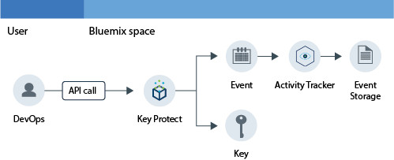

---

copyright:
  years: 2016, 2017

lastupdated: "2017-09-19"

---

{:shortdesc: .shortdesc}
{:new_window: target="_blank"}
{:codeblock: .codeblock}
{:screen: .screen}
{:pre: .pre}

# Surveillance de l'activité de Key Protect
{: #kp_at}

Utilisez le service {{site.data.keyword.cloudaccesstrailfull}} pour contrôler comment des applications interagissent avec le service {{site.data.keyword.keymanagementservicelong_notm}} dans {{site.data.keyword.Bluemix}}.
{:shortdesc}

## A propos de Key Protect
{: #about}

{{site.data.keyword.keymanagementserviceshort}} est un service de gestion des clés de chiffrement. Vous pouvez utiliser le service {{site.data.keyword.keymanagementserviceshort}} pour mettre à disposition des clés chiffrées pour des applications dans {{site.data.keyword.Bluemix_notm}}. Pour plus d'informations, voir [Initiation à Key Protect](/docs/services/keymgmt/index.html#getting-started-with-key-protect).

Pour gérer des clés chiffrées, vous pouvez créer et supprimer des clés via l'interface utilisateur {{site.data.keyword.Bluemix_notm}} ou à l'aide d'un programme en utilisant l'API [IBM Key Protect](https://docs-api-keyprotect.ng.bluemix.net/#/){: new_window}.

## Fonctionnement
{: #how}

Dans {{site.data.keyword.Bluemix_notm}}, pour surveiller le journal d'activité du service {{site.data.keyword.keymanagementserviceshort}}, vous devez mettre à disposition le service {{site.data.keyword.cloudaccesstrailshort}} dans l'espace où le service {{site.data.keyword.keymanagementserviceshort}} est à disposition. Une fois les deux services à disposition et actifs, des événements d'activité sont générés et automatiquement collectés dans le journal {{site.data.keyword.cloudaccesstrailshort}} lorsque vous créez, lisez ou supprimez une clé. 

En raison du caractère sensible des informations d'une clé chiffrée, lorsqu'un événement est généré suite à un appel API au service {{site.data.keyword.keymanagementserviceshort}}, l'événement généré n'inclut pas les informations détaillées relatives à la clé. Il inclut un ID corrélation qui peut être utilisé
pour identifier la clé en interne, dans votre environnement cloud. L'ID corrélation est une zone renvoyée dans le cadre de la zone **responseHeader.content**. Vous utilisez ces informations afin de corréler les données sensibles de la clé chiffrée avec les informations
de l'action signalée via l'événement.

La figure suivante représente les différents composants et les actions qui se produisent quand un utilisateur
effectue un appel API pour créer une clé.

## Méthodes d'API
{: #methods}

Le tableau suivant répertorie les méthodes d'API de {{site.data.keyword.keymanagementserviceshort}} qui génèrent un événement lorsqu'elles sont appelées :

<table>
  <caption>Tableau 1. Méthodes d'API</caption>
  <tr>
    <th>Méthode</th>
	<th>Description</th>
  <tr>
  <tr>
    <td>GET /secrets </td>
	<td>Extrait les valeurs confidentielles</td>
  </tr>
  <tr>
    <td>POST /secrets </td>
	<td>Crée une valeur confidentielle</td>
  </tr>
  <tr>
    <td>DELETE /secrets/{id}</td>
	<td>Supprime une valeur confidentielle par ID</td>
  </tr>
  <tr>
    <td>GET /secrets/{id} </td>
	<td>Extrait une valeur confidentielle par ID</td>
  </tr>  
</table>

**Remarque :** Une valeur confidentielle est une clé chiffrée.

 	
 	
## Tutoriel : Surveillance de l'activité d'IBM Key Protect dans le Cloud
{: #tutorial1}

Utilisez ce tutoriel pour apprendre à surveiller l'interaction d'un utilisateur avec le service Cloud {{site.data.keyword.keymanagementservicelong_notm}}. 

Dans ce tutoriel, vous créez une clé de sécurité dans {{site.data.keyword.keymanagementserviceshort}} (KP). Le service Cloud KP a été activé pour envoyer des événements à {{site.data.keyword.cloudaccesstrailshort}} lorsqu'un utilisateur crée une clé via l'interface utilisateur, l'interface de ligne de commande ou l'API. Une fois la clé créée, vous pouvez surveiller les événements à l'aide de l'interface utilisateur d'{{site.data.keyword.cloudaccesstrailshort}} et de Kibana.

Ce tutoriel vous montrera comment :

1. [Mettre le service {{site.data.keyword.keymanagementserviceshort}} à disposition](/docs/services/cloud-activity-tracker/tutorials/key_protect.html#step1)
2. [Créer une clé de sécurité dans {{site.data.keyword.keymanagementserviceshort}} afin de générer des données d'événement {{site.data.keyword.cloudaccesstrailshort}}](/docs/services/cloud-activity-tracker/tutorials/key_protect.html#step2)
3. [Vérifier à l'aide de l'interface utilisateur {{site.data.keyword.Bluemix_notm}} que des événements {{site.data.keyword.cloudaccesstrailshort}} sont générés](/docs/services/cloud-activity-tracker/tutorials/key_protect.html#step3)

### Hypothèses
{: #assumptions}

Vous disposez d'un ID utilisateur {{site.data.keyword.Bluemix_notm}} doté des droits d'accès de développeur vous permettant de travailler dans un espace d'un compte {{site.data.keyword.Bluemix_notm}} où le service {{site.data.keyword.cloudaccesstrailshort}} est à disposition. 

### Etape 1 : Mise à disposition d'Activity Tracker
{: #step1}

Vous devez mettre le service {{site.data.keyword.cloudaccesstrailshort}} à disposition dans la région et l'espace où le service Cloud que vous voulez surveiller est à disposition. Une fois le service {{site.data.keyword.cloudaccesstrailshort}} mis à disposition, les événements sont collectés automatiquement à partir des services Cloud sélectionnés mis à disposition dans cet espace. Pour la liste des service dont vous pouvez surveiller l'activité à l'aide d'{{site.data.keyword.cloudaccesstrailshort}}, voir [Services cloud pris en charge](/docs/services/cloud-activity-tracker/cloud_services.html#cloud_services).

**Remarque :** Ce tutoriel montre comment utiliser le service {{site.data.keyword.cloudaccesstrailshort}} pour surveiller l'interaction d'un utilisateur avec le service Cloud {{site.data.keyword.keymanagementservicelong_notm}}. Le service {{site.data.keyword.keymanagementserviceshort}} est disponible dans le sud des États-Unis. Par conséquent, vous devez mettre {{site.data.keyword.cloudaccesstrailshort}} à disposition dans la région du sud des États-Unis, dans l'espace où le service {{site.data.keyword.keymanagementserviceshort}} est disponible. Pour afficher les informations relatives à la région où un service est à disposition, voir [Services par région](/docs/services/services_region.html#services_region).

Pour mettre à disposition une instance du service {{site.data.keyword.cloudaccesstraillong_notm}} dans {{site.data.keyword.Bluemix_notm}} :

1. Connectez-vous à votre compte {{site.data.keyword.Bluemix_notm}}.

    Le tableau de bord {{site.data.keyword.Bluemix_notm}} se trouve à l'adresse suivante : [http://bluemix.net ](http://bluemix.net){:new_window}.
    
	Une fois que vous êtes connecté avec votre ID utilisateur et votre mot de passe, l'interface utilisateur {{site.data.keyword.Bluemix_notm}} s'ouvre.

2. Cliquez sur **Catalogue**. La liste des services disponibles sur {{site.data.keyword.Bluemix_notm}} s'ouvre.

3. Sélectionnez la catégorie **Sécurité** pour filtrer la liste de services affichée.

4. Cliquez sur la vignette **Activity Tracker**. 

5. Configurez les informations qui définissent où le service va être mis à disposition. 

    Entrez les données indiquées dans le tableau suivant : 

    <table>
	  <caption>Tableau 1. Zones obligatoires pour mise à disposition du service {{site.data.keyword.cloudaccesstrailshort}}</caption>
	  <tr>
	    <th width="50%">Zone</th>
		<th width="50%">Valeur</th>
	  </tr>
	  <tr>
	    <td>Sélectionnez une région dans laquelle effectuer le déploiement :</td>
		<td>Sud des Etats-Unis</td>
	  </tr>
	  <tr>
	    <td>Choisissez une organisation :</td>
		<td>Sélectionnez l'organisation dont vous prévoyez de surveiller l'activité.</td>
	  </tr>
	  <tr>
	    <td>Choisissez un espace :</td>
		<td>Sélectionnez l'espace de l'organisation sélectionnée dans lequel vous prévoyez de surveiller l'activité.</td>
	  </tr>
	</table>

6. Cliquez sur **Créer** pour mettre à disposition le service {{site.data.keyword.cloudaccesstrailshort}} dans l'espace {{site.data.keyword.Bluemix_notm}} auquel vous êtes connecté.
   

### Etape 2 : Mise à disposition de Key Protect 
{: #step2}
	
Pour mettre à disposition une instance du service {{site.data.keyword.keymanagementserviceshort}} dans la région sud des Etats-Unis de {{site.data.keyword.Bluemix_notm}}, procédez comme suit :

1. Connectez-vous à votre compte {{site.data.keyword.Bluemix_notm}}.

    Le tableau de bord {{site.data.keyword.Bluemix_notm}} se trouve à l'adresse suivante : [http://bluemix.net ](http://bluemix.net){:new_window}
	
	Après que vous vous êtes connecté avec votre ID utilisateur et votre mot de passe, l'interface utilisateur {{site.data.keyword.Bluemix_notm}} s'ouvre.

2. Cliquez sur **Catalogue**. La liste des services disponibles sur {{site.data.keyword.Bluemix_notm}} s'ouvre.

    Sélectionnez la catégorie **Sécurité** pour filtrer la liste de services affichée.

3. Sélectionnez la vignette **Key Protect**.

4. Configurez les informations qui définissent où le service va être mis à disposition. 

    Entrez les données indiquées dans le tableau suivant : 

    <table>
	  <caption>Tableau 2. Zones obligatoires pour mise à disposition du service {{site.data.keyword.keymanagementserviceshort}}</caption>
	  <tr>
	    <th width="50%">Zone</th>
		<th width="50%">Valeur</th>
	  </tr>
	  <tr>
	    <td>Sélectionnez une région dans laquelle effectuer le déploiement :</td>
		<td>Sud des Etats-Unis</td>
	  </tr>
	  <tr>
	    <td>Choisissez une organisation :</td>
		<td>Sélectionnez l'organisation pour laquelle vous voulez mettre le service {{site.data.keyword.cloudaccesstrailshort}} à disposition.</td>
	  </tr>
	  <tr>
	    <td>Choisissez un espace :</td>
		<td>Sélectionnez l'espace dans lequel vous voulez mettre le service {{site.data.keyword.cloudaccesstrailshort}} à disposition.</td>
	  </tr>
	</table>

5. Cliquez sur **Créer** pour mettre à disposition le service {{site.data.keyword.keymanagementserviceshort}} dans l'espace {{site.data.keyword.Bluemix_notm}} auquel vous êtes connecté.

### Etape 3 : Création d'une clé de sécurité dans Key Protect afin de générer des données d'événement d'Activity Tracker 
{: # step3}

Pour générer un événement {{site.data.keyword.cloudaccesstrailshort}}, procédez comme suit :

1. Dans le tableau de bord {{site.data.keyword.Bluemix_notm}}, sélectionnez le service **Key Protect**. Le tableau de bord {{site.data.keyword.keymanagementserviceshort}} s'ouvre. Ensuite, sélectionnez l'onglet **Gérer**.

2. Cliquez sur **Add Key**. Une nouvelle fenêtre s'ouvre.

    Fenêtre d'ajout de clés de 

3. Sélectionnez **Generate key**, puis effectuez les opérations suivantes :

    * Entrez un nom pour la clé, par exemple, *MaPremièreClé*.

    * Choisissez un algorithme pour la clé.

    * Cliquez sur **Add key**. 

### Etape 4 : Vérification via l'interface utilisateur Bluemix de la génération d'événements d'Activity Tracker 
{: #step4}

Vérifiez comme suit qu'un événement a été créé :

1. Dans le tableau de bord {{site.data.keyword.Bluemix_notm}}, sélectionnez le service {{site.data.keyword.cloudaccesstrailshort}}. Le tableau de bord du service s'ouvre.

2. Configurez la vue de recherche des événements {{site.data.keyword.keymanagementserviceshort}} générés lorsque vous avez mis le service a disposition et ajouté une clé.

    * Sélectionnez **Space logs** pour la zone *Afficher les journaux*.
    * Sélectionnez **target.name** pour la zone *Zone de Recherche*.
    * Entrez **ibm-key-protect** dans la zone *Filtrer*.
	
    Les données affichées correspondent aux événements {{site.data.keyword.keymanagementserviceshort}} disponibles pour les dernières 24 heures. 

    Onglet Gérer d'

 	
 	
 	
 	

