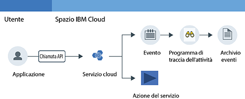

---

copyright:
  years: 2016, 2019
lastupdated: "2019-02-18"

---

{:new_window: target="_blank"}
{:shortdesc: .shortdesc}
{:screen: .screen}
{:pre: .pre}
{:table: .aria-labeledby="caption"}
{:codeblock: .codeblock}
{:tip: .tip}
{:download: .download}

# Introduzione
{: #getting-started-with-cla}

Il servizio {{site.data.keyword.cloudaccesstrailfull}} registra le attività avviate dall'utente che modificano lo stato di un servizio in {{site.data.keyword.Bluemix}}. Impara ad utilizzare il servizio {{site.data.keyword.cloudaccesstrailfull}} per monitorare un'interazione dell'utente con un servizio cloud.
{:shortdesc}

La seguente figura mostra i diversi componenti e azioni che si verificano quando un'attività avviata dall'utente modifica lo stato di un servizio:

**Nota:** questa introduzione ti mostrerà come diventare operativo per monitorare l'attività cloud in Stati Uniti Sud.

## Prima di iniziare
{: #index_prereqs}

* Leggi le informazioni sul servizio {{site.data.keyword.cloudaccesstrailshort}}. Per ulteriori informazioni, vedi [Informazioni su {{site.data.keyword.cloudaccesstrailshort}}](/docs/services/cloud-activity-tracker/activity_tracker_ov.html#activity_tracker_ov).
* Controlla le regioni in cui è disponibile il servizio. Per ulteriori informazioni, vedi [Regioni](/docs/services/cloud-activity-tracker/activity_tracker_ov.html#activity_tracker_ov_regions).
* Ottieni un ID utente che è un membro o un proprietario di un account {{site.data.keyword.cloud_notm}}. 

    Per ottenere un ID utente {{site.data.keyword.cloud_notm}}, vai a: [Registrazione ](https://cloud.ibm.com/registration/){:new_window}.

## Passo 1: provisioning di {{site.data.keyword.cloudaccesstrailshort}}
{: #index_step1}

Prendi in considerazione le seguenti informazioni per scegliere dove eseguire il provisioning di un'istanza del servizio {{site.data.keyword.cloudaccesstrailshort}}:

* {{site.data.keyword.cloudaccesstrailshort}} raccoglie gli eventi nei domini. Esiste un dominio dell'account per regione e un dominio dello spazio per spazio Cloud Foundry (CF). 

* **Per monitorare le azioni dell'account globali**, devi eseguire il provisioning di un'istanza del servizio {{site.data.keyword.cloudaccesstrailshort}} in uno spazio nella regione Stati Uniti Sud. Questi sono alcuni esempi di azioni globali: provisioning di un'istanza, modifica della politica IAM di un utente o invito di un utente nell'account.

* **Per monitorare gli eventi generati da un servizio di cui viene eseguito il provisioning nel contesto di un'organizzazione e uno spazio CF**, devi eseguire il provisioning di un'istanza del servizio {{site.data.keyword.cloudaccesstrailshort}} negli stessi spazio e regione in cui viene eseguito il provisioning del servizio di cui desideri monitorare l'attività. 

* **Per monitorare gli eventi generati da un servizio di cui viene eseguito il provisioning nel contesto di un gruppo di risorse**, devi eseguire il provisioning di un'istanza del servizio {{site.data.keyword.cloudaccesstrailshort}} in uno spazio nella stessa regione in cui viene eseguito il provisioning del servizio di cui desideri monitorare l'attività. 

* Per eseguire il provisioning di un'istanza, il tuo ID utente deve avere il **ruolo di sviluppatore** nello spazio in cui pianifichi di eseguire il provisioning del servizio {{site.data.keyword.cloudaccesstrailshort}}.

Completa la seguente procedura per eseguire il provisioning di un'istanza del servizio {{site.data.keyword.cloudaccesstraillong_notm}} in {{site.data.keyword.cloud_notm}}:

1. Accedi a {{site.data.keyword.cloud_notm}}.

    Il dashboard {{site.data.keyword.cloud_notm}} può essere trovato all'indirizzo: [https://cloud.ibm.com ](https://cloud.ibm.com){:new_window}.
    
	Dopo aver eseguito l'accesso con i tuoi ID e password utente, viene aperta la IU {{site.data.keyword.cloud_notm}}.

2. Fai clic su **Catalogo**. Viene aperto l'elenco dei servizi disponibili in {{site.data.keyword.cloud_notm}}.

3. Seleziona la categoria **Sicurezza e identità** per filtrare l'elenco dei servizi visualizzati.

    **Nota:** il servizio è anche disponibile tramite la categoria **Strumenti di sviluppo**.

4. Fai clic sul tile **Programma di traccia dell'attività**. 

5. Configura le informazioni che definiscono dove viene eseguito il provisioning del servizio.

    Ad esempio, per eseguire il provisioning del servizio nella regione Stai Uniti Sud, immetti i dati come indicato nella seguente tabella: 

    <table>
	  <caption>Tabella 1. Campi obbligatori per eseguire il provisioning del servizio {{site.data.keyword.cloudaccesstrailshort}}</caption>
	  <tr>
	    <th width="50%">Campo</th>
		<th width="50%">Valore</th>
	  </tr>
	  <tr>
	    <td>Seleziona la regione a cui distribuire:</td>
		<td>Stati Uniti Sud</td>
	  </tr>
	  <tr>
	    <td>Scegli un'organizzazione:</td>
		<td>Seleziona l'organizzazione in cui scegli di eseguire il provisioning del tuo piano {{site.data.keyword.cloudaccesstrailshort}}.</td>
	  </tr>
	  <tr>
	    <td>Scegli uno spazio:</td>
		<td>Seleziona lo spazio nell'organizzazione selezionata in cui vuoi eseguire il provisioning del servizio {{site.data.keyword.cloudaccesstrailshort}}.</td>
	  </tr>
	</table>

6. Seleziona un piano.  

    Per impostazione predefinita, viene selezionato il piano **Lite**.

	Per ulteriori informazioni, vedi [Piani di servizio](/docs/services/cloud-activity-tracker/activity_tracker_ov.html#activity_tracker_ov_plan).

7. Fai clic su **Crea** per eseguire il provisioning di un'istanza del servizio {{site.data.keyword.cloudaccesstrailshort}} nello spazio in cui hai eseguito l'accesso.
   

## Passo 2: concedi l'accesso utente per monitorare gli eventi
{: #index_step2}

Per visualizzare gli eventi, devi avere le autorizzazioni di accesso in {{site.data.keyword.cloud_notm}}. Le autorizzazioni variano a seconda se vuoi visualizzare gli eventi dell'account globali, gli eventi di un servizio di cui è stato eseguito il provisioning nel contesto di un gruppo di risorse oppure gli eventi di un servizio di cui è stato eseguito il provisioning nel contesto di uno spazio e un'organizzazione CF. 

**Per monitorare la azioni dell'account globali** e **monitorare un servizio di cui è stato eseguito il provisioning nel contesto di un gruppo di risorse**, prendi in considerazione le seguenti informazioni:

* Devi avere una politica IAM per il servizio {{site.data.keyword.loganalysisshort}} con il ruolo di **lettore** sul servizio {{site.data.keyword.loganalysisshort}}. 
* Il proprietario dell'account o un amministratore del servizio {{site.data.keyword.loganalysisshort}} può concedere questa politica.

**Per monitorare un servizio di cui è stato eseguito il provisioning nel contesto di uno spazio e un'organizzazione CF**, prendi in considerazione le seguenti informazioni:

* Devi avere il ruolo di **sviluppatore** per lo spazio in cui hai eseguito il provisioning di un'istanza del servizio {{site.data.keyword.cloudaccesstrailshort}}.
* Il proprietario dell'account, il gestore dell'organizzazione o il gestore dello spazio può concederti il ruolo di **sviluppatore** per lo spazio.

**Nota: per concedere a un utente una politica IAM, devi essere il proprietario dell'account o un amministratore del servizio {{site.data.keyword.loganalysisshort}}.**

### Concedi l'accesso agli utenti per monitorare gli eventi del dominio dell'account
{: #index_acc}

Completa la seguente procedura per concedere una politica IAM a un utente dall'IU {{site.data.keyword.cloud_notm}}:

1. Accedi alla console {{site.data.keyword.cloud_notm}}.

    Apri un browser web e avvia il dashboard {{site.data.keyword.cloud_notm}}: [https://cloud.ibm.com ](https://cloud.ibm.com){:new_window}

2. Dalla barra dei menu, fai clic su **Gestisci** &gt; **Sicurezza** &gt; **Identità e accesso** e seleziona **Utenti**. 
3. Dalla riga per l'utente a cui desideri assegnare l'accesso, seleziona il menu **Azioni** e fai quindi clic su **Assegna accesso**. 
4. Seleziona **Assegna l'accesso alle risorse**.
5. Seleziona **Analisi log**.
6. Seleziona **Tutte le regioni**.
7. Seleziona **Tutte le istanze del servizio**.
8. Seleziona il ruolo del servizio **Lettore**.
9. Fai clic su Assegna.

### Concedi l'accesso agli utenti per monitorare gli eventi del dominio dello spazio
{: #index_space}

Per concedere a un utente un ruolo di sviluppatore in uno spazio dall'IU {{site.data.keyword.cloud_notm}}, completa la seguente procedura:

1. Accedi alla console {{site.data.keyword.cloud_notm}}.

    Apri un browser web e avvia il dashboard {{site.data.keyword.cloud_notm}}: [https://cloud.ibm.com ](https://cloud.ibm.com){:new_window}
	
	Dopo aver eseguito l'accesso con i tuoi ID e password utente, viene aperta la IU {{site.data.keyword.cloud_notm}}.

2. Dalla barra dei menu, fai clic su **Gestisci** &gt; **Sicurezza** &gt; **Identità e accesso** e seleziona **Utenti**. 

3. Seleziona l'utente.

4. Seleziona **Accesso Cloud Foundry**.

5. Espandi un'organizzazione.

    Viene visualizzato l'elenco degli spazi disponibili in tale organizzazione.

6. Dal menu delle azioni, seleziona **Modifica ruolo organizzazione**. Seleziona il ruolo **Revisore** per il campo *Ruoli organizzazione*. Fai quindi clic su **Salva ruolo**.

7. Seleziona uno spazio. 

8. Dal menu delle azioni, seleziona **Modifica ruolo spazio**. Seleziona il ruolo **Sviluppatore** per il campo *Ruoli spazio*. Fai quindi clic su **Salva ruolo**.
	
7. Fai clic su **Assegna**.

## Passo 3: genera gli eventi {{site.data.keyword.cloudaccesstrailshort}} 
{: #index_step3}

Dopo aver eseguito il provisioning del servizio {{site.data.keyword.cloudaccesstrailshort}}, gli eventi vengono raccolti automaticamente dai servizi cloud selezionati. Per ulteriori informazioni sui servizi che puoi monitorare con {{site.data.keyword.cloudaccesstrailshort}}, incluse le informazioni sulle azioni che generano un evento {{site.data.keyword.cloudaccesstrailshort}}, consulta [Servizi cloud](/docs/services/cloud-activity-tracker/cloud_services.html#cloud_services).

**Nota:** perché un utente generi degli eventi {{site.data.keyword.BluVirtServers_short}} e {{site.data.keyword.baremetal_short}} {{site.data.keyword.cloudaccesstrailshort}}, deve avere accesso alle risorse dell'infrastruttura nella console IBM Cloud. Per ulteriori informazioni, vedi [Monitoraggio di {{site.data.keyword.BluVirtServers_short}} e dell'attività di {{site.data.keyword.baremetal_short}} con {{site.data.keyword.cloudaccesstrailshort}}](/docs/services/cloud-activity-tracker/tutorials/vsi.html#vsi).

Per informazioni su come generare gli eventi, completa l'esercitazione [Monitoraggio dell'attività di {{site.data.keyword.keymanagementserviceshort}} con {{site.data.keyword.cloudaccesstrailshort}}](/docs/services/cloud-activity-tracker/tutorials/kp.html#kp).

## Passo 4: visualizzazione degli eventi
{: #index_step4}

Puoi monitorare gli eventi {{site.data.keyword.cloudaccesstrailshort}} nell'IU {{site.data.keyword.cloud_notm}}. Puoi inoltre eseguire l'upgrade del tuo piano al piano premium per monitorare gli eventi tramite Kibana. 

**Per monitorare la azioni dell'account globali** e **monitorare un servizio di cui è stato eseguito il provisioning nel contesto di un gruppo di risorse**, prendi in considerazione le seguenti informazioni:

* Gli eventi vengono raccolti in un dominio dell'account.

    Esiste un dominio dell'account per regione.

    Le azioni dell'account globali vengono raccolte nel dominio dell'account Stati Uniti Sud.

    Gli eventi per un servizio vengono raccolti nel dominio dell'account della regione in cui viene eseguito il provisioning di un'istanza di questo servizio.

* Il proprietario dell'account può visualizzare gli eventi tramite l'IU {{site.data.keyword.cloud_notm}} o in Kibana.
* Gli altri utenti possono soltanto visualizzare gli eventi del dominio dell'account tramite Kibana. 

**Per monitorare un servizio di cui è stato eseguito il provisioning nel contesto di uno spazio e un'organizzazione CF**, prendi in considerazione le seguenti informazioni:

* Gli eventi vengono raccolti in un dominio dello spazio. 
* Ogni spazio CF ha un dominio dello spazio {{site.data.keyword.cloudaccesstrailshort}} associato. 
* Puoi visualizzare gli eventi tramite l'IU {{site.data.keyword.cloud_notm}} o in Kibana.

La seguente tabella definisce il dominio {{site.data.keyword.cloudaccesstrailshort}} in cui devi monitorare gli eventi:

| Monitoraggio                                                           | Dominio {{site.data.keyword.cloudaccesstrailshort}}  |  
|----------------------------------------------------------------------|----------------------------------------------------| 
| `Global account actions`                                             | dominio account Stati Uniti Sud                            |  
| `Services that are provisioned in the context of a resource group`   | dominio account                                     | 
| `Services that are provisioned in the context of a CF org and space` | dominio spazio                                       | 
{: caption="Tabella 1. Domini {{site.data.keyword.cloudaccesstrailshort}} per origine evento" caption-side="top"} 

Per visualizzare gli eventi, puoi scegliere una delle seguenti opzioni:

* [Passaggio al dashboard del programma di traccia dell'attività per monitorare l'attività cloud nell'account](/docs/services/cloud-activity-tracker/how-to/manage-events-ui/launch_at_ui.html#launch_at_ui_account_view_account) 
* [Passaggio al dashboard del programma di traccia dell'attività per monitorare l'attività cloud in uno spazio](/docs/services/cloud-activity-tracker/how-to/manage-events-ui/launch_at_ui.html#launch_at_ui_account_view_space) 
* [Passaggio a Kibana da un browser web](/docs/services/cloud-activity-tracker/how-to/manage-events-ui/launch_kibana.html#launch_kibana).

Per visualizzare gli eventi che generi completando la procedura nell'esercitazione, scegli [Passaggio al dashboard del programma di traccia dell'attività per monitorare l'attività cloud nell'account](/docs/services/cloud-activity-tracker/how-to/manage-events-ui/launch_at_ui.html#launch_at_ui_account_view_account). Se non sei il proprietario dell'account, esegui l'upgrade al piano del servizio e controlla di disporre delle autorizzazioni di accesso corrette per visualizzare gli eventi. 

## Passo successivo
{: #index_next_steps}

Utilizza la CLI {{site.data.keyword.cloudaccesstrailshort}} per gestire i tuoi eventi dalla riga di comando. Per ulteriori informazioni, consulta [Gestione degli eventi utilizzando la CLI del programma di traccia dell'attività](/docs/services/cloud-activity-tracker/tutorials/manage_events_cli.html#tutorial2).

