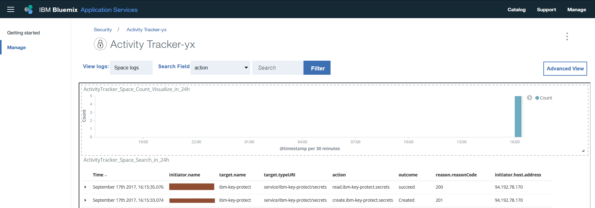

---

copyright:
  years: 2016, 2017
lastupdated: "2017-09-17"

---

{:new_window: target="_blank"}
{:shortdesc: .shortdesc}
{:screen: .screen}
{:codeblock: .codeblock}
{:pre: .pre}

# Esercitazione introduttiva
{: #getting-started-with-cla}

Il servizio {{site.data.keyword.cloudaccesstrailfull}} registra le attività avviate dall'utente che modificano lo stato di un servizio nel cloud {{site.data.keyword.IBM}}. Utilizza questa esercitazione per informazioni su come utilizzare il servizio {{site.data.keyword.cloudaccesstrailfull}} per monitorare un'interazione dell'utente con un servizio cloud.
{:shortdesc}

Gli obiettivi di questa esercitazione introduttiva sono i seguenti:

1. Mostrare come eseguire il provisioning del servizio {{site.data.keyword.cloudaccesstrailshort}}.
2. Mostrare come utilizzare un servizio cloud per generare gli eventi attività raccolti automaticamente dal servizio {{site.data.keyword.cloudaccesstrailshort}}. Gli eventi conformi agli standard CADF (Cloud Auditing Data Federation). 
3. Mostrare come monitorare l'attività cloud di un servizio utilizzando i dashboard {{site.data.keyword.cloudaccesstrailshort}} predefiniti.

La seguente figura mostra i diversi componenti e azioni che si verificano quando un'attività avviata dall'utente modifica lo stato di un servizio: 

## Prima di iniziare
{: #prereqs}

Crea un account [{{site.data.keyword.Bluemix_notm}}](https://console.bluemix.net/registration/). Il tuo ID utente deve essere un membro o un proprietario di un account {{site.data.keyword.Bluemix_notm}}, con autorizzazioni da sviluppatore nello spazio in cui pianifichi di utilizzare il servizio {{site.data.keyword.cloudaccesstrailshort}}.

## Passo 1: esegui il provisioning del programma di traccia dell'attività
{: #step1}

Devi eseguire il provisioning del servizio {{site.data.keyword.cloudaccesstrailshort}} negli stessi spazio e regione in cui viene eseguito il provisioning del servizio cloud di cui desideri monitorare l'attività. Dopo aver eseguito il provisioning del servizio {{site.data.keyword.cloudaccesstrailshort}}, gli eventi vengono raccolti automaticamente dai servizi cloud selezionati di cui è stato eseguito il provisioning in tale spazio. Consulta [Servizi cloud supportati](/docs/services/cloud-activity-tracker/cloud_services.html#cloud_services) per un elenco di servizi di cui vuoi monitorare l'attività tramite {{site.data.keyword.cloudaccesstrailshort}}.

**Nota:** questa esercitazione mostra come utilizzare il servizio {{site.data.keyword.cloudaccesstrailshort}} per monitorare un'interazione dell'utente con il servizio cloud {{site.data.keyword.keymanagementservicelong_notm}}. Il servizio {{site.data.keyword.keymanagementserviceshort}} è disponibile in Stati Uniti Sud. Pertanto, devi eseguire il provisioning di {{site.data.keyword.cloudaccesstrailshort}} nella regione Stati Uniti Sud, nello stesso spazio in cui è disponibile il servizio {{site.data.keyword.keymanagementserviceshort}}. Per visualizzare le informazioni su quale regione è disponibile un servizio, consulta [Servizi per regione](/docs/services/services_region.html#services_region).

Completa la seguente procedura per eseguire il provisioning di un'istanza del servizio {{site.data.keyword.cloudaccesstraillong_notm}} in {{site.data.keyword.Bluemix_notm}}:

1. Accedi al tuo account {{site.data.keyword.Bluemix_notm}}.

    Il dashboard {{site.data.keyword.Bluemix_notm}} può essere trovato all'indirizzo: [http://bluemix.net ](http://bluemix.net){:new_window}.
    
	Dopo aver eseguito l'accesso con i tuoi ID e password utente, viene aperta la IU {{site.data.keyword.Bluemix_notm}}.

2. Fai clic su **Catalogo**. Viene aperto l'elenco dei servizi disponibili in {{site.data.keyword.Bluemix_notm}}.

3. Seleziona la categoria **Sicurezza** per filtrare l'elenco dei servizi visualizzati.

4. Fai clic sul tile **Programma di traccia dell'attività**. 

5. Configura le informazioni che definiscono dove viene eseguito il provisioning del servizio. 

    Immetti i dati come indicato nella seguente tabella: 

    <table>
	  <caption>Tabella 1. Campi obbligatori per eseguire il provisioning del servizio {{site.data.keyword.cloudaccesstrailshort}}</caption>
	  <tr>
	    <th width="50%">Campo</th>
		<th width="50%">Valore</th>
	  </tr>
	  <tr>
	    <td>Seleziona la regione a cui distribuire:</td>
		<td>Stati Uniti Sud</td>
	  </tr>
	  <tr>
	    <td>Scegli un'organizzazione:</td>
		<td>Seleziona l'organizzazione in cui il tuo piano monitora l'attività.</td>
	  </tr>
	  <tr>
	    <td>Scegli uno spazio:</td>
		<td>Seleziona lo spazio nell'organizzazione selezionata in cui il tuo piano monitora l'attività.</td>
	  </tr>
	</table>

6. Fai clic su **Crea** per eseguire il provisioning del servizio {{site.data.keyword.cloudaccesstrailshort}} nello spazio
{{site.data.keyword.Bluemix_notm}} in cui hai eseguito l'accesso.
   

## Passo 2:  Provisioning di un servizio cloud 
{: #step2}
	
Completa la seguente procedura per eseguire il provisioning di un'istanza del servizio {{site.data.keyword.keymanagementserviceshort}} nella regione Stati Uniti Sud di {{site.data.keyword.Bluemix_notm}}:

1. Accedi al tuo account {{site.data.keyword.Bluemix_notm}}.

    Il dashboard {{site.data.keyword.Bluemix_notm}} può essere trovato all'indirizzo: [http://bluemix.net ](http://bluemix.net){:new_window}
	
	Dopo aver eseguito l'accesso con i tuoi ID e password utente, viene aperta la IU {{site.data.keyword.Bluemix_notm}}.

2. Fai clic su **Catalogo**. Viene aperto l'elenco dei servizi disponibili in {{site.data.keyword.Bluemix_notm}}.

    Seleziona la categoria **Sicurezza** per filtrare l'elenco dei servizi visualizzati.

3. Seleziona il tile **Key Protect**.

4. Configura le informazioni che definiscono dove viene eseguito il provisioning del servizio. 

    Immetti i dati come indicato nella seguente tabella: 

    <table>
	  <caption>Tabella 2. Campi obbligatori per eseguire il provisioning del servizio {{site.data.keyword.keymanagementserviceshort}}</caption>
	  <tr>
	    <th width="50%">Campo</th>
		<th width="50%">Valore</th>
	  </tr>
	  <tr>
	    <td>Seleziona la regione a cui distribuire:</td>
		<td>Stati Uniti Sud</td>
	  </tr>
	  <tr>
	    <td>Scegli un'organizzazione:</td>
		<td>Seleziona l'organizzazione in cui scegli di eseguire il provisioning del servizio {{site.data.keyword.cloudaccesstrailshort}}.</td>
	  </tr>
	  <tr>
	    <td>Scegli uno spazio:</td>
		<td>Seleziona lo spazio in cui scegli di eseguire il provisioning del servizio {{site.data.keyword.cloudaccesstrailshort}}. </td>
	  </tr>
	</table>

5. Fai clic su **Crea** per eseguire il provisioning del servizio {{site.data.keyword.keymanagementserviceshort}} nello spazio
{{site.data.keyword.Bluemix_notm}} in cui hai eseguito l'accesso.

## Passo 3: Genera un evento del programma di traccia dell'attività
{: # step3}

In questo passo, crea una chiave di sicurezza utilizzando il servizio {{site.data.keyword.keymanagementserviceshort}} per generare i dati dell'evento
{{site.data.keyword.cloudaccesstrailshort}}. 

Completa la seguente procedura per generare un evento {{site.data.keyword.cloudaccesstrailshort}}:

1. Dal dashboard {{site.data.keyword.Bluemix_notm}}, seleziona il servizio **Key Protect**,
Viene aperto il dashboard {{site.data.keyword.keymanagementserviceshort}}. Quindi, seleziona la scheda **Gestisci**.

2. Fai clic su **Aggiungi chiave**. Viene visualizzata una nuova finestra. 

3. Seleziona **Genera chiave** e completa le seguenti istruzioni:

    * Immetti un nome per la chiave, ad esempio, *MyFirstKey*.

    * Scegli un algoritmo per la chiave.

    * Fai clic su **Aggiungi chiave**. 
	
Gli eventi {{site.data.keyword.cloudaccesstrailshort}} vengono generati come risultato della creazione di una chiave.

## Passo 4: Monitora un evento del programma di traccia dell'attività
{: #step4}

In questo passo, verifica tramite la IU {{site.data.keyword.Bluemix_notm}} che gli eventi {{site.data.keyword.cloudaccesstrailshort}} siano stati generati.

Completa la seguente procedura per verificare che un evento è stato creato: 

1. Dal dashboard {{site.data.keyword.Bluemix_notm}}, seleziona il servizio {{site.data.keyword.cloudaccesstrailshort}}. Viene aperto il dashboard del servizio.

2. Configura la vista per ricercare gli eventi {{site.data.keyword.keymanagementserviceshort}} che sono stati generati quando hai eseguito il provisioning del servizio e aggiunto una chiave.

    * Seleziona **Space logs** per il campo *View logs*.
    * Seleziona **target.name** per il campo *Search field*.
    * Immetti **ibm-key-protect** nel campo *Filter*.
	
    I dati visualizzati mostrano gli eventi {{site.data.keyword.keymanagementserviceshort}} disponibili per le ultime 24 ore. 
	
	

## Passo successivo
{: #next_steps}

Successivamente, utilizza il dashboard Kibana predefinito {{site.data.keyword.cloudaccesstrailshort}} per monitorare e analizzare i log evento. Per avviare Kibana, consulta [Passaggio al dashboard Kibana](/docs/services/cloud-activity-tracker/how-to/manage-events-ui/launch_kibana.html#launch_kibana). 

Per impostazione predefinita, in Kibana, i log di attività dello spazio vengono visualizzati tramite il dashboard **ActivityTracker_Space_Search_in_24h**:

Puoi anche utilizzare la CLI {{site.data.keyword.cloudaccesstrailshort}} per gestire i tuoi eventi dalla riga di comando. Per ulteriori informazioni, vedi [Visualizzazione di informazioni sull'evento](/docs/services/cloud-activity-tracker/how-to/manage-events-cli/viewing_event_information.html#viewing_event_status).

                                                                                                                      

