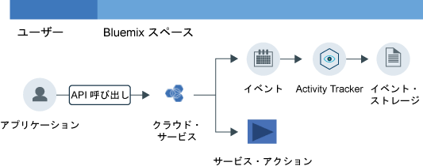

---

copyright:
  years: 2016, 2019
lastupdated: "2019-05-01"

keywords: IBM Cloud, Activity Tracker, getting started

subcollection: cloud-activity-tracker

---

{:new_window: target="_blank"}
{:shortdesc: .shortdesc}
{:screen: .screen}
{:pre: .pre}
{:table: .aria-labeledby="caption"}
{:codeblock: .codeblock}
{:tip: .tip}
{:download: .download}
{:important: .important}
{:note: .note}
{:deprecated: .deprecated}

# 入門チュートリアル
{: #getting-started}

{{site.data.keyword.cloudaccesstrailfull}} サービスは、{{site.data.keyword.cloud_notm}} 内のサービスの状態を変更するユーザー開始アクティビティーを記録します。 クラウド・サービスとユーザーとの対話を {{site.data.keyword.cloudaccesstrailfull}} サービスを使用してモニターする方法について説明します。 
{:shortdesc}

{{site.data.keyword.cloudaccesstrailfull}} は非推奨になりました。 2019 年 5 月 9 日以降、新しい {{site.data.keyword.cloudaccesstrailshort}} インスタンスをプロビジョンできません。 既存のプレミアム・プランのインスタンスは、2019 年 9 月 30 日までサポートされます。 {{site.data.keyword.cloud_notm}} アカウントのアクティビティーのモニタリングを続行するには、[{{site.data.keyword.at_full}}](/docs/services/Activity-Tracker-with-LogDNA?topic=logdnaat-getting-started#getting-started) のインスタンスをプロビジョンします。
{: deprecated}

次の図は、さまざまなコンポーネントと、サービスの状態を変更するユーザー開始アクティビティーがあったときに起こるアクションを示します。

**注:** このチュートリアルでは、米国南部でクラウド・アクティビティーをモニターするように稼働させる方法を示します。

## 始めに
{: #gs_prereqs}

* {{site.data.keyword.cloudaccesstrailshort}} サービスに関する文書をお読みください。 詳しくは、[{{site.data.keyword.cloudaccesstrailshort}} の紹介](/docs/services/cloud-activity-tracker?topic=cloud-activity-tracker-activity_tracker_ov#activity_tracker_ov)を参照してください。
* このサービスが使用可能な地域を確認してください。 詳しくは、[地域](/docs/services/cloud-activity-tracker?topic=cloud-activity-tracker-activity_tracker_ov#activity_tracker_ov_regions)を参照してください。
* {{site.data.keyword.cloud_notm}} アカウントのメンバーまたは所有者であるユーザー ID を取得してください。 [ここで登録 ](https://cloud.ibm.com/login){:new_window} してください。

## ステップ 1. {{site.data.keyword.cloudaccesstrailshort}} をプロビジョンする
{: #gs_step1}

{{site.data.keyword.cloudaccesstrailshort}} サービスのインスタンスをプロビジョンする場所を選択する際には、以下のことを考慮してください。

* {{site.data.keyword.cloudaccesstrailshort}} はイベントをドメインに収集します。 地域ごとに 1 つのアカウント・ドメインがあり、Cloud Foundry (CF) スペースごとに 1 つのスペース・ドメインがあります。 

* **グローバル・アカウント・アクションをモニターするには**、米国南部地域のスペースで {{site.data.keyword.cloudaccesstrailshort}} サービスのインスタンスをプロビジョンする必要があります。 グローバル・アクションの例として、インスタンスのプロビジョン、ユーザーの IAM ポリシーの変更、アカウントへのユーザーの招待があります。

* **CF 組織およびスペースのコンテキストでプロビジョンされたサービスによって生成されるイベントをモニターするには**、モニター対象アクティビティーのサービスがプロビジョンされているのと同じ地域およびスペース内で {{site.data.keyword.cloudaccesstrailshort}} サービスのインスタンスをプロビジョンする必要があります。 

* **リソース・グループのコンテキストでプロビジョンされたサービスによって生成されるイベントをモニターするには**、モニター対象アクティビティーのサービスがプロビジョンされているのと同じ地域内のスペースで {{site.data.keyword.cloudaccesstrailshort}} サービスのインスタンスをプロビジョンする必要があります。 

* インスタンスをプロビジョンするには、{{site.data.keyword.cloudaccesstrailshort}} サービスをプロビジョンする予定のスペースにおける**開発者役割**が、ユーザー ID に必要です。

{{site.data.keyword.cloud_notm}} 内で {{site.data.keyword.cloudaccesstraillong_notm}} サービスのインスタンスをプロビジョンするには、以下の手順を実行します。

1. [{{site.data.keyword.cloud_notm}} にログイン ](https://cloud.ibm.com/login){:new_window} します。

    ユーザー ID とパスワードを使用してログインすると、{{site.data.keyword.cloud_notm}} UI が開きます。

2. **「カタログ」**をクリックします。 {{site.data.keyword.cloud_notm}} で使用可能なサービスのリストが開きます。

3. **「セキュリティーおよび ID」**カテゴリーを選択して、表示されるサービスのリストをフィルタリングします。

    **注:** このサービスは**「開発者ツール」**カテゴリーからも使用可能です。

4. **Activity Tracker** タイルをクリックします。 

5. サービスがプロビジョンされる場所を定義する情報を構成します。

    例えば、米国南部地域でサービスをプロビジョンするには、以下の表に示したようにデータを入力します。 

    <table>
	  <caption>表 1. {{site.data.keyword.cloudaccesstrailshort}} サービスをプロビジョンするために必要なフィールド</caption>
	  <tr>
	    <th width="50%">フィールド</th>
		<th width="50%">値</th>
	  </tr>
	  <tr>
	    <td>デプロイする地域の選択:</td>
		<td>米国南部</td>
	  </tr>
	  <tr>
	    <td>組織の選択:</td>
		<td>{{site.data.keyword.cloudaccesstrailshort}} サービスをプロビジョンすることを計画している組織を選択します。</td>
	  </tr>
	  <tr>
	    <td>スペースの選択:</td>
		<td>{{site.data.keyword.cloudaccesstrailshort}} サービスをプロビジョンすることを計画しているスペースを選択します。</td>
	  </tr>
	</table>

6. プランを選択します。 

    デフォルトでは、**「ライト」**プランが選択されます。

	詳しくは、[サービス・プラン](/docs/services/cloud-activity-tracker?topic=cloud-activity-tracker-activity_tracker_ov#activity_tracker_ov_plan)を参照してください。

7. **「作成」**をクリックして、ログインしているスペース内で {{site.data.keyword.cloudaccesstrailshort}} サービスのインスタンスをプロビジョンします。
   

## ステップ 2. イベントをモニターするためのアクセス権限をユーザーに付与する
{: #gs_step2}

イベントを表示するには、{{site.data.keyword.cloud_notm}} でのアクセス許可が必要です。 グローバル・アカウント・イベントを表示するか、リソース・グループのコンテキストでプロビジョンされたサービスのイベントを表示するか、または CF 組織およびスペースのコンテキストでプロビジョンされたサービスのイベントを表示するかによって、許可は異なります。 

**グローバル・アカウント・アクションをモニターする場合**と**リソース・グループのコンテキストでプロビジョンされたサービスをモニターする場合**、以下のことを考慮してください。

* {{site.data.keyword.loganalysisshort}} サービスでの**リーダー**役割が指定された、{{site.data.keyword.loganalysisshort}} サービスの IAM ポリシーを持っている必要があります。 
* アカウント所有者、または {{site.data.keyword.loganalysisshort}} サービスの管理者が、このポリシーを付与できます。

**CF 組織およびスペースのコンテキストでプロビジョンされたサービスをモニターする場合**、以下のことを考慮してください。

* {{site.data.keyword.cloudaccesstrailshort}} サービスのインスタンスをプロビジョンしたスペースの**開発者**役割を持っている必要があります。
* アカウント所有者、組織管理者、またはスペース管理者が、スペースの**開発者**役割を付与できます。

**注: ユーザーに IAM ポリシーを付与するには、アカウント所有者であるか、{{site.data.keyword.loganalysisshort}} サービスの管理者でなければなりません。**

### アカウント・ドメイン・イベントをモニターするためのアクセス権限をユーザーに付与する
{: #index_acc}

{{site.data.keyword.cloud_notm}} UI からユーザーに IAM ポリシーを付与するには、以下のステップを実行します。

1. [{{site.data.keyword.cloud_notm}} コンソールにログイン ](https://cloud.ibm.com/login){:new_window} します。
2. メニュー・バーで、**「管理」**&gt;**「セキュリティー」**&gt;**「ID およびアクセス」**をクリックして、**「ユーザー」**を選択します。
3. アクセス権限を割り当てるユーザーの行から**「アクション」**メニューを選択し、**「アクセス権限の割り当て」**をクリックします。
4. **「リソースへのアクセス権限の割り当て」**を選択します。
5. **「Log Analysis」**を選択します。
6. **「すべての地域」**を選択します。
7. **「すべてのサービス・インスタンス」** を選択します。
8. サービス役割**「リーダー」**を選択します。
9. 「割り当て」をクリックします。

### スペース・ドメイン・イベントをモニターするためのアクセス権限をユーザーに付与する
{: #gs_space}

{{site.data.keyword.cloud_notm}} UI からスペースでの開発者役割をユーザーに付与するには、以下のステップを実行します。

1. {{site.data.keyword.cloud_notm}} コンソールにログインします。

    Web ブラウザーを開き、[{{site.data.keyword.cloud_notm}} ダッシュボード ](https://cloud.ibm.com/login){:new_window} を起動します。
	
	ユーザー ID とパスワードを使用してログインすると、{{site.data.keyword.cloud_notm}} UI が開きます。

2. メニュー・バーで、**「管理」**&gt;**「セキュリティー」**&gt;**「ID およびアクセス」**をクリックして、**「ユーザー」**を選択します。

3. ユーザーを選択します。

4. **「Cloud Foundry アクセス権限」**を選択します。

5. 組織を展開します。

    その組織で使用可能なスペースがリストされます。

6. アクション・メニューから**「組織の役割の編集」**を選択します。 *「組織の役割」* フィールドに**「監査員」**役割を選択します。 次に、**「役割の保存」**をクリックします。

7. スペースを選択します。 

8. メニュー・アクションから**「スペースの役割の編集」**を選択します。 *「スペースの役割」* フィールドに**「開発者」**役割を選択します。 次に、**「役割の保存」**をクリックします。
	
7. **「割り当て」**をクリックします。

## ステップ 3. {{site.data.keyword.cloudaccesstrailshort}} イベントを生成する
{: #gs_step3}

{{site.data.keyword.cloudaccesstrailshort}} サービスがプロビジョンされた後、選択済みクラウド・サービスからイベントが自動的に収集されるようになります。 {{site.data.keyword.cloudaccesstrailshort}} イベントを生成するアクションに関する詳細など、{{site.data.keyword.cloudaccesstrailshort}} でモニターできるサービスについて詳しくは、[クラウド・サービス](/docs/services/cloud-activity-tracker?topic=cloud-activity-tracker-cloud_services#cloud_services)を参照してください。

**注:** ユーザーが {{site.data.keyword.BluVirtServers_short}} および {{site.data.keyword.baremetal_short}} {{site.data.keyword.cloudaccesstrailshort}} イベントを生成するには、ユーザーは IBM Cloud コンソールのインフラストラクチャー・リソースにアクセスできる必要があります。 詳しくは、[{{site.data.keyword.cloudaccesstrailshort}} での {{site.data.keyword.BluVirtServers_short}} および {{site.data.keyword.baremetal_short}} アクティビティーのモニター](/docs/services/cloud-activity-tracker/tutorials?topic=cloud-activity-tracker-vsi#vsi)を参照してください。

イベントの生成方法の詳細については、[{{site.data.keyword.cloudaccesstrailshort}} での {{site.data.keyword.keymanagementserviceshort}} アクティビティーのモニター](/docs/services/cloud-activity-tracker/tutorials?topic=cloud-activity-tracker-kp#kp)のチュートリアルを完了してください。

## ステップ 4. イベントを表示する
{: #gs_step4}

{{site.data.keyword.cloud_notm}} UI で {{site.data.keyword.cloudaccesstrailshort}} イベントをモニターすることができます。 また、プレミアム・プランにアップグレードして、Kibana でイベントをモニターすることも可能です。 

**グローバル・アカウント・アクションをモニターする場合**と**リソース・グループのコンテキストでプロビジョンされたサービスをモニターする場合**、以下のことを考慮してください。

* イベントは、アカウント・ドメインで収集されます。

    地域ごとに 1 つのアカウント・ドメインがあります。

    グローバル・アカウント・アクションは、米国南部アカウント・ドメインで収集されます。

    サービスのイベントは、当該サービスのインスタンスがプロビジョンされた地域のアカウント・ドメインで収集されます。

* アカウント所有者は、{{site.data.keyword.cloud_notm}} UI または Kibana でイベントを表示できます。
* 他のユーザーは、Kibana でアカウント・ドメイン・イベントのみを表示できます。 

**CF 組織およびスペースのコンテキストでプロビジョンされたサービスをモニターする場合**、以下のことを考慮してください。

* イベントは、スペース・ドメインで収集されます。 
* 各 CF スペースに、{{site.data.keyword.cloudaccesstrailshort}} スペース・ドメインが関連付けられています。 
* {{site.data.keyword.cloud_notm}} UI または Kibana でイベントを表示できます。

以下の表に定義された {{site.data.keyword.cloudaccesstrailshort}} ドメインで、イベントをモニターする必要があります。

| モニタリング                                                           | {{site.data.keyword.cloudaccesstrailshort}} ドメイン |  
|----------------------------------------------------------------------|----------------------------------------------------| 
| `グローバル・アカウント・アクション`                                             | 米国南部アカウント・ドメイン                            |  
| `リソース・グループのコンテキストでプロビジョンされたサービス`   | アカウント・ドメイン                                     | 
| `CF 組織およびスペースのコンテキストでプロビジョンされたサービス` | スペース・ドメイン                                       | 
{: caption="表 1. イベント・ソースごとの {{site.data.keyword.cloudaccesstrailshort}} ドメイン" caption-side="top"} 

イベントを表示する場合、以下のいずれかのオプションを選択できます。

* [アカウントでのクラウド・アクティビティーをモニターするための Activity Tracker ダッシュボードへのナビゲート](/docs/services/cloud-activity-tracker/how-to/manage-events-ui?topic=cloud-activity-tracker-launch_at_ui#launch_at_ui_account_view_account) 
* [スペース内のクラウド・アクティビティーをモニターするための Activity Tracker ダッシュボードへのナビゲート](/docs/services/cloud-activity-tracker/how-to/manage-events-ui?topic=cloud-activity-tracker-launch_at_ui#launch_at_ui_account_view_space) 
* [Web ブラウザーから Kibana へのナビゲート](/docs/services/cloud-activity-tracker/how-to/manage-events-ui?topic=cloud-activity-tracker-launch_kibana#launch_kibana)

チュートリアルのステップを完了して生成するイベントを表示するには、[アカウントでのクラウド・アクティビティーをモニターするための Activity Tracker ダッシュボードへのナビゲート](/docs/services/cloud-activity-tracker/how-to/manage-events-ui?topic=cloud-activity-tracker-launch_at_ui#launch_at_ui_account_view_account)を選択します。 アカウント所有者でない場合、サービス・プランをアップグレードして、イベントを表示するための適切なアクセス許可があることを確認してください。 

## 次のステップ
{: #gs_next_steps}

{{site.data.keyword.cloudaccesstrailshort}} CLI を使用して、コマンド・ラインからイベントを管理します。 詳しくは、[Activity Tracker CLI を使用したイベント管理](/docs/services/cloud-activity-tracker/tutorials?topic=cloud-activity-tracker-tutorial2#tutorial2)を参照してください。

