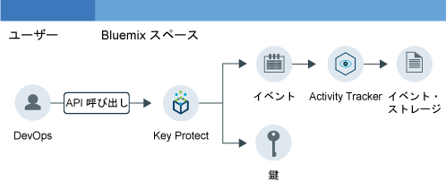

---

copyright:
  years: 2016, 2017

lastupdated: "2017-09-19"

---

{:shortdesc: .shortdesc}
{:new_window: target="_blank"}
{:codeblock: .codeblock}
{:screen: .screen}
{:pre: .pre}

# Key Protect アクティビティーのモニター
{: #kp_at}

アプリケーションが {{site.data.keyword.Bluemix}} 内の {{site.data.keyword.keymanagementservicelong_notm}} サービスとどのように対話するのかを {{site.data.keyword.cloudaccesstrailfull}} サービスを使用してトラッキングします。
{:shortdesc}

## Key Protect について
{: #about}

{{site.data.keyword.keymanagementserviceshort}} は、暗号鍵管理サービスです。{{site.data.keyword.keymanagementserviceshort}} サービスを使用して、{{site.data.keyword.Bluemix_notm}} 全体でアプリの暗号化鍵をプロビジョンできます。詳しくは、[Key Protect 概説](/docs/services/keymgmt/index.html#getting-started-with-key-protect)を参照してください。

暗号化鍵を管理するため、鍵の作成および削除を、{{site.data.keyword.Bluemix_notm}} UI を介して行うか、または、[IBM Key Protect API](https://docs-api-keyprotect.ng.bluemix.net/#/){: new_window} を使用してプログラマチックに行うことができます。

## 処理の流れ
{: #how}

{{site.data.keyword.Bluemix_notm}} 内で、{{site.data.keyword.keymanagementserviceshort}} サービスのアクティビティー証跡をモニターするには、{{site.data.keyword.keymanagementserviceshort}} サービスがプロビジョンされているのと同じスペース内で {{site.data.keyword.cloudaccesstrailshort}} サービスをプロビジョンする必要があります。両方のサービスがプロビジョンされ、実行中になった後、鍵の作成、読み取り、または削除を行うと、アクティビティー・イベントが生成され、{{site.data.keyword.cloudaccesstrailshort}} ログに自動的に収集されます。 

暗号化鍵の情報の機密性のため、{{site.data.keyword.keymanagementserviceshort}} サービスに対する API 呼び出しの結果としてイベントが生成される際、生成されるイベントには鍵に関する詳しい情報は含まれません。イベントには、クラウド環境で内部的に鍵を識別するために使用できる相関 ID が含まれます。相関 ID は、**responseHeader.content** フィールドの一部として返されるフィールドです。この情報は、暗号化鍵の機密データと、イベントを介して報告されたアクションの情報とを相関させるために使用します。

次の図は、さまざまなコンポーネントと、ユーザーが鍵を作成するための API 呼び出しを行ったときに起こるアクションを示します。

## API メソッド
{: #methods}

次の表に、呼び出されるとイベントを生成する {{site.data.keyword.keymanagementserviceshort}} API メソッドのリストを示します。

<table>
  <caption>表 1. API メソッド</caption>
  <tr>
    <th>メソッド</th>
	<th>説明</th>
  <tr>
  <tr>
    <td>GET /secrets</td>
	<td>secret を取得します</td>
  </tr>
  <tr>
    <td>POST /secrets</td>
	<td>secret を作成します</td>
  </tr>
  <tr>
    <td>DELETE /secrets/{id}</td>
	<td>ID によって secret を削除します</td>
  </tr>
  <tr>
    <td>GET /secrets/{id}</td>
	<td>ID によって secret を取得します</td>
  </tr>  
</table>

**注:** 「secret」は、暗号化鍵です。

 	
 	
## チュートリアル: クラウド内の IBM Key Protect アクティビティーのモニター
{: #tutorial1}

このチュートリアルでは、クラウド・サービス {{site.data.keyword.keymanagementservicelong_notm}} とユーザーとの対話をモニターする方法について説明します。 

このチュートリアルでは、{{site.data.keyword.keymanagementserviceshort}} (KP) でセキュリティー・キーを作成します。KP クラウド・サービスは、ユーザーが UI、CLI、または API のいずれかを介して鍵を作成すると {{site.data.keyword.cloudaccesstrailshort}} にイベントを送信するように有効化されています。鍵が作成された後、{{site.data.keyword.cloudaccesstrailshort}} UI を介して、および Kibana を介して、イベントをモニターできます。

このチュートリアルでは、以下を行う方法を説明します。

1. [{{site.data.keyword.keymanagementserviceshort}} サービスをプロビジョンする](/docs/services/cloud-activity-tracker/tutorials/key_protect.html#step1)
2. [{{site.data.keyword.cloudaccesstrailshort}} イベント・データを生成するため、{{site.data.keyword.keymanagementserviceshort}} でセキュリティー・キーを作成する](/docs/services/cloud-activity-tracker/tutorials/key_protect.html#step2)
3. [{{site.data.keyword.cloudaccesstrailshort}} イベントが生成されたことを {{site.data.keyword.Bluemix_notm}} UI を介して検証する](/docs/services/cloud-activity-tracker/tutorials/key_protect.html#step3)

### 前提条件
{: #assumptions}

{{site.data.keyword.cloudaccesstrailshort}} サービスがプロビジョンされた {{site.data.keyword.Bluemix_notm}} アカウントのスペース内で作業するために、開発者の許可がある {{site.data.keyword.Bluemix_notm}} ユーザー ID を持っていること。 

### ステップ 1: Activity Tracker をプロビジョンする
{: #step1}

アクティビティーをモニターしたいクラウド・サービスがプロビジョンされているのと同じ地域およびスペース内で {{site.data.keyword.cloudaccesstrailshort}} サービスをプロビジョンする必要があります。{{site.data.keyword.cloudaccesstrailshort}} サービスがプロビジョンされた後、そのスペース内にプロビジョンされた選択済みクラウド・サービスからイベントが自動的に収集されるようになります。{{site.data.keyword.cloudaccesstrailshort}} を通してアクティビティーをモニターできるサービスのリストについては、[サポートされるクラウド・サービス](/docs/services/cloud-activity-tracker/cloud_services.html#cloud_services)を参照してください。

**注:** このチュートリアルでは、クラウド・サービス {{site.data.keyword.keymanagementservicelong_notm}} とユーザーとの対話を {{site.data.keyword.cloudaccesstrailshort}} サービスを使用してモニターする方法について説明します。{{site.data.keyword.keymanagementserviceshort}} サービスは、米国南部で使用可能です。したがって、米国南部地域の、{{site.data.keyword.keymanagementserviceshort}} サービスが使用可能であるのと同じスペース内に、{{site.data.keyword.cloudaccesstrailshort}} をプロビジョンする必要があります。どの地域でサービスが使用可能なのかについては、[地域別のサービス](/docs/services/services_region.html#services_region)を参照してください。

{{site.data.keyword.Bluemix_notm}} 内で {{site.data.keyword.cloudaccesstraillong_notm}} サービスのインスタンスをプロビジョンするには、以下の手順を実行します。

1. {{site.data.keyword.Bluemix_notm}} アカウントにログインします。

    {{site.data.keyword.Bluemix_notm}} ダッシュボードは、[http://bluemix.net ](http://bluemix.net){:new_window} にあります。
    
	ユーザー ID とパスワードを使用してログインすると、{{site.data.keyword.Bluemix_notm}} UI が開きます。

2. **「カタログ」**をクリックします。{{site.data.keyword.Bluemix_notm}} で使用可能なサービスのリストが開きます。

3. **「セキュリティー」**カテゴリーを選択して、表示されたサービスのリストをフィルタリングします。

4. **Activity Tracker** タイルをクリックします。 

5. サービスがプロビジョンされる場所を定義する情報を構成します。 

    次の表に示されているようにデータを入力します。 

    <table>
	  <caption>表 1. {{site.data.keyword.cloudaccesstrailshort}} サービスをプロビジョンするために必要なフィールド</caption>
	  <tr>
	    <th width="50%">フィールド</th>
		<th width="50%">値</th>
	  </tr>
	  <tr>
	    <td>デプロイする地域の選択:</td>
		<td>米国南部</td>
	  </tr>
	  <tr>
	    <td>組織の選択:</td>
		<td>アクティビティーをモニターすることを計画している組織を選択します。</td>
	  </tr>
	  <tr>
	    <td>スペースの選択:</td>
		<td>アクティビティーをモニターすることを計画している、選択した組織内のスペースを選択します。</td>
	  </tr>
	</table>

6. **「作成」**をクリックして、ログインしている {{site.data.keyword.Bluemix_notm}} スペース内で {{site.data.keyword.cloudaccesstrailshort}} サービスをプロビジョンします。
   

### ステップ 2: Key Protect をプロビジョンする 
{: #step2}
	
以下の手順を実行して、{{site.data.keyword.Bluemix_notm}} 米国南部地域で {{site.data.keyword.keymanagementserviceshort}} サービスのインスタンスをプロビジョンします。

1. {{site.data.keyword.Bluemix_notm}} アカウントにログインします。

    {{site.data.keyword.Bluemix_notm}} ダッシュボードは、[http://bluemix.net ](http://bluemix.net){:new_window} にあります。
	
	ユーザー ID とパスワードを使用してログインすると、{{site.data.keyword.Bluemix_notm}} UI が開きます。

2. **「カタログ」**をクリックします。{{site.data.keyword.Bluemix_notm}} で使用可能なサービスのリストが開きます。

    **「セキュリティー」**カテゴリーを選択して、表示されたサービスのリストをフィルタリングします。

3. **Key Protect** タイルを選択します。

4. サービスがプロビジョンされる場所を定義する情報を構成します。 

    次の表に示されているようにデータを入力します。 

    <table>
	  <caption>表 2. {{site.data.keyword.keymanagementserviceshort}} サービスをプロビジョンするために必要なフィールド</caption>
	  <tr>
	    <th width="50%">フィールド</th>
		<th width="50%">値</th>
	  </tr>
	  <tr>
	    <td>デプロイする地域の選択:</td>
		<td>米国南部</td>
	  </tr>
	  <tr>
	    <td>組織の選択:</td>
		<td>{{site.data.keyword.cloudaccesstrailshort}} サービスをプロビジョンするよう選択した組織を選択します。</td>
	  </tr>
	  <tr>
	    <td>スペースの選択:</td>
		<td>{{site.data.keyword.cloudaccesstrailshort}} サービスをプロビジョンするよう選択したスペースを選択します。</td>
	  </tr>
	</table>

5. **「作成」**をクリックして、ログインしている {{site.data.keyword.Bluemix_notm}} スペース内で {{site.data.keyword.keymanagementserviceshort}} サービスをプロビジョンします。

### ステップ 3: Activity Tracker イベント・データを生成するため、Key Protect でセキュリティー・キーを作成する 
{: # step3}

以下の手順を実行して {{site.data.keyword.cloudaccesstrailshort}} イベントを生成します。

1. {{site.data.keyword.Bluemix_notm}} ダッシュボードから **Key Protect** サービスを選択します。{{site.data.keyword.keymanagementserviceshort}} ダッシュボードが開きます。次に、**「管理」**タブを選択します。

2. **「鍵の追加」**をクリックします。新しいウィンドウが開きます。

    

3. **「鍵の生成」**を選択し、以下の手順を実行します。

    * 鍵の名前を入力します (例: *MyFirstKey*)。

    * 鍵のアルゴリズムを選択します。

    * **「鍵の追加」**をクリックします。 

### ステップ 4: Activity Tracker イベントが生成されたことを Bluemix UI を介して検証する 
{: #step4}

イベントが作成されたことを検証します。

1. {{site.data.keyword.Bluemix_notm}} ダッシュボードから {{site.data.keyword.cloudaccesstrailshort}} サービスを選択します。このサービスのダッシュボードが開きます。

2. ビューを構成して、サービスをプロビジョンして鍵を追加したときに生成された {{site.data.keyword.keymanagementserviceshort}} イベントを検索します。

    * *「ログの表示」*フィールドで**「スペース・ログ」**を選択します。
    * *「検索フィールド」*フィールドで**「target.name」**を選択します。
    * *「フィルター」*フィールドに **ibm-key-protect** を入力します。
	
    表示されるデータは、過去 24 時間の使用可能な {{site.data.keyword.keymanagementserviceshort}} イベントに対応します。 

    

 	
 	
 	
 	

