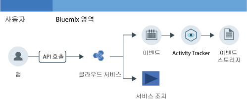

---

copyright:
  years: 2016, 2019
lastupdated: "2019-02-18"

---

{:new_window: target="_blank"}
{:shortdesc: .shortdesc}
{:screen: .screen}
{:pre: .pre}
{:table: .aria-labeledby="caption"}
{:codeblock: .codeblock}
{:tip: .tip}
{:download: .download}

# 시작하기
{: #getting-started-with-cla}

{{site.data.keyword.cloudaccesstrailfull}} 서비스는 {{site.data.keyword.Bluemix}} 내 서비스의 상태를 변경하는, 사용자가 시작한 활동을 기록합니다. {{site.data.keyword.cloudaccesstrailfull}} 서비스를 사용하여 사용자와 클라우드 서비스 간의 상호작용을 모니터하는 방법을 알아보십시오. 
{:shortdesc}

다음 그림은 사용자가 시작한 활동이 서비스의 상태를 변경하는 경우 발생하는 다양한 컴포넌트 및 조치를 보여줍니다.

**참고:** 이 시작하기에는 미국 남부의 클라우드 활동을 모니터하기 위해 시작하고 실행하는 방법이 표시됩니다.

## 시작하기 전에
{: #index_prereqs}

* {{site.data.keyword.cloudaccesstrailshort}} 서비스에 대해 읽으십시오. 자세한 정보는 [{{site.data.keyword.cloudaccesstrailshort}} 정보](/docs/services/cloud-activity-tracker/activity_tracker_ov.html#activity_tracker_ov)를 참조하십시오.
* 서비스가 사용 가능한 지역을 확인하십시오. 자세한 정보는 [지역](/docs/services/cloud-activity-tracker/activity_tracker_ov.html#activity_tracker_ov_regions)을 참조하십시오.
* {{site.data.keyword.cloud_notm}} 계정의 구성원 또는 소유자인 사용자 ID를 가져오십시오. 

    {{site.data.keyword.cloud_notm}} 사용자 ID를 가져오려면 [등록 ](https://cloud.ibm.com/login){:new_window}으로 이동하십시오.

## 1단계: {{site.data.keyword.cloudaccesstrailshort}} 프로비저닝
{: #index_step1}

{{site.data.keyword.cloudaccesstrailshort}} 서비스의 인스턴스를 프로비저닝할 위치를 선택하려면 다음 정보를 고려하십시오.

* {{site.data.keyword.cloudaccesstrailshort}}는 도메인에 이벤트를 수집합니다. 각 지역에는 계정 도메인이 있고, 각 Cloud Foundry(CF) 영역에는 영역 도메인이 있습니다. 

* **글로벌 계정 조치를 모니터하려면**, 미국 남부 지역의 영역에 {{site.data.keyword.cloudaccesstrailshort}} 서비스의 인스턴스를 프로비저닝해야 합니다. 글로벌 조치의 예는 인스턴스 프로비저닝, 사용자의 IAM 정책 변경 또는 계정으로 사용자 초대입니다.

* **CF 조직 및 영역의 컨텍스트에 프로비저닝된 서비스에 의해 생성되는 이벤트를 모니터하려면**, 모니터할 활동이 있는 서비스가 프로비저닝된 동일한 지역과 영역에 {{site.data.keyword.cloudaccesstrailshort}} 서비스의 인스턴스를 프로비저닝해야 합니다. 

* **리소스 그룹의 컨텍스트에 프로비저닝된 서비스에 의해 생성되는 이벤트를 모니터하려면**, 모니터할 활동이 있는 서비스가 프로비저닝된 동일한 지역의 영역에 {{site.data.keyword.cloudaccesstrailshort}} 서비스의 인스턴스를 프로비저닝해야 합니다. 

* 인스턴스를 프로비저닝하려면 사용자 ID가 {{site.data.keyword.cloudaccesstrailshort}} 서비스를 프로비저닝할 영역에서 **개발자 역할**을 가져야 합니다.

{{site.data.keyword.cloudaccesstraillong_notm}} 서비스의 인스턴스를 {{site.data.keyword.cloud_notm}}에 프로비저닝하려면 다음 단계를 완료하십시오.

1. [{{site.data.keyword.cloud_notm}} ](https://cloud.ibm.com/login){:new_window}.
    
	사용자 ID 및 비밀번호를 사용하여 로그인하면 {{site.data.keyword.cloud_notm}} UI가 열립니다.

2. **카탈로그**를 클릭하십시오. {{site.data.keyword.cloud_notm}}에서 사용 가능한 서비스의 목록이 열립니다.

3. **보안 및 ID** 카테고리를 선택하여 표시되는 서비스의 목록을 필터링하십시오.

    **참고:** 이 서비스는 **개발자 도구** 카테고리를 통해서도 사용할 수 있습니다.

4. **Activity Tracker** 타일을 클릭하십시오. 

5. 서비스가 프로비저닝될 위치를 정의하는 정보를 구성하십시오.

    예를 들어, 미국 남부 지역에 서비스를 프로비저닝하려면 다음 표에 표시된 대로 데이터를 입력하십시오. 

    <table>
	  <caption>표 1. {{site.data.keyword.cloudaccesstrailshort}} 서비스를 프로비저닝하는 데 필요한 필드</caption>
	  <tr>
	    <th width="50%">필드</th>
		<th width="50%">값</th>
	  </tr>
	  <tr>
	    <td>배치할 지역 선택:</td>
		<td>미국 남부</td>
	  </tr>
	  <tr>
	    <td>조직 선택:</td>
		<td>{{site.data.keyword.cloudaccesstrailshort}} 서비스를 프로비저닝할 조직을 선택하십시오.</td>
	  </tr>
	  <tr>
	    <td>영역 선택:</td>
		<td>{{site.data.keyword.cloudaccesstrailshort}} 서비스를 프로비저닝하기 위해 선택한 조직 내의 영역을 선택하십시오.</td>
	  </tr>
	</table>

6. 플랜을 선택하십시오. 

    기본적으로는 **Lite** 플랜이 선택되어 있습니다.

	자세한 정보는 [서비스 플랜](/docs/services/cloud-activity-tracker/activity_tracker_ov.html#activity_tracker_ov_plan)을 참조하십시오.

7. **작성**을 클릭하여 로그인되어 있는 영역에 {{site.data.keyword.cloudaccesstrailshort}} 서비스의 인스턴스를 프로비저닝하십시오.
   

## 2단계: 이벤트를 모니터할 수 있는 액세스 권한을 사용자에게 부여
{: #index_step2}

이벤트를 보려면 {{site.data.keyword.cloud_notm}}의 액세스 권한을 가져야 합니다. 권한은 글로벌 계정 이벤트, 리소스 그룹의 컨텍스트에 프로비저닝된 서비스에 대한 이벤트 또는 CF 조직 및 영역의 컨텍스트에 프로비저닝된 서비스에 대한 이벤트 중 어느 이벤트를 보려는 지에 따라 다릅니다. 

**글로벌 계정 조치를 모니터**하고 **리소스 그룹의 컨텍스트에 프로비저닝된 서비스를 모니터**하려면 다음 정보를 고려하십시오.

* {{site.data.keyword.loganalysisshort}} 서비스의 **독자** 역할이 있는 {{site.data.keyword.loganalysisshort}} 서비스에 대한 IAM 정책이 있어야 합니다. 
* {{site.data.keyword.loganalysisshort}} 서비스의 계정 소유자 또는 관리자는 이 정책을 부여할 수 있습니다.

**CF 조직 및 영역의 컨텍스트에 프로비저닝된 서비스를 모니터하려면**, 다음 정보를 고려하십시오.

* {{site.data.keyword.cloudaccesstrailshort}} 서비스의 인스턴스를 프로비저닝한 영역에 대한 **개발자** 역할이 있어야 합니다.
* 계정 소유자, 조직 관리자 또는 영역 관리자가 사용자에게 영역에 대한 **개발자** 역할을 부여할 수 있습니다.

**참고: 사용자에게 IAM 정책을 부여하려면 {{site.data.keyword.loganalysisshort}} 서비스의 계정 소유자 또는 관리자여야 합니다.**

### 계정 도메인 이벤트를 모니터할 수 있는 액세스 권한을 사용자에게 부여
{: #index_acc}

{{site.data.keyword.cloud_notm}} UI에서 IAM 정책을 사용자에게 부여하려면 다음 단계를 완료하십시오.

1. [{{site.data.keyword.cloud_notm}} 콘솔 ](https://cloud.ibm.com/login){:new_window}.

2. 메뉴 표시줄에서 **관리** &gt; **보안** &gt; **ID 및 액세스**를 클릭한 다음 **사용자**를 선택하십시오.
3. 액세스 권한을 지정할 사용자에 대한 행에서 **조치** 메뉴를 선택한 다음 **액세스 권한 지정**을 클릭하십시오.
4. **리소스에 대한 액세스 권한 지정**을 선택하십시오.
5. **로그 분석**을 선택하십시오.
6. **모든 지역**을 선택하십시오.
7. **모든 서비스 인스턴스**를 선택하십시오.
8. 서비스 역할 **독자**를 선택하십시오.
9. 지정을 클릭하십시오.

### 영역 도메인 이벤트를 모니터할 수 있는 액세스 권한을 사용자에게 부여
{: #index_space}

{{site.data.keyword.cloud_notm}} UI에서 영역의 개발자 역할을 사용자에게 부여하려면 다음 단계를 완료하십시오.

1. [{{site.data.keyword.cloud_notm}} 콘솔 ](https://cloud.ibm.com/login){:new_window}.
	
	사용자 ID 및 비밀번호를 사용하여 로그인하면 {{site.data.keyword.cloud_notm}} UI가 열립니다.

2. 메뉴 표시줄에서 **관리** &gt; **보안** &gt; **ID 및 액세스**를 클릭한 다음 **사용자**를 선택하십시오.

3. 사용자를 선택하십시오.

4. **Cloud Foundry 액세스 권한**을 선택하십시오.

5. 조직을 펼치십시오.

    해당 조직에서 사용 가능한 영역의 목록이 나열합니다.

6. 조치 메뉴에서 **조직 역할 편집**을 선택하십시오. *조직 역할* 필드에서 **감사자** 역할을 선택하십시오. 그런 다음 **역할 저장**을 클릭하십시오.

7. 영역을 선택하십시오. 

8. 조치 메뉴에서 **영역 역할 편집**을 선택하십시오. *영역 역할* 필드에서 **개발자** 역할을 선택하십시오. 그런 다음 **역할 저장**을 클릭하십시오.
	
7. **지정**을 클릭하십시오.

## 3단계: {{site.data.keyword.cloudaccesstrailshort}} 이벤트 생성
{: #index_step3}

{{site.data.keyword.cloudaccesstrailshort}} 서비스가 프로비저닝되면 선택된 클라우드 서비스로부터 자동으로 이벤트가 수집됩니다. {{site.data.keyword.cloudaccesstrailshort}} 이벤트를 생성하는 조치에 대한 정보를 포함해 {{site.data.keyword.cloudaccesstrailshort}}를 사용하여 모니터할 수 있는 서비스에 대해 자세히 알아보려면 [클라우드 서비스](/docs/services/cloud-activity-tracker/cloud_services.html#cloud_services)를 참조하십시오.

**참고:** 사용자가 {{site.data.keyword.BluVirtServers_short}} 및 {{site.data.keyword.baremetal_short}} {{site.data.keyword.cloudaccesstrailshort}} 이벤트를 생성하려면 사용자에게 IBM Cloud 콘솔의 인프라 리소스에 대한 액세스 권한이 있어야 합니다. 자세한 정보는 [{{site.data.keyword.cloudaccesstrailshort}}를 사용하여 {{site.data.keyword.BluVirtServers_short}} 및 {{site.data.keyword.baremetal_short}} 활동 모니터링](/docs/services/cloud-activity-tracker/tutorials/vsi.html#vsi)을 참조하십시오.

이벤트를 생성하는 방법에 대해 알아보려면 튜토리얼 [{{site.data.keyword.cloudaccesstrailshort}}를 사용하여 {{site.data.keyword.keymanagementserviceshort}} 활동 모니터링](/docs/services/cloud-activity-tracker/tutorials/kp.html#kp)을 참조하십시오.

## 4단계: 이벤트 보기
{: #index_step4}

{{site.data.keyword.cloud_notm}} UI에서 {{site.data.keyword.cloudaccesstrailshort}} 이벤트를 모니터할 수 있습니다. 또한 플랜을 Premium 플랜으로 업그레이드하여 Kibana를 통해 이벤트를 모니터할 수 있습니다. 

**글로벌 계정 조치를 모니터**하고 **리소스 그룹의 컨텍스트에 프로비저닝된 서비스를 모니터**하려면 다음 정보를 고려하십시오.

* 이벤트가 계정 도메인에 수집됩니다.

    지역마다 계정 도메인이 있습니다.

    글로벌 계정 조치는 미국 남부 계정 도메인에 수집됩니다.

    서비스에 대한 이벤트는 이 서비스의 인스턴스가 프로비저닝되는 지역의 계정 도메인에 수집됩니다.

* 계정 소유자는 {{site.data.keyword.cloud_notm}} UI를 통해 또는 Kibana에서 이벤트를 볼 수 있습니다.
* 다른 사용자는 Kibana를 통해 계정 도메인 이벤트만 볼 수 있습니다. 

**CF 조직 및 영역의 컨텍스트에 프로비저닝된 서비스를 모니터하려면**, 다음 정보를 고려하십시오.

* 이벤트가 영역 도메인에 수집됩니다. 
* 각 CF 영역은 {{site.data.keyword.cloudaccesstrailshort}} 영역 도메인과 연관되어 있습니다. 
* {{site.data.keyword.cloud_notm}} UI를 통해 또는 Kibana에서 이벤트를 볼 수 있습니다.

다음 표에서는 이벤트를 모니터해야 하는 {{site.data.keyword.cloudaccesstrailshort}} 도메인을 정의합니다.

| 모니터링                                                           | {{site.data.keyword.cloudaccesstrailshort}} 도메인 |  
|----------------------------------------------------------------------|----------------------------------------------------| 
| `글로벌 계정 조치`                                             | 미국 남부 계정 도메인                            |  
| `리소스 그룹의 컨텍스트에 프로비저닝된 서비스`   | 계정 도메인                                     | 
| `CF 조직 및 영역의 컨텍스트에 프로비저닝된 서비스` | 영역 도메인                                       | 
{: caption="표 1. 이벤트 소스당 {{site.data.keyword.cloudaccesstrailshort}} 도메인" caption-side="top"} 

이벤트를 보기 위해 다음 옵션 중 하나를 선택할 수 있습니다.

* [계정 내의 클라우드 활동을 모니터하기 위해 Activity Tracker 대시보드로 이동](/docs/services/cloud-activity-tracker/how-to/manage-events-ui/launch_at_ui.html#launch_at_ui_account_view_account) 
* [영역 내의 클라우드 활동을 모니터하기 위해 Activity Tracker 대시보드로 이동](/docs/services/cloud-activity-tracker/how-to/manage-events-ui/launch_at_ui.html#launch_at_ui_account_view_space) 
* [웹 브라우저에서 Kibana로 이동](/docs/services/cloud-activity-tracker/how-to/manage-events-ui/launch_kibana.html#launch_kibana).

튜토리얼의 단계를 완료하여 생성하는 이벤트를 보려면 [Activity Tracker 대시보드로 이동하여 계정의 클라우드 활동 모니터](/docs/services/cloud-activity-tracker/how-to/manage-events-ui/launch_at_ui.html#launch_at_ui_account_view_account)를 선택하십시오. 계정 소유자가 아닌 경우 서비스 플랜을 업그레이드하고 이벤트를 볼 수 있는 올바른 액세스 권한이 있는지 확인하십시오. 

## 다음 단계
{: #index_next_steps}

{{site.data.keyword.cloudaccesstrailshort}} CLI를 사용하여 명령행에서 이벤트를 관리하십시오. 자세한 정보는 [Activity Tracker CLI를 사용하여 이벤트 관리](/docs/services/cloud-activity-tracker/tutorials/manage_events_cli.html#tutorial2)를 참조하십시오.

