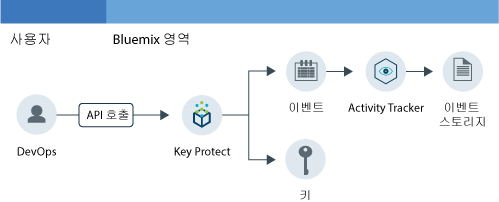

---

copyright:
  years: 2016, 2017

lastupdated: "2017-09-19"

---

{:shortdesc: .shortdesc}
{:new_window: target="_blank"}
{:codeblock: .codeblock}
{:screen: .screen}
{:pre: .pre}

# Key Protect 활동 모니터링
{: #kp_at}

{{site.data.keyword.cloudaccesstrailfull}} 서비스를 사용하여 애플리케이션이 {{site.data.keyword.Bluemix}}의 {{site.data.keyword.keymanagementservicelong_notm}} 서비스와 어떻게 상호작용하는지 추적하십시오.
{:shortdesc}

## Key Protect 정보
{: #about}

{{site.data.keyword.keymanagementserviceshort}}는 암호화 키 관리 서비스입니다. {{site.data.keyword.keymanagementserviceshort}} 서비스를 사용하여 {{site.data.keyword.Bluemix_notm}} 전체에서 앱에 대한 암호화된 키를 프로비저닝할 수 있습니다. 자세한 정보는 [Key Protect 시작하기](/docs/services/keymgmt/index.html#getting-started-with-key-protect)를 참조하십시오.

사용자는 {{site.data.keyword.Bluemix_notm}} UI를 통해 암호화된 키를 작성하고 삭제하거나, [IBM Key Protect API](https://docs-api-keyprotect.ng.bluemix.net/#/){: new_window}를 사용하여
프로그래밍 방식으로 암호화된 키를 작성하고 삭제함으로써 키를 관리할 수 있습니다. 

## 작동 방식
{: #how}

{{site.data.keyword.Bluemix_notm}}에서 {{site.data.keyword.keymanagementserviceshort}} 서비스의 활동 내역을 모니터하려면 {{site.data.keyword.keymanagementserviceshort}} 서비스가 프로비저닝된 영역에 {{site.data.keyword.cloudaccesstrailshort}} 서비스를 프로비저닝해야 합니다. 두 서비스가 모두 프로비저닝되어 실행되고 나면 키를 작성하거나, 읽거나 삭제할 때마다 활동 이벤트가 자동으로 생성되어 {{site.data.keyword.cloudaccesstrailshort}} 로그에 수집됩니다.  

암호화된 키에 대한 정보의 민감성으로 인해, {{site.data.keyword.keymanagementserviceshort}} 서비스에 대한 API 호출의 결과로 이벤트가 생성되는 경우
생성된 이벤트는 키에 대한 자세한 정보를 포함하지 않습니다. 이벤트에는 클라우드 환경에서 키를
내부적으로 식별하는 데 사용할 수 있는 상관 ID가 포함됩니다.상관 ID는 **responseHeader.content** 필드의 일부로 리턴되는 필드입니다.
이 정보를 사용하여 이벤트를 통해 보고된 조치의
정보와 암호화된 키의 민감한 데이터를 상관시킵니다.

다음 그림에는 사용자가 키 작성을 위해 API를 호출할 때 발생하는 여러
컴포넌트와 조치가 표시됩니다.

## API 메소드
{: #methods}

다음 표에는 메소드가 호출되는 경우 이벤트를 생성하는 {{site.data.keyword.keymanagementserviceshort}} API 메소드가 나열되어 있습니다. 

<table>
  <caption>표 1. API 메소드</caption>
  <tr>
    <th>메소드</th>
	<th>설명</th>
  <tr>
  <tr>
    <td>GET /secrets</td>
	<td>시크릿 검색</td>
  </tr>
  <tr>
    <td>POST /secrets</td>
	<td>시크릿 작성</td>
  </tr>
  <tr>
    <td>DELETE /secrets/{id}</td>
	<td>ID로 시크릿 삭제</td>
  </tr>
  <tr>
    <td>GET /secrets/{id}</td>
	<td>ID로 시크릿 검색</td>
  </tr>  
</table>

**참고:** 시크릿은 암호화된 키입니다. 

 	
 	
## 튜토리얼: 클라우드 내의 IBM Key Protect 활동 모니터링
{: #tutorial1}

이 튜토리얼을 통해 사용자와 클라우드 서비스 {{site.data.keyword.keymanagementservicelong_notm}} 간의 상호작용을 모니터하는 방법을 알아보십시오.  

이 튜토리얼에서는 {{site.data.keyword.keymanagementserviceshort}}(KP)에서 보안 키를 작성합니다. KP 클라우드 서비스는 사용자가 UI, CLI 또는 API를 통해 키를 작성하는 경우 {{site.data.keyword.cloudaccesstrailshort}}에 이벤트를 전송하도록 설정되었습니다. 키가 작성되고 나면 사용자는 {{site.data.keyword.cloudaccesstrailshort}} UI 및 Kibana를 통해 이벤트를 모니터할 수 있습니다. 

이 튜토리얼에서는 다음 작업의 수행 방법을 보여줍니다. 

1. [{{site.data.keyword.keymanagementserviceshort}} 서비스 프로비저닝](/docs/services/cloud-activity-tracker/tutorials/key_protect.html#step1)
2. [{{site.data.keyword.cloudaccesstrailshort}} 이벤트 데이터를 생성하기 위해 {{site.data.keyword.keymanagementserviceshort}} 에서 보안 키 작성](/docs/services/cloud-activity-tracker/tutorials/key_protect.html#step2)
3. [{{site.data.keyword.Bluemix_notm}} UI를 통해 {{site.data.keyword.cloudaccesstrailshort}} 이벤트의 생성 여부 확인](/docs/services/cloud-activity-tracker/tutorials/key_protect.html#step3)

### 가정
{: #assumptions}

{{site.data.keyword.cloudaccesstrailshort}} 서비스가 프로비저닝되는 {{site.data.keyword.Bluemix_notm}} 계정의 영역에서 작업할 수 있는 개발자 권한을 가진 {{site.data.keyword.Bluemix_notm}} 사용자 ID가 있습니다.  

### 1단계: Activity Tracker 프로비저닝
{: #step1}

모니터하려는 활동이 프로비저닝되는 클라우드 서비스와 동일한 영역 및 지역에서 {{site.data.keyword.cloudaccesstrailshort}} 서비스를 프로비저닝해야 합니다. {{site.data.keyword.cloudaccesstrailshort}} 서비스가 프로비저닝되면 해당 영역에 프로비저닝되어 있는, 선택된 클라우드 서비스로부터 자동으로 이벤트가 수집됩니다. {{site.data.keyword.cloudaccesstrailshort}}을 통해 활동을 모니터할 수 있는 서비스의 목록은 [지원되는 클라우드 서비스](/docs/services/cloud-activity-tracker/cloud_services.html#cloud_services)를 참조하십시오. 

**참고:** 이 튜토리얼은 {{site.data.keyword.cloudaccesstrailshort}} 서비스를 사용하여 사용자와 클라우드 서비스 {{site.data.keyword.keymanagementservicelong_notm}} 간의 상호작용을 모니터하는 방법을 보여줍니다. {{site.data.keyword.keymanagementserviceshort}} 서비스는 미국 남부에서 사용 가능합니다. 따라서 {{site.data.keyword.cloudaccesstrailshort}}은 미국 남부 지역에서 {{site.data.keyword.keymanagementserviceshort}} 서비스를 사용할 수 있는 동일한 영역에서 프로비저닝해야 합니다. 특정 서비스를 사용할 수 있는 지역에 대한 정보를 확인하려면 [지역별 서비스](/docs/services/services_region.html#services_region)를 참조하십시오. 

{{site.data.keyword.Bluemix_notm}}에서 {{site.data.keyword.cloudaccesstraillong_notm}} 서비스의 인스턴스를 프로비저닝하려면 다음 단계를 완료하십시오. 

1. {{site.data.keyword.Bluemix_notm}} 계정에 로그인하십시오. 

    {{site.data.keyword.Bluemix_notm}} 대시보드는 [http://bluemix.net ](http://bluemix.net){:new_window}에 있습니다. 
    
	사용자 ID 및 비밀번호를 사용하여 로그인하면 {{site.data.keyword.Bluemix_notm}} UI가 열립니다. 

2. **카탈로그**를 클릭하십시오. {{site.data.keyword.Bluemix_notm}}에서 사용 가능한 서비스의 목록이 열립니다. 

3. **보안** 카테고리를 선택하여 표시되는 서비스의 목록을 필터링하십시오. 

4. **Activity Tracker** 타일을 클릭하십시오.  

5. 서비스가 프로비저닝될 위치를 정의하는 정보를 구성하십시오.  

    다음 표에 표시된 대로 데이터를 입력하십시오.  

    <table>
	  <caption>표 1. {{site.data.keyword.cloudaccesstrailshort}} 서비스를 프로비저닝하는 데 필요한 필드</caption>
	  <tr>
	    <th width="50%">필드</th>
		<th width="50%">값</th>
	  </tr>
	  <tr>
	    <td>배치할 지역 선택:</td>
		<td>미국 남부</td>
	  </tr>
	  <tr>
	    <td>조직 선택:</td>
		<td>활동을 모니터할 조직을 선택하십시오. </td>
	  </tr>
	  <tr>
	    <td>영역 선택:</td>
		<td>활동을 모니터하기 위해 선택한 조직 내의 영역을 선택하십시오. </td>
	  </tr>
	</table>

6. **작성**을 클릭하여 로그인되어 있는 {{site.data.keyword.Bluemix_notm}} 영역에서 {{site.data.keyword.cloudaccesstrailshort}} 서비스를 프로비저닝하십시오. 
   

### 2단계: Key Protect 프로비저닝 
{: #step2}
	
{{site.data.keyword.Bluemix_notm}} 미국 남부 지역에 {{site.data.keyword.keymanagementserviceshort}} 서비스의 인스턴스를 프로비저닝하려면 다음 단계를 완료하십시오. 

1. {{site.data.keyword.Bluemix_notm}} 계정에 로그인하십시오. 

    {{site.data.keyword.Bluemix_notm}} 대시보드는 [http://bluemix.net ](http://bluemix.net){:new_window}에 있습니다. 
	
	사용자 ID 및 비밀번호를 사용하여 로그인하면 {{site.data.keyword.Bluemix_notm}} UI가 열립니다. 

2. **카탈로그**를 클릭하십시오. {{site.data.keyword.Bluemix_notm}}에서 사용 가능한 서비스의 목록이 열립니다. 

    **보안** 카테고리를 선택하여 표시되는 서비스의 목록을 필터링하십시오. 

3. **Key Protect** 타일을 선택하십시오. 

4. 서비스가 프로비저닝될 위치를 정의하는 정보를 구성하십시오.  

    다음 표에 표시되어 있는 바와 같이 데이터를 입력하십시오.  

    <table>
	  <caption>표 2. {{site.data.keyword.keymanagementserviceshort}} 서비스를 프로비저닝하는 데 필요한 필드</caption>
	  <tr>
	    <th width="50%">필드</th>
		<th width="50%">값</th>
	  </tr>
	  <tr>
	    <td>배치할 지역 선택:</td>
		<td>미국 남부</td>
	  </tr>
	  <tr>
	    <td>조직 선택:</td>
		<td>{{site.data.keyword.cloudaccesstrailshort}} 서비스를 프로비저닝하기 위해 선택한 조직을 선택하십시오. </td>
	  </tr>
	  <tr>
	    <td>영역 선택:</td>
		<td>{{site.data.keyword.cloudaccesstrailshort}} 서비스를 프로비저닝하기 위해 선택한 영역을 선택하십시오. </td>
	  </tr>
	</table>

5. **작성**을 클릭하여 로그인되어 있는 {{site.data.keyword.Bluemix_notm}} 영역에서 {{site.data.keyword.keymanagementserviceshort}} 서비스를 프로비저닝하십시오. 

### 3단계: Activity Tracker 이벤트 데이터를 생성하기 위해 Key Protect에서 보안 키 작성 
{: # step3}

{{site.data.keyword.cloudaccesstrailshort}} 이벤트를 생성하려면 다음 단계를 완료하십시오. 

1. {{site.data.keyword.Bluemix_notm}} 대시보드에서 **Key Protect** 서비스를 선택하십시오. {{site.data.keyword.keymanagementserviceshort}} 대시보드가 열립니다. 그런 다음 **관리** 탭을 선택하십시오. 

2. **키 추가**를 클릭하십시오. 새 창이 열립니다. 

    

3. **키 생성**을 선택하고 다음 단계를 완료하십시오. 

    * *MyFirstKey*와 같이 키의 이름을 입력하십시오. 

    * 키의 알고리즘을 선택하십시오. 

    * **키 추가**를 클릭하십시오.  

### 4단계: Bluemix UI를 통해 Activity Tracker 이벤트의 생성 여부 확인 
{: #step4}

이벤트가 작성되었는지 확인하십시오. 

1. {{site.data.keyword.Bluemix_notm}} 대시보드에서 {{site.data.keyword.cloudaccesstrailshort}} 서비스를 선택하십시오. 서비스 대시보드가 열립니다. 

2. 서비스를 프로비저닝하고 키를 추가했을 때 생성된 {{site.data.keyword.keymanagementserviceshort}} 이벤트를 검색하도록 보기를 구성하십시오. 

    * *로그 보기* 필드에서 **영역 로그**를 선택하십시오. 
    * *검색 필드* 필드에서 **target.name**을 선택하십시오. 
    * *필터* 필드에 **ibm-key-protect**를 입력하십시오. 
	
    표시되는 데이터는 최근 24시간 동안 사용 가능한 {{site.data.keyword.keymanagementserviceshort}} 이벤트에 해당합니다.  

    

 	
 	
 	
 	

