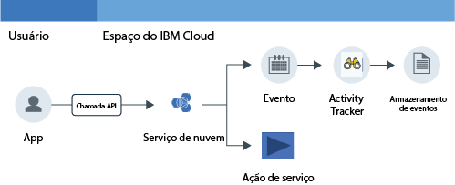

---

copyright: years: 2016, 2017 lastupdated: "2017-09-17"

---

{:new_window: target="_blank"}
{:shortdesc: .shortdesc}
{:screen: .screen}
{:codeblock: .codeblock}
{:pre: .pre}

# Tutorial Introdução
{: #getting-started-with-cla}

O serviço {{site.data.keyword.cloudaccesstrailfull}} registra atividades iniciadas pelo usuário que mudam o estado de um serviço na nuvem {{site.data.keyword.IBM}}. Use este tutorial para aprender como usar o serviço {{site.data.keyword.cloudaccesstrailfull}} para monitorar a interação de um usuário com um serviço de nuvem.
{:shortdesc}

Os objetivos deste tutorial de introdução são os seguintes:

1. Mostrar como provisionar o serviço {{site.data.keyword.cloudaccesstrailshort}}.
2. Mostrar como usar um serviço de nuvem para gerar eventos de atividade que são coletados automaticamente pelo serviço {{site.data.keyword.cloudaccesstrailshort}}. Os eventos obedecem ao padrão Cloud Auditing Data Federation (CADF).
3. Mostrar como monitorar a atividade de nuvem de um serviço usando os painéis predefinidos do {{site.data.keyword.cloudaccesstrailshort}}.

A figura a seguir mostra os diferentes componentes e ações que ocorrem quando uma atividade iniciada pelo usuário muda o estado de um serviço:

## Antes de Começar
{: #prereqs}

Crie um [{{site.data.keyword.Bluemix_notm}} conta](https://console.bluemix.net/registration/). Seu ID do usuário deve ser um membro ou proprietário de uma conta do {{site.data.keyword.Bluemix_notm}}, com permissões de desenvolvedor no espaço em que você planeja usar o serviço {{site.data.keyword.cloudaccesstrailshort}}.

## Etapa 1: Provisionar o Activity Tracker
{: #step1}

Deve-se provisionar o serviço {{site.data.keyword.cloudaccesstrailshort}} na mesma região e espaço em que o serviço Cloud cuja atividade você deseja monitorar é provisionado. Após o serviço {{site.data.keyword.cloudaccesstrailshort}} ser provisionado, os eventos são coletados automaticamente de serviços de Nuvem selecionados que são provisionados nesse espaço. Veja [Serviços de nuvem suportados](/docs/services/cloud-activity-tracker/cloud_services.html#cloud_services) para obter uma lista de serviços cuja atividade é possível monitorar por meio do {{site.data.keyword.cloudaccesstrailshort}}.

**Nota:** este tutorial mostra como usar o serviço {{site.data.keyword.cloudaccesstrailshort}} para monitorar a interação com o usuário com o serviço de Nuvem {{site.data.keyword.keymanagementservicelong_notm}}. O serviço {{site.data.keyword.keymanagementserviceshort}} está disponível no Sul dos EUA. Portanto, deve-se provisionar o {{site.data.keyword.cloudaccesstrailshort}} na região Sul dos EUA, no mesmo espaço no qual o serviço {{site.data.keyword.keymanagementserviceshort}} está disponível. Para ver informações sobre em qual região um serviço está disponível, veja [Serviços por região](/docs/services/services_region.html#services_region).

Conclua as etapas a seguir para provisionar uma instância do serviço {{site.data.keyword.cloudaccesstraillong_notm}} no {{site.data.keyword.Bluemix_notm}}:

1. Efetue login em sua conta do {{site.data.keyword.Bluemix_notm}}.

    O painel do {{site.data.keyword.Bluemix_notm}} pode ser localizado em: [http://bluemix.net ](http://bluemix.net){:new_window}.
    
	Depois de efetuar login com seu ID de usuário e senha, a UI do {{site.data.keyword.Bluemix_notm}} é aberta.

2. Clique em **Catálogo**. A lista dos serviços que estão disponíveis no {{site.data.keyword.Bluemix_notm}} é aberta.

3. Selecione a categoria **Segurança** para filtrar a lista de serviços que é exibida.

4. Clique no tile **Activity Tracker**. 

5. Configure as informações que definem onde o serviço será provisionado. 

    Insira os dados conforme indicado na tabela a seguir: 

    <table>
	  <caption>Tabela 1. Campos que são necessários para provisionar o serviço {{site.data.keyword.cloudaccesstrailshort}}</caption>
	  <tr>
	    <th width="50%">Campo</th>
		<th width="50%">Valor</th>
	  </tr>
	  <tr>
	    <td>Selecionar região para implementar em:</td>
		<td>Sul dos EUA</td>
	  </tr>
	  <tr>
	    <td>Escolha uma organização:</td>
		<td>Selecione a organização na qual você planeja monitorar a atividade.</td>
	  </tr>
	  <tr>
	    <td>Escolha um espaço:</td>
		<td>Selecione o espaço na organização que você selecionou no qual planeja monitorar a atividade.</td>
	  </tr>
	</table>

6. Clique em **Criar** para provisionar o serviço do {{site.data.keyword.cloudaccesstrailshort}} no espaço do {{site.data.keyword.Bluemix_notm}} no qual você está com login efetuado.
   

## Etapa 2: provisionar um serviço de nuvem 
{: #step2}
	
Conclua as etapas a seguir para provisionar uma instância do serviço {{site.data.keyword.keymanagementserviceshort}} na região Sul dos EUA do {{site.data.keyword.Bluemix_notm}}:

1. Efetue login em sua conta do {{site.data.keyword.Bluemix_notm}}.

    O painel do {{site.data.keyword.Bluemix_notm}} pode ser localizado em: [http://bluemix.net ](http://bluemix.net){:new_window}
	
	Depois de efetuar login com seu ID de usuário e senha, a UI do {{site.data.keyword.Bluemix_notm}} é aberta.

2. Clique em **Catálogo**. A lista dos serviços que estão disponíveis no {{site.data.keyword.Bluemix_notm}} é aberta.

    Selecione a categoria **Segurança** para filtrar a lista de serviços que é exibida.

3. Selecione o tile **Key Protect**.

4. Configure as informações que definem onde o serviço será provisionado. 

    Insira os dados conforme indicado na tabela a seguir: 

    <table>
	  <caption>Tabela 2. Campos que são necessários para provisionar o serviço {{site.data.keyword.keymanagementserviceshort}}</caption>
	  <tr>
	    <th width="50%">Campo</th>
		<th width="50%">Valor</th>
	  </tr>
	  <tr>
	    <td>Selecionar região para implementar em:</td>
		<td>Sul dos EUA</td>
	  </tr>
	  <tr>
	    <td>Escolha uma organização:</td>
		<td>Selecione a organização que você escolheu para provisionar o serviço {{site.data.keyword.cloudaccesstrailshort}}.</td>
	  </tr>
	  <tr>
	    <td>Escolha um espaço:</td>
		<td>Selecione o espaço que você escolheu para provisionar o serviço {{site.data.keyword.cloudaccesstrailshort}}.</td>
	  </tr>
	</table>

5. Clique em **Criar** para provisionar o serviço do {{site.data.keyword.keymanagementserviceshort}} no espaço do {{site.data.keyword.Bluemix_notm}} no qual você está com login efetuado.

## Etapa 3: gerar um evento do Activity Tracker
{: # step3}

Nesta etapa, crie uma chave de segurança usando o serviço {{site.data.keyword.keymanagementserviceshort}} para gerar dados do evento do {{site.data.keyword.cloudaccesstrailshort}}. 

Conclua as etapas a seguir para gerar um evento do {{site.data.keyword.cloudaccesstrailshort}}:

1. No painel do {{site.data.keyword.Bluemix_notm}}, selecione o serviço **Key Protect**. O painel do {{site.data.keyword.keymanagementserviceshort}} é aberto. Em seguida, selecione a guia **Gerenciar**.

2. Clique em **Incluir Chave**. Uma nova janela é aberta.

3. Selecione **Gerar chave** e conclua as etapas a seguir:

    * Insira um nome para a chave, por exemplo, *MyFirstKey*.

    * Escolha um algoritmo para a chave.

    * Clique em **Incluir chave**. 
	
Os eventos do {{site.data.keyword.cloudaccesstrailshort}} são gerados como resultado da criação de uma chave.

## Etapa 4: monitorar um evento do Activity Tracker
{: #step4}

Nesta etapa, verifique por meio da UI do {{site.data.keyword.Bluemix_notm}} se os eventos do {{site.data.keyword.cloudaccesstrailshort}} são gerados.

Conclua as etapas a seguir para verificar se um evento foi criado:

1. No Painel do {{site.data.keyword.Bluemix_notm}}, selecione o serviço {{site.data.keyword.cloudaccesstrailshort}}. O painel do serviço é aberto.

2. Configure a visualização para procurar eventos do {{site.data.keyword.keymanagementserviceshort}} que foram gerados quando você provisionou o serviço e incluiu uma chave.

    * Selecione **Logs de espaço** para o campo *Visualizar logs*.
    * Selecione **target.name** para o campo *Campo de procura*.
    * Insira **ibm-key-protect** no campo *Filtrar*.
	
    Os dados que são exibidos mostram eventos do {{site.data.keyword.keymanagementserviceshort}} que estão disponíveis para as últimas 24 horas. 
	
	

## Etapas Seguintes
{: #next_steps}

Em seguida, use o painel Kibana predefinido do {{site.data.keyword.cloudaccesstrailshort}} para monitorar e analisar logs de eventos. Para ativar o Kibana, veja [Navegando para o painel Kibana](/docs/services/cloud-activity-tracker/how-to/manage-events-ui/launch_kibana.html#launch_kibana). 

Por padrão, no Kibana os logs de atividades do espaço são exibidos por meio do painel **ActivityTracker_Space_Search_in_24h**:

Também é possível usar a CLI do {{site.data.keyword.cloudaccesstrailshort}} para gerenciar seus eventos por meio da linha de comandos. Para obter mais informações, veja [Visualizando informações de evento](/docs/services/cloud-activity-tracker/how-to/manage-events-cli/viewing_event_information.html#viewing_event_status).

                                                                                                                      

