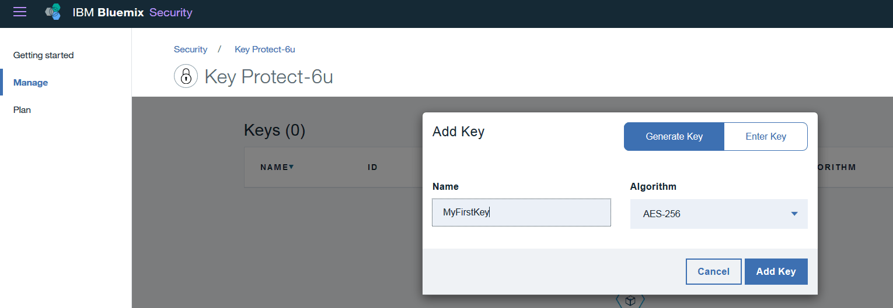

---

copyright:
  years: 2016, 2017

lastupdated: "2017-09-19"

---

{:shortdesc: .shortdesc}
{:new_window: target="_blank"}
{:codeblock: .codeblock}
{:screen: .screen}
{:pre: .pre}

# Monitorando a atividade Key Protect
{: #kp_at}

Use o serviço {{site.data.keyword.cloudaccesstrailfull}} para controlar como os aplicativos interagem com o serviço {{site.data.keyword.keymanagementservicelong_notm}} no {{site.data.keyword.Bluemix}}.
{:shortdesc}

## Sobre o Key Protect
{: #about}

O {{site.data.keyword.keymanagementserviceshort}} é um serviço de gerenciamento de chave de criptografia. É possível usar o serviço {{site.data.keyword.keymanagementserviceshort}} para provisionar chaves criptografadas para apps no {{site.data.keyword.Bluemix_notm}}. Para obter mais informações, consulte [Introdução ao Key Protect](/docs/services/keymgmt/index.html#getting-started-with-key-protect).

Para gerenciar chaves criptografadas, é possível criar e excluir chaves por meio da UI do {{site.data.keyword.Bluemix_notm}} ou programaticamente usando a [API do IBM Key Protect](https://docs-api-keyprotect.ng.bluemix.net/#/){: new_window}.

## Como funciona
{: #how}

No {{site.data.keyword.Bluemix_notm}}, para monitorar a trilha de atividade para o serviço {{site.data.keyword.keymanagementserviceshort}}, deve-se provisionar o serviço {{site.data.keyword.cloudaccesstrailshort}} no mesmo espaço em que o serviço {{site.data.keyword.keymanagementserviceshort}} é provisionado. Depois que ambos os serviços são provisionados e estão em execução, os eventos de atividade são gerados e automaticamente coletados no log do {{site.data.keyword.cloudaccesstrailshort}} ao criar, ler ou excluir uma chave. 

Devido ao sigilo das informações para uma chave criptografada, quando um evento é gerado como resultado de uma chamada API para o serviço {{site.data.keyword.keymanagementserviceshort}}, o evento gerado não inclui informações detalhadas sobre a chave. O evento inclui um ID de correlação que pode ser usado para identificar a chave internamente em seu ambiente de nuvem. O ID de correlação é um campo retornado como parte do campo **responseHeader.content**. Você usa essas informações para correlacionar os dados sensíveis da chave criptografada com as informações da ação relatada por meio do evento.

A figura a seguir mostra os diferentes componentes e ações que ocorrem quando um usuário faz uma chamada API para criar uma chave:

## Métodos de API
{: #methods}

A tabela a seguir lista os métodos de API do {{site.data.keyword.keymanagementserviceshort}} que geram um evento quando eles são chamados:

<table>
  <caption>Tabela 1. Métodos de API</caption>
  <tr>
    <th>Método</th>
	<th>Descrição</th>
  <tr>
  <tr>
    <td>GET/segredos </td>
	<td>Recuperar segredos</td>
  </tr>
  <tr>
    <td>POST/segredos </td>
	<td>Criar um segredo</td>
  </tr>
  <tr>
    <td>DELETE/segredos/{id}</td>
	<td>Excluir um segredo por ID</td>
  </tr>
  <tr>
    <td>GET/segredos/{id} </td>
	<td>Recuperar um segredo por ID</td>
  </tr>  
</table>

**Nota:** um segredo é uma chave criptografada.

 	
 	
## Tutorial: monitorar atividade do IBM Key Protect na nuvem
{: #tutorial1}

Use este tutorial para aprender como é possível monitorar a interação de um usuário com o serviço de nuvem {{site.data.keyword.keymanagementservicelong_notm}}. 

Neste tutorial, você cria uma chave de segurança no {{site.data.keyword.keymanagementserviceshort}} (KP). O serviço de nuvem KP foi ativado para enviar eventos para o {{site.data.keyword.cloudaccesstrailshort}} quando um usuário cria uma chave ou por meio da UI, CLI ou API. Após a criação da chave, é possível monitorar os eventos por meio da UI do {{site.data.keyword.cloudaccesstrailshort}} e por meio do Kibana.

Este tutorial mostrará como:

1. [Provisionar o serviço {{site.data.keyword.keymanagementserviceshort}}](/docs/services/cloud-activity-tracker/tutorials/key_protect.html#step1)
2. [Criar uma chave de segurança no {{site.data.keyword.keymanagementserviceshort}} para gerar dados do evento do {{site.data.keyword.cloudaccesstrailshort}}](/docs/services/cloud-activity-tracker/tutorials/key_protect.html#step2)
3. [Verificar por meio da UI do {{site.data.keyword.Bluemix_notm}} se os eventos do {{site.data.keyword.cloudaccesstrailshort}} são gerados ](/docs/services/cloud-activity-tracker/tutorials/key_protect.html#step3)

### Suposições
{: #assumptions}

Você tem um ID do usuário do {{site.data.keyword.Bluemix_notm}} que tem permissões de desenvolvedor para trabalhar em um espaço de uma conta do {{site.data.keyword.Bluemix_notm}} em que o serviço {{site.data.keyword.cloudaccesstrailshort}} é provisionado. 

### Etapa 1: Provisionar o Activity Tracker
{: #step1}

Deve-se provisionar o serviço {{site.data.keyword.cloudaccesstrailshort}} na mesma região e espaço em que o serviço Cloud cuja atividade você deseja monitorar é provisionado. Após o serviço {{site.data.keyword.cloudaccesstrailshort}} ser provisionado, os eventos são coletados automaticamente de serviços de Nuvem selecionados que são provisionados nesse espaço. Veja [Serviços de nuvem suportados](/docs/services/cloud-activity-tracker/cloud_services.html#cloud_services) para obter uma lista de serviços cuja atividade é possível monitorar por meio do {{site.data.keyword.cloudaccesstrailshort}}.

**Nota:** este tutorial mostra como usar o serviço {{site.data.keyword.cloudaccesstrailshort}} para monitorar a interação com o usuário com o serviço de Nuvem {{site.data.keyword.keymanagementservicelong_notm}}. O serviço {{site.data.keyword.keymanagementserviceshort}} está disponível no Sul dos EUA. Portanto, deve-se provisionar o {{site.data.keyword.cloudaccesstrailshort}} na região Sul dos EUA, no mesmo espaço no qual o serviço {{site.data.keyword.keymanagementserviceshort}} está disponível. Para ver informações sobre em qual região um serviço está disponível, veja [Serviços por região](/docs/services/services_region.html#services_region).

Conclua as etapas a seguir para provisionar uma instância do serviço {{site.data.keyword.cloudaccesstraillong_notm}} no {{site.data.keyword.Bluemix_notm}}:

1. Efetue login em sua conta do {{site.data.keyword.Bluemix_notm}}.

    O painel do {{site.data.keyword.Bluemix_notm}} pode ser localizado em: [http://bluemix.net ](http://bluemix.net){:new_window}.
    
	Após você efetuar login com o seu ID do usuário e senha, a UI do {{site.data.keyword.Bluemix_notm}} será aberta.

2. Clique em **Catálogo**. A lista de serviços disponíveis no {{site.data.keyword.Bluemix_notm}} será aberta.

3. Selecione a categoria **Segurança** para filtrar a lista de serviços que é exibida.

4. Clique no tile **Activity Tracker**. 

5. Configure as informações que definem onde o serviço será provisionado. 

    Insira os dados conforme indicado na tabela a seguir: 

    <table>
	  <caption>Tabela 1. Campos que são necessários para provisionar o serviço {{site.data.keyword.cloudaccesstrailshort}}</caption>
	  <tr>
	    <th width="50%">Campo</th>
		<th width="50%">Valor</th>
	  </tr>
	  <tr>
	    <td>Selecionar região para implementar em:</td>
		<td>Sul dos EUA</td>
	  </tr>
	  <tr>
	    <td>Escolha uma organização:</td>
		<td>Selecione a organização na qual você planeja monitorar a atividade.</td>
	  </tr>
	  <tr>
	    <td>Escolha um espaço:</td>
		<td>Selecione o espaço na organização que você selecionou no qual planeja monitorar a atividade.</td>
	  </tr>
	</table>

6. Clique em **Criar** para provisionar o serviço do {{site.data.keyword.cloudaccesstrailshort}} no espaço do {{site.data.keyword.Bluemix_notm}} no qual você está com login efetuado.
   

### Etapa 2: provisionar o Key Protect 
{: #step2}
	
Conclua as etapas a seguir para provisionar uma instância do serviço {{site.data.keyword.keymanagementserviceshort}} na região Sul dos EUA do {{site.data.keyword.Bluemix_notm}}:

1. Efetue login em sua conta do {{site.data.keyword.Bluemix_notm}}.

    O painel do {{site.data.keyword.Bluemix_notm}} pode ser localizado em: [http://bluemix.net ](http://bluemix.net){:new_window}
	
	Após você efetuar login com o seu ID do usuário e senha, a UI do {{site.data.keyword.Bluemix_notm}} será aberta.

2. Clique em **Catálogo**. A lista de serviços disponíveis no {{site.data.keyword.Bluemix_notm}} será aberta.

    Selecione a categoria **Segurança** para filtrar a lista de serviços que é exibida.

3. Selecione o tile **Key Protect**.

4. Configure as informações que definem onde o serviço será provisionado. 

    Insira os dados conforme indicado na tabela a seguir: 

    <table>
	  <caption>Tabela 2. Campos que são necessários para provisionar o serviço {{site.data.keyword.keymanagementserviceshort}}</caption>
	  <tr>
	    <th width="50%">Campo</th>
		<th width="50%">Valor</th>
	  </tr>
	  <tr>
	    <td>Selecionar região para implementar em:</td>
		<td>Sul dos EUA</td>
	  </tr>
	  <tr>
	    <td>Escolha uma organização:</td>
		<td>Selecione a organização que você escolheu para provisionar o serviço {{site.data.keyword.cloudaccesstrailshort}}.</td>
	  </tr>
	  <tr>
	    <td>Escolha um espaço:</td>
		<td>Selecione o espaço que você escolheu para provisionar o serviço {{site.data.keyword.cloudaccesstrailshort}}.</td>
	  </tr>
	</table>

5. Clique em **Criar** para provisionar o serviço do {{site.data.keyword.keymanagementserviceshort}} no espaço do {{site.data.keyword.Bluemix_notm}} no qual você está com login efetuado.

### Etapa 3: criar uma chave de segurança no Key Protect para gerar dados do evento do Activity Tracker 
{: # step3}

Conclua as etapas a seguir para gerar um evento do {{site.data.keyword.cloudaccesstrailshort}}:

1. No painel do {{site.data.keyword.Bluemix_notm}}, selecione o serviço **Key Protect**. O painel do {{site.data.keyword.keymanagementserviceshort}} é aberto. Em seguida, selecione a guia **Gerenciar**.

2. Clique em **Incluir Chave**. Uma nova janela é aberta.

    

3. Selecione **Gerar chave** e conclua as etapas a seguir:

    * Insira um nome para a chave, por exemplo, *MyFirstKey*.

    * Escolha um algoritmo para a chave.

    * Clique em **Incluir chave**. 

### Etapa 4: verificar por meio da UI do Bluemix se os eventos do Activity Tracker são gerados 
{: #step4}

Verifique se um evento foi criado:

1. No Painel do {{site.data.keyword.Bluemix_notm}}, selecione o serviço {{site.data.keyword.cloudaccesstrailshort}}. O painel do serviço é aberto.

2. Configure a visualização para procurar eventos do {{site.data.keyword.keymanagementserviceshort}} que foram gerados quando você provisionou o serviço e incluiu uma chave.

    * Selecione **Logs de espaço** para o campo *Visualizar logs*.
    * Selecione **target.name** para o campo *Campo de procura*.
    * Insira **ibm-key-protect** no campo *Filtro*.
	
    Os dados que são exibidos correspondem a eventos do {{site.data.keyword.keymanagementserviceshort}} que estão disponíveis para as últimas 24 horas. 

    

 	
 	
 	
 	

