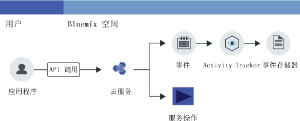

---

copyright:
  years: 2016, 2019
lastupdated: "2019-03-06"

keywords: IBM Cloud, Activity Tracker, getting started

subcollection: cloud-activity-tracker

---

{:new_window: target="_blank"}
{:shortdesc: .shortdesc}
{:screen: .screen}
{:pre: .pre}
{:table: .aria-labeledby="caption"}
{:codeblock: .codeblock}
{:tip: .tip}
{:download: .download}
{:important: .important}
{:note: .note}

# 入门教程
{: #getting-started}

{{site.data.keyword.cloudaccesstrailfull}} 服务会记录用户发起的用于在 {{site.data.keyword.cloud_notm}} 中更改服务状态的活动。了解如何使用 {{site.data.keyword.cloudaccesstrailfull}} 服务来监视用户与云服务的交互。
{:shortdesc}

下图显示用户发起的活动更改服务状态时涉及的不同组件和操作：

**注：**此教程将为您展示如何快速入门和熟悉运用以监视美国南部的云活动。

## 开始之前
{: #gs_prereqs}

* 请阅读有关 {{site.data.keyword.cloudaccesstrailshort}} 服务的信息。有关更多信息，请参阅[关于 {{site.data.keyword.cloudaccesstrailshort}}](/docs/services/cloud-activity-tracker?topic=cloud-activity-tracker-activity_tracker_ov#activity_tracker_ov)。
* 查看提供该服务的区域。有关更多信息，请参阅[区域](/docs/services/cloud-activity-tracker?topic=cloud-activity-tracker-activity_tracker_ov#activity_tracker_ov_regions)。
* 获取 {{site.data.keyword.cloud_notm}} 帐户的成员或所有者的用户标识。[在此处注册 ](https://cloud.ibm.com/login){:new_window}

## 步骤 1. 供应 {{site.data.keyword.cloudaccesstrailshort}}
{: #gs_step1}

考虑以下信息以选择供应 {{site.data.keyword.cloudaccesstrailshort}} 服务实例的位置：

* {{site.data.keyword.cloudaccesstrailshort}} 将事件收集到域中。每个区域都有一个帐户域，并且每个 Cloud Foundry (CF) 空间都有一个空间域。 

* **要监视全局帐户操作**，必须在美国南部区域的空间中供应 {{site.data.keyword.cloudaccesstrailshort}} 服务的实例。全局操作的一些示例包括：供应实例、更改用户的 IAM 策略或邀请用户加入帐户。

* **要监视 CF 组织和空间上下文中供应的服务所生成的事件**，必须在要监视其活动的服务供应所在相同区域和空间中供应 {{site.data.keyword.cloudaccesstrailshort}} 服务实例。 

* **要监视资源组上下文中供应的服务所生成的事件**，必须在要监视其活动的服务供应所在相同区域的空间中供应 {{site.data.keyword.cloudaccesstrailshort}} 服务实例。 

* 要供应实例，您的 userID 在计划供应 {{site.data.keyword.cloudaccesstrailshort}} 服务的空间中必须具有 **developer 角色**。

要在 {{site.data.keyword.cloud_notm}} 中供应 {{site.data.keyword.cloudaccesstraillong_notm}} 服务的实例，请完成以下步骤：

1. [登录到 {{site.data.keyword.cloud_notm}} "外部链接图标")](https://cloud.ibm.com/login){:new_window}。

    使用您的用户标识和密码登录后，{{site.data.keyword.cloud_notm}} UI 会打开。

2. 单击**目录**。这将打开 {{site.data.keyword.cloud_notm}} 上可用的服务的列表。

3. 选择**安全性和身份**类别以过滤显示的服务列表。

    **注：**该服务还在**开发者工具**类别中提供。

4. 单击 **Activity Tracker** 磁贴。 

5. 配置用于定义要供应服务的位置的信息。

    例如，要在美国南部区域供应该服务，请输入下表中指示的数据： 

    <table>
	  <caption>表 1. 供应 {{site.data.keyword.cloudaccesstrailshort}} 服务所必需的字段</caption>
	  <tr>
	    <th width="50%">字段</th>
		<th width="50%">值</th>
	  </tr>
	  <tr>
	    <td>选择要在其中部署的区域：</td>
		<td>美国南部</td>
	  </tr>
	  <tr>
	    <td>选择组织：</td>
		<td>选择计划用于供应 {{site.data.keyword.cloudaccesstrailshort}} 服务的组织。</td>
	  </tr>
	  <tr>
	    <td>选择空间：</td>
		<td>选择计划用于供应 {{site.data.keyword.cloudaccesstrailshort}} 服务的空间。</td>
	  </tr>
	</table>

6. 选择套餐。 

    缺省情况下，会选择**轻量**套餐。

	有关更多信息，请参阅[服务套餐](/docs/services/cloud-activity-tracker?topic=cloud-activity-tracker-activity_tracker_ov#activity_tracker_ov_plan)。

7. 单击**创建**以在登录到的空间中供应 {{site.data.keyword.cloudaccesstrailshort}} 服务的实例。
   

## 步骤 2. 授予用户访问权以监视事件
{: #gs_step2}

要查看事件，您在 {{site.data.keyword.cloud_notm}} 中必须具有访问许可权。根据您是要查看全局帐户事件、在资源组上下文中供应的服务的事件，还是在 CF 组织和空间上下文中供应的服务的事件，许可权也会所有不同。 

**要监视全局帐户操作**以及**监视在资源组上下文中供应的服务**，请考虑以下信息：

* 针对具有 **reader** 角色的 {{site.data.keyword.loganalysisshort}} 服务，必须具有该 {{site.data.keyword.loganalysisshort}} 服务的 IAM 策略。 
* {{site.data.keyword.loganalysisshort}} 服务的帐户所有者或管理员可以授予此策略。

**要监视在 CF 组织和空间上下文中供应的服务**，请考虑以下信息：

* 针对在其中供应 {{site.data.keyword.cloudaccesstrailshort}} 服务实例的空间，您必须具有 **developer** 角色。
* 帐户所有者、组织管理员或空间管理员可以向您授予此空间的 **developer** 角色。

**注：要为用户授予 IAM 策略，您必须是 {{site.data.keyword.loganalysisshort}} 服务的帐户所有者或管理员。**

### 授予用户访问权以监视帐户域事件
{: #gs_acc}

要通过 {{site.data.keyword.cloud_notm}} UI 来为用户授予 IAM 策略，请完成以下步骤：

1. [登录到 {{site.data.keyword.cloud_notm}} 控制台 ](https://cloud.ibm.com/login){:new_window}。
2. 在菜单栏中，单击**管理** &gt; **安全性** &gt; **身份和访问权**，然后选择**用户**。
3. 在要为其分配访问权的用户所在的行中，选择**操作**菜单，然后单击**分配访问权**。
4. 选择**分配对资源的访问权**。
5. 选择**日志分析**。
6. 选择**所有区域**。
7. 选择**所有服务实例**。
8. 选择服务角色 **Reader**。
9. 单击“分配”。

### 授予用户访问权以监视空间域事件
{: #gs_space}

要通过 {{site.data.keyword.cloud_notm}} UI 为用户授予空间中的 developer 角色，请完成以下步骤：

1. [登录到 {{site.data.keyword.cloud_notm}} 控制台 ](https://cloud.ibm.com/login){:new_window}。
	
    使用您的用户标识和密码登录后，{{site.data.keyword.cloud_notm}} UI 会打开。

2. 在菜单栏中，单击**管理** &gt; **安全性** &gt; **身份和访问权**，然后选择**用户**。

3. 选择用户。

4. 选择 **Cloud Foundry 访问权**。

5. 展开组织。

    这将列出该组织中可用的空间。

6. 从操作菜单中，选择**编辑组织角色**。为*组织角色*字段选择**审计员**角色。然后，单击**保存角色**。

7. 选择空间。 

8. 从操作菜单中，选择**编辑空间角色**。为*空间角色*字段选择 **Developer** 角色。然后，单击**保存角色**。
	
7. 单击**分配**。

## 步骤 3. 生成 {{site.data.keyword.cloudaccesstrailshort}} 事件
{: #gs_step3}

供应 {{site.data.keyword.cloudaccesstrailshort}} 服务后，将从所选云服务中自动收集事件。要了解有关使用 {{site.data.keyword.cloudaccesstrailshort}} 可以监视的服务的更多信息，包括有关生成 {{site.data.keyword.cloudaccesstrailshort}} 事件的操作的信息，请查看[云服务](/docs/services/cloud-activity-tracker?topic=cloud-activity-tracker-cloud_services#cloud_services)。

**注：**要使用户能够生成 {{site.data.keyword.BluVirtServers_short}} 和 {{site.data.keyword.baremetal_short}} {{site.data.keyword.cloudaccesstrailshort}} 事件，该用户必须有权访问 IBM Cloud 控制台中的基础架构资源。有关更多信息，请参阅[使用 {{site.data.keyword.cloudaccesstrailshort}} 来监视 {{site.data.keyword.BluVirtServers_short}} 和 {{site.data.keyword.baremetal_short}} 活动](/docs/services/cloud-activity-tracker/tutorials?topic=cloud-activity-tracker-vsi#vsi)。

要了解如何生成事件，请完成教程[使用 {{site.data.keyword.cloudaccesstrailshort}} 监视 {{site.data.keyword.keymanagementserviceshort}} 活动](/docs/services/cloud-activity-tracker/tutorials?topic=cloud-activity-tracker-kp#kp)。

## 步骤 4. 查看事件
{: #gs_step4}

在 {{site.data.keyword.cloud_notm}} UI 中您可以监视 {{site.data.keyword.cloudaccesstrailshort}} 事件。还可以将您的套餐升级为高端套餐以通过 Kibana 监视事件。 

**要监视全局帐户操作**以及**监视在资源组上下文中供应的服务**，请考虑以下信息：

* 事件在帐户域中收集。

    每个区域都有一个帐户域。

    全局帐户操作在美国南部帐户域中收集。

    服务的事件在此服务的实例供应所在区域的帐户域中收集。

* 帐户所有者可以通过 {{site.data.keyword.cloud_notm}} UI 或 Kibana 来查看事件。
* 其他用户只能通过 Kibana 来查看帐户域事件。 

**要监视在 CF 组织和空间上下文中供应的服务**，请考虑以下信息：

* 事件在空间域中收集。 
* 每个 CF 空间都有一个关联的 {{site.data.keyword.cloudaccesstrailshort}} 空间域。 
* 可以通过 {{site.data.keyword.cloud_notm}} UI 或 Kibana 来查看事件。

下表定义了必须在其中监视事件的 {{site.data.keyword.cloudaccesstrailshort}} 域：

| 监视                                                           | {{site.data.keyword.cloudaccesstrailshort}} 域 |  
|----------------------------------------------------------------------|----------------------------------------------------| 
| `全局帐户操作`                                             | 美国南部帐户域                            |  
| `在资源组上下文中供应的服务`   | 帐户域                                     | 
| `在 CF 组织和空间上下文中供应的服务` | 空间域                               | 
{: caption="表 1. 每个事件源的 {{site.data.keyword.cloudaccesstrailshort}} 域" caption-side="top"} 

要查看事件，可以选择以下其中一个选项：

* [导航至 Activity Tracker 仪表板以监视帐户中的云活动](/docs/services/cloud-activity-tracker/how-to/manage-events-ui?topic=cloud-activity-tracker-launch_at_ui#launch_at_ui_account_view_account) 
* [导航至 Activity Tracker 仪表板以监视空间中的云活动](/docs/services/cloud-activity-tracker/how-to/manage-events-ui?topic=cloud-activity-tracker-launch_at_ui#launch_at_ui_account_view_space) 
* [通过 Web 浏览器导航至 Kibana](/docs/services/cloud-activity-tracker/how-to/manage-events-ui?topic=cloud-activity-tracker-launch_kibana#launch_kibana)。

要查看通过完成该教程中的步骤生成的事件，请选择[导航至 Activity Tracker 仪表板以监视帐户中的云活动](/docs/services/cloud-activity-tracker/how-to/manage-events-ui?topic=cloud-activity-tracker-launch_at_ui#launch_at_ui_account_view_account)。如果您不是帐户所有者，请更新服务套餐并查看您是否具有查看事件的正确访问许可权。 

## 后续步骤
{: #gs_next_steps}

使用 {{site.data.keyword.cloudaccesstrailshort}} CLI 通过命令行来管理事件。有关更多信息，请参阅[使用 Activity Tracker CLI 来管理事件](/docs/services/cloud-activity-tracker/tutorials?topic=cloud-activity-tracker-tutorial2#tutorial2)。

