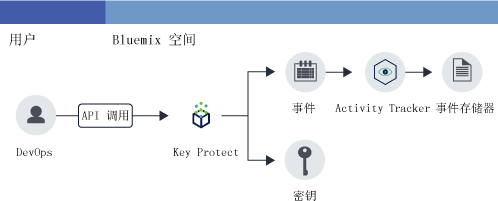

---

copyright:
  years: 2016, 2017

lastupdated: "2017-09-19"

---

{:shortdesc: .shortdesc}
{:new_window: target="_blank"}
{:codeblock: .codeblock}
{:screen: .screen}
{:pre: .pre}

# 监视 Key Protect 活动
{: #kp_at}

使用 {{site.data.keyword.cloudaccesstrailfull}} 服务可跟踪应用程序与 {{site.data.keyword.Bluemix}} 中 {{site.data.keyword.keymanagementservicelong_notm}} 服务交互的方式。
{:shortdesc}

## 关于 Key Protect
{: #about}

{{site.data.keyword.keymanagementserviceshort}} 是一个加密密钥管理服务。可以使用 {{site.data.keyword.keymanagementserviceshort}} 服务为 {{site.data.keyword.Bluemix_notm}} 中的应用程序供应加密密钥。有关更多信息，请参阅 [Key Protect 入门](/docs/services/keymgmt/index.html#getting-started-with-key-protect)。

要管理加密密钥，可通过 {{site.data.keyword.Bluemix_notm}} UI 或使用 [IBM Key Protect API](https://docs-api-keyprotect.ng.bluemix.net/#/){: new_window} 以编程方式创建和删除密钥。

## 工作原理
{: #how}

在 {{site.data.keyword.Bluemix_notm}} 中，要监视 {{site.data.keyword.keymanagementserviceshort}} 服务的活动跟踪，必须在供应 {{site.data.keyword.keymanagementserviceshort}} 服务的同一空间中供应 {{site.data.keyword.cloudaccesstrailshort}} 服务。在这两项服务都已供应并开始运行后，创建、读取或删除密钥时，会生成活动事件并在 {{site.data.keyword.cloudaccesstrailshort}} 日志中自动收集这些事件。 

由于加密密钥的信息十分敏感，因此对 {{site.data.keyword.keymanagementserviceshort}} 服务发起 API 调用而生成事件时，生成的事件并不包含有关该密钥的详细信息。事件中包含可用于在云环境中内部标识密钥的相关标识。“相关标识”是作为 **responseHeader.content** 字段的一部分返回的字段。使用此信息可将加密密钥的敏感数据与通过事件报告的操作的信息关联。

下图显示用户执行 API 调用以创建密钥时出现的不同组件和操作：

## API 方法
{: #methods}

下表列出为了生成事件而调用的 {{site.data.keyword.keymanagementserviceshort}} API 方法：

<table>
  <caption>表 1. API 方法</caption>
  <tr>
    <th>方法</th>
	<th>描述</th>
  <tr>
  <tr>
    <td>GET /secrets</td>
	<td>检索密钥</td>
  </tr>
  <tr>
    <td>POST /secrets</td>
	<td>创建密钥</td>
  </tr>
  <tr>
    <td>DELETE /secrets/{id}</td>
	<td>按标识删除密钥</td>
  </tr>
  <tr>
    <td>GET /secrets/{id}</td>
	<td>按标识检索密钥</td>
  </tr>  
</table>

**注：**密钥为加密密钥。

 	
 	
## 教程：在云中监视 IBM Key Protect 活动
{: #tutorial1}

使用本教程可了解如何监视用户与云服务 {{site.data.keyword.keymanagementservicelong_notm}} 的交互。 

在本教程中，您将在 {{site.data.keyword.keymanagementserviceshort}} (KP) 中创建安全密钥。已允许 KP 云服务在用户通过 UI、CLI 或 API 创建密钥时，将事件发送到 {{site.data.keyword.cloudaccesstrailshort}}。创建密钥后，可以通过 {{site.data.keyword.cloudaccesstrailshort}} UI 以及通过 Kibana 来监视事件。

本教程将说明如何执行以下操作：

1. [供应 {{site.data.keyword.keymanagementserviceshort}} 服务](/docs/services/cloud-activity-tracker/tutorials/key_protect.html#step1)
2. [在 {{site.data.keyword.keymanagementserviceshort}} 中创建安全密钥以生成 {{site.data.keyword.cloudaccesstrailshort}} 事件数据](/docs/services/cloud-activity-tracker/tutorials/key_protect.html#step2)
3. [通过 {{site.data.keyword.Bluemix_notm}} UI 验证是否已生成 {{site.data.keyword.cloudaccesstrailshort}} 事件](/docs/services/cloud-activity-tracker/tutorials/key_protect.html#step3)

### 假定
{: #assumptions}

您有 {{site.data.keyword.Bluemix_notm}} 用户标识，该用户标识具有开发者许可权，可以在供应 {{site.data.keyword.cloudaccesstrailshort}} 服务的 {{site.data.keyword.Bluemix_notm}} 帐户的空间中工作。 

### 步骤 1：供应 Activity Tracker
{: #step1}

必须在供应要监视其活动的云服务所在的区域和空间中供应 {{site.data.keyword.cloudaccesstrailshort}} 服务。供应 {{site.data.keyword.cloudaccesstrailshort}} 服务后，将从该空间中供应的所选云服务中自动收集事件。有关可通过 {{site.data.keyword.cloudaccesstrailshort}} 监视其活动的服务的列表，请参阅[支持的云服务](/docs/services/cloud-activity-tracker/cloud_services.html#cloud_services)。

**注：**本教程说明如何使用 {{site.data.keyword.cloudaccesstrailshort}} 服务来监视用户与云服务 {{site.data.keyword.keymanagementservicelong_notm}} 的交互。{{site.data.keyword.keymanagementserviceshort}} 服务在美国南部可用。因此，您必须在美国南部区域中 {{site.data.keyword.keymanagementserviceshort}} 服务可用的空间中供应 {{site.data.keyword.cloudaccesstrailshort}}。要查看有关服务在哪个区域中可用的信息，请参阅[按区域列出的服务](/docs/services/services_region.html#services_region)。

要在 {{site.data.keyword.Bluemix_notm}} 中供应 {{site.data.keyword.cloudaccesstraillong_notm}} 服务的实例，请完成以下步骤：

1. 登录到您的 {{site.data.keyword.Bluemix_notm}} 帐户。

    可在以下地址找到 {{site.data.keyword.Bluemix_notm}}“仪表板”：[http://bluemix.net ](http://bluemix.net){:new_window}。
    
	使用您的用户标识和密码登录后，{{site.data.keyword.Bluemix_notm}} UI 会打开。

2. 单击**目录**。这将打开 {{site.data.keyword.Bluemix_notm}} 上可用的服务的列表。

3. 选择**安全性**类别以过滤显示的服务列表。

4. 单击 **Activity Tracker** 磁贴。 

5. 配置用于定义要供应服务的位置的信息。 

    如下表所示输入数据： 

    <table>
	  <caption>表 1. 供应 {{site.data.keyword.cloudaccesstrailshort}} 服务所必需的字段</caption>
	  <tr>
	    <th width="50%">字段</th>
		<th width="50%">值</th>
	  </tr>
	  <tr>
	    <td>选择要在其中部署的区域：</td>
		<td>美国南部</td>
	  </tr>
	  <tr>
	    <td>选择组织：</td>
		<td>选择您计划监视其活动的组织。</td>
	  </tr>
	  <tr>
	    <td>选择空间：</td>
		<td>选择所选组织中您计划监视其活动的空间。</td>
	  </tr>
	</table>

6. 单击**创建**以在您登录到的 {{site.data.keyword.Bluemix_notm}} 空间中供应 {{site.data.keyword.cloudaccesstrailshort}} 服务。
   

### 步骤 2：供应 Key Protect 
{: #step2}
	
要在 {{site.data.keyword.Bluemix_notm}} 美国南部区域中供应 {{site.data.keyword.keymanagementserviceshort}} 服务的实例，请完成以下步骤：

1. 登录到您的 {{site.data.keyword.Bluemix_notm}} 帐户。

    可在以下地址找到 {{site.data.keyword.Bluemix_notm}}“仪表板”：[http://bluemix.net ](http://bluemix.net){:new_window}。
	
	使用您的用户标识和密码登录后，{{site.data.keyword.Bluemix_notm}} UI 会打开。

2. 单击**目录**。这将打开 {{site.data.keyword.Bluemix_notm}} 上可用的服务的列表。

    选择**安全性**类别以过滤显示的服务列表。

3. 选择 **Key Protect** 磁贴。

4. 配置用于定义要供应服务的位置的信息。 

    如下表所示输入数据： 

    <table>
	  <caption>表 2. 供应 {{site.data.keyword.keymanagementserviceshort}} 服务所必需的字段</caption>
	  <tr>
	    <th width="50%">字段</th>
		<th width="50%">值</th>
	  </tr>
	  <tr>
	    <td>选择要在其中部署的区域：</td>
		<td>美国南部</td>
	  </tr>
	  <tr>
	    <td>选择组织：</td>
		<td>选择已选中用于供应 {{site.data.keyword.cloudaccesstrailshort}} 服务的组织。</td>
	  </tr>
	  <tr>
	    <td>选择空间：</td>
		<td>选择已选中用于供应 {{site.data.keyword.cloudaccesstrailshort}} 服务的空间。</td>
	  </tr>
	</table>

5. 单击**创建**以在您登录到的 {{site.data.keyword.Bluemix_notm}} 空间中供应 {{site.data.keyword.keymanagementserviceshort}} 服务。

### 步骤 3：在 Key Protect 中创建安全密钥以生成 Activity Tracker 事件数据 
{: # step3}

要生成 {{site.data.keyword.cloudaccesstrailshort}} 事件，请完成以下步骤：

1. 在 {{site.data.keyword.Bluemix_notm}}“仪表板”中，选择 **Key Protect** 服务。这将打开 {{site.data.keyword.keymanagementserviceshort}} 仪表板。然后，选择**管理**选项卡。

2. 单击**添加密钥**。这将打开一个新窗口。

    

3. 选择**生成密钥**，然后完成以下步骤：

    * 输入密钥的名称，例如 *MyFirstKey*。

    * 为密钥选择算法。

    * 单击**添加密钥**。 

### 步骤 4：通过 Bluemix UI 验证是否已生成 Activity Tracker 事件 
{: #step4}

验证是否已创建事件：

1. 在 {{site.data.keyword.Bluemix_notm}}“仪表板”中，选择 {{site.data.keyword.cloudaccesstrailshort}} 服务。这将打开该服务仪表板。

2. 将该视图配置为搜索在供应该服务并添加密钥时已生成的 {{site.data.keyword.keymanagementserviceshort}} 事件。

    * 对于*查看日志*字段，选择**空间日志**。
    * 对于*搜索字段*字段，选择 **target.name**。
    * 在*过滤器*字段中，输入 **ibm-key-protect**。
	
    显示的数据对应于最近 24 小时可用的 {{site.data.keyword.keymanagementserviceshort}} 事件。 

    

 	
 	
 	
 	

