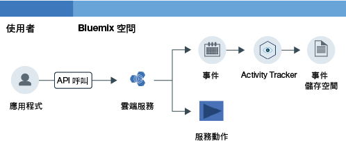

---

copyright:
  years: 2016, 2019
lastupdated: "2019-04-25"

---

{:new_window: target="_blank"}
{:shortdesc: .shortdesc}
{:screen: .screen}
{:pre: .pre}
{:table: .aria-labeledby="caption"}
{:codeblock: .codeblock}
{:tip: .tip}
{:download: .download}
{:deprecated: .deprecated}

# 開始使用
{: #getting-started-with-cla}

{{site.data.keyword.cloudaccesstrailfull}} 服務會記錄使用者起始的活動，這些活動會在 {{site.data.keyword.Bluemix}} 中變更服務的狀態。學習如何使用 {{site.data.keyword.cloudaccesstrailfull}} 服務來監視使用者與雲端服務的互動。
{:shortdesc}

{{site.data.keyword.cloudaccesstrailfull}} 已淘汰。從 2019 年 5 月 9 日開始，您無法佈建新的 {{site.data.keyword.cloudaccesstrailshort}} 實例，並將移除對*精簡* 方案實例的存取。現有的超值方案實例將支援到 2019 年 9 月 30 日為止。若要繼續監視 {{site.data.keyword.cloud_notm}} 帳戶的活動，請佈建 [{{site.data.keyword.at_full}}](/docs/services/Activity-Tracker-with-LogDNA?topic=logdnaat-getting-started#getting-started) 的實例。
{: deprecated}

下圖顯示當使用者起始的活動變更服務的狀態時，發生的不同元件和動作：

**附註：**此入門指導教學將會示範如何開始在美國南部監視雲端活動。

## 開始之前
{: #index_prereqs}

* 查看 {{site.data.keyword.cloudaccesstrailshort}} 服務。如需相關資訊，請參閱[關於 {{site.data.keyword.cloudaccesstrailshort}}](/docs/services/cloud-activity-tracker/activity_tracker_ov.html#activity_tracker_ov)。
* 查看提供該服務的地區。如需相關資訊，請參閱[地區](/docs/services/cloud-activity-tracker/activity_tracker_ov.html#activity_tracker_ov_regions)。
* 取得具有 {{site.data.keyword.cloud_notm}} 帳戶成員或擁有者身分的使用者 ID。 

    若要取得 {{site.data.keyword.cloud_notm}} 使用者 ID，請移至：[登錄 ](https://cloud.ibm.com/login){:new_window}。

## 步驟 1：佈建 {{site.data.keyword.cloudaccesstrailshort}}
{: #index_step1}

請考量下列資訊，以選擇要將 {{site.data.keyword.cloudaccesstrailshort}} 服務的實例佈建在哪裡：

* {{site.data.keyword.cloudaccesstrailshort}} 會將事件收集至網域中。每個地區各有一個帳戶網域，而每個 Cloud Foundry (CF) 空間各有一個空間網域。 

* **若要監視廣域帳戶動作**，您必須在美國南部地區的空間中佈建 {{site.data.keyword.cloudaccesstrailshort}} 服務的實例。廣域動作的部分範例如下：佈建實例、變更使用者的 IAM 原則，或是邀請使用者加入帳戶。

* **若要監視佈建在 CF 組織和空間環境定義中的服務所產生的事件**，您必須將 {{site.data.keyword.cloudaccesstrailshort}} 服務的實例佈建在您要監視其活動之服務佈建所在的相同地區和空間中。 

* **若要監視佈建在資源群組環境定義中的服務所產生的事件**，您必須將 {{site.data.keyword.cloudaccesstrailshort}} 服務的實例佈建在您要監視其活動之服務佈建所在的相同地區的空間中。 

* 若要佈建實例，您的使用者 ID 必須具有您計劃佈建 {{site.data.keyword.cloudaccesstrailshort}} 服務之空間中的**開發人員角色**。

請完成下列步驟，以在 {{site.data.keyword.cloud_notm}} 中佈建 {{site.data.keyword.cloudaccesstraillong_notm}} 服務的實例：

1. [登入 {{site.data.keyword.cloud_notm}} ](https://cloud.ibm.com/login){:new_window}。
    
	使用您的使用者 ID 及密碼登入之後，會開啟 {{site.data.keyword.cloud_notm}} 使用者介面。

2. 按一下**型錄**。即會開啟 {{site.data.keyword.cloud_notm}} 上可用的服務清單。

3. 選取**安全和身分**種類，以過濾顯示的服務清單。

    **附註：**服務也提供於**開發人員工具**種類。

4. 按一下 **Activity Tracker** 磚。 

5. 配置定義將佈建服務之處的資訊。

    例如，若要在美國南部地區佈建服務，請依照下表的指示輸入資料： 

    <table>
	  <caption>表 1. 佈建 {{site.data.keyword.cloudaccesstrailshort}} 服務所需的欄位</caption>
	  <tr>
	    <th width="50%">欄位</th>
		<th width="50%">值</th>
	  </tr>
	  <tr>
	    <td>選取要部署在哪個地區：</td>
		<td>美國南部</td>
	  </tr>
	  <tr>
	    <td>選擇組織：</td>
		<td>選取您計劃要在其中佈建 {{site.data.keyword.cloudaccesstrailshort}} 服務的組織。</td>
	  </tr>
	  <tr>
	    <td>選擇空間：</td>
		<td>在您已選取的組織中選取計劃佈建 {{site.data.keyword.cloudaccesstrailshort}} 服務的空間。</td>
	  </tr>
	</table>

6. 選取方案。 

    依預設會選取**精簡**方案。

	如需相關資訊，請參閱[服務方案](/docs/services/cloud-activity-tracker/activity_tracker_ov.html#activity_tracker_ov_plan)。

7. 按一下**建立**，以在您登入的空間中佈建 {{site.data.keyword.cloudaccesstrailshort}} 服務的實例。
   

## 步驟 2：為使用者授與監視事件的存取權
{: #index_step2}

若要檢視事件，您必須具有 {{site.data.keyword.cloud_notm}} 中的存取權。依據您是要檢視廣域帳戶事件、佈建在資源群組環境定義中之服務的事件，還是佈建在 CF 組織和空間環境定義中之服務的事件，所需的存取權各不相同。 

**若要監視廣域帳戶動作**以及**監視佈建在資源群組環境定義中的服務**，請考量下列資訊：

* 您必須具有 {{site.data.keyword.loganalysisshort}} 服務的 IAM 原則，以及 {{site.data.keyword.loganalysisshort}} 服務的**讀者**角色。 
* 帳戶擁有者或 {{site.data.keyword.loganalysisshort}} 服務的管理者可以授與此原則。

**若要監視佈建在 CF 組織和空間環境定義中的服務**，請考量下列資訊：

* 您必須具有已佈建 {{site.data.keyword.cloudaccesstrailshort}} 服務實例之空間的**開發人員**角色。
* 帳戶擁有者、組織管理員或空間管理員可以為您授與空間的**開發人員**角色。

**附註：若要為使用者授與 IAM 原則，您必須是帳戶擁有者或 {{site.data.keyword.loganalysisshort}} 服務的管理者。**

### 為使用者授與監視帳戶網域事件的存取權
{: #index_acc}

請完成下列步驟，從 {{site.data.keyword.cloud_notm}} 使用者介面為使用者授與 IAM 原則：

1. [登入 {{site.data.keyword.cloud_notm}} 主控台 ](https://cloud.ibm.com/login){:new_window}。

2. 從功能表列按一下**管理** &gt; **安全** &gt; **身分及存取**，然後選取**使用者**。
3. 從您要指派存取權的使用者列中，選取**動作**功能表，然後按一下**指派存取權**。
4. 選取**指派對資源的存取權**。
5. 選取 **Log Analysis**。
6. 選取**所有地區**。
7. 選取**所有服務實例**。
8. 選取服務角色：**讀者**。
9. 按一下「指派」。

### 為使用者授與監視空間網域事件的存取權
{: #index_space}

若要從 {{site.data.keyword.cloud_notm}} 使用者介面為使用者授與空間中的開發人員角色，請完成下列步驟：

1. [登入 {{site.data.keyword.cloud_notm}} 主控台 ](https://cloud.ibm.com/login){:new_window}。
	
	使用您的使用者 ID 及密碼登入之後，會開啟 {{site.data.keyword.cloud_notm}} 使用者介面。

2. 從功能表列按一下**管理** &gt; **安全** &gt; **身分及存取**，然後選取**使用者**。

3. 選取使用者。

4. 選取 **Cloud Foundry 存取**。

5. 展開組織。

    即會列出該組織中可用的空間清單。

6. 從動作功能表選取**編輯組織角色**。在*組織角色* 欄位選取**審核員**角色。然後按一下**儲存角色**。

7. 選取空間。 

8. 從動作功能表選取**編輯空間角色**。在*空間角色* 欄位選取**開發人員**角色。然後按一下**儲存角色**。
	
7. 按一下**指派**。

## 步驟 3：產生 {{site.data.keyword.cloudaccesstrailshort}} 事件
{: #index_step3}

佈建 {{site.data.keyword.cloudaccesstrailshort}} 服務之後，即會自動從所選取的雲端服務中收集事件。若要進一步瞭解您可以使用 {{site.data.keyword.cloudaccesstrailshort}} 來監視的服務，包括會產生 {{site.data.keyword.cloudaccesstrailshort}} 事件的動作相關資訊，請參閱[雲端服務](/docs/services/cloud-activity-tracker/cloud_services.html#cloud_services)。

**附註：**若要讓使用者產生 {{site.data.keyword.BluVirtServers_short}} 和 {{site.data.keyword.baremetal_short}} {{site.data.keyword.cloudaccesstrailshort}} 事件，該使用者必須要有在「IBM Cloud 主控台」中存取「基礎架構」資源的權限。如需相關資訊，請參閱[使用 {{site.data.keyword.cloudaccesstrailshort}} 來監視 {{site.data.keyword.BluVirtServers_short}} 和 {{site.data.keyword.baremetal_short}} 活動](/docs/services/cloud-activity-tracker/tutorials/vsi.html#vsi)。

若要瞭解如何產生事件，請完成[使用 {{site.data.keyword.cloudaccesstrailshort}} 來監視 {{site.data.keyword.keymanagementserviceshort}} 活動](/docs/services/cloud-activity-tracker/tutorials/kp.html#kp)的指導教學。

## 步驟 4：檢視事件
{: #index_step4}

您可以在 {{site.data.keyword.cloud_notm}} 使用者介面中監視 {{site.data.keyword.cloudaccesstrailshort}} 事件。您也可以將您的方案升級為超值方案，以透過 Kibana 來監視事件。 

**若要監視廣域帳戶動作**以及**監視佈建在資源群組環境定義中的服務**，請考量下列資訊：

* 事件會收集在帳戶網域中。

    每個地區各有一個帳戶網域。

    廣域帳戶動作會收集在美國南部帳戶網域中。

    服務的事件會收集在此服務實例佈建所在地區的帳戶網域中。

* 帳戶擁有者可以透過 {{site.data.keyword.cloud_notm}} 使用者介面或 Kibana 來檢視事件。
* 其他使用者只能透過 Kibana 來檢視帳戶網域事件。 

**若要監視佈建在 CF 組織和空間環境定義中的服務**，請考量下列資訊：

* 事件會收集在空間網域中。 
* 每個 CF 空間各有一個相關聯的 {{site.data.keyword.cloudaccesstrailshort}} 空間網域。 
* 您可以透過 {{site.data.keyword.cloud_notm}} 使用者介面或 Kibana 來檢視事件。

下表定義您必須監視事件的 {{site.data.keyword.cloudaccesstrailshort}} 網域：

| 監視                                                           | {{site.data.keyword.cloudaccesstrailshort}} 網域 |  
|----------------------------------------------------------------------|----------------------------------------------------| 
| `廣域帳戶動作`                                             | 美國南部帳戶網域                            |  
| `佈建在資源群組環境定義中的服務`   | 帳戶網域                                     | 
| `佈建在 CF 組織和空間環境定義中的服務` | 空間網域                                       | 
{: caption="表 1. 每個事件來源的 {{site.data.keyword.cloudaccesstrailshort}} 網域" caption-side="top"} 

若要檢視事件，您可以選擇下列其中一個選項：

* [導覽至 Activity Tracker 儀表板以監視帳戶中的雲端活動](/docs/services/cloud-activity-tracker/how-to/manage-events-ui/launch_at_ui.html#launch_at_ui_account_view_account) 
* [導覽至 Activity Tracker 儀表板以監視空間中的雲端活動](/docs/services/cloud-activity-tracker/how-to/manage-events-ui/launch_at_ui.html#launch_at_ui_account_view_space) 
* [從 Web 瀏覽器導覽至 Kibana](/docs/services/cloud-activity-tracker/how-to/manage-events-ui/launch_kibana.html#launch_kibana)。

若要檢視您完成指導教學中的步驟後所產生的事件，請選擇[導覽至 Activity Tracker 儀表板以監視帳戶中的雲端活動](/docs/services/cloud-activity-tracker/how-to/manage-events-ui/launch_at_ui.html#launch_at_ui_account_view_account)。如果您不是帳戶擁有者，請升級服務方案，並檢查您是否有檢視事件的正確存取權。 

## 後續步驟
{: #index_next_steps}

使用 {{site.data.keyword.cloudaccesstrailshort}} CLI 可從指令行管理事件。如需相關資訊，請參閱[使用 Activity Tracker CLI 管理事件](/docs/services/cloud-activity-tracker/tutorials/manage_events_cli.html#tutorial2)。

