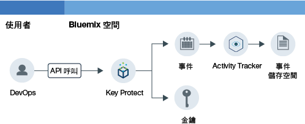

---

copyright:
  years: 2016, 2017

lastupdated: "2017-09-19"

---

{:shortdesc: .shortdesc}
{:new_window: target="_blank"}
{:codeblock: .codeblock}
{:screen: .screen}
{:pre: .pre}

# 監視 Key Protect 活動
{: #kp_at}

請使用 {{site.data.keyword.cloudaccesstrailfull}} 服務來追蹤應用程式與 {{site.data.keyword.Bluemix}} 中的 {{site.data.keyword.keymanagementservicelong_notm}} 服務互動的情形。
{:shortdesc}

## 關於 Key Protect
{: #about}

{{site.data.keyword.keymanagementserviceshort}} 是加密金鑰管理服務。您可以使用 {{site.data.keyword.keymanagementserviceshort}} 服務，在 {{site.data.keyword.Bluemix_notm}} 之間佈建應用程式的加密金鑰。如需相關資訊，請參閱[開始使用 Key Protect](/docs/services/keymgmt/index.html#getting-started-with-key-protect)。

若要管理已加密的金鑰，您可以透過 {{site.data.keyword.Bluemix_notm}} 使用者介面，或使用 [IBM Key Protect API](https://docs-api-keyprotect.ng.bluemix.net/#/){: new_window} 以程式設計方式，建立及刪除金鑰。

## 如何運作
{: #how}

在 {{site.data.keyword.Bluemix_notm}} 中，若要監視 {{site.data.keyword.keymanagementserviceshort}} 服務的活動軌跡，您必須在佈建 {{site.data.keyword.keymanagementserviceshort}} 服務的相同空間中佈建 {{site.data.keyword.cloudaccesstrailshort}} 服務。這兩項服務都佈建並執行之後，當您建立、讀取或刪除金鑰時，會產生活動事件並自動收集在 {{site.data.keyword.cloudaccesstrailshort}} 日誌中。 

由於加密金鑰的資訊機密性，當因為對 {{site.data.keyword.keymanagementserviceshort}} 服務的 API 呼叫而產生事件時，產生的事件不會包含關於金鑰的詳細資訊。事件包含相關性 ID，可以用來在您的雲端環境內部識別金鑰。相關性 ID 是在 **responseHeader.content** 欄位當中傳回的欄位。您使用此資訊來讓加密金鑰的機密資料與透過事件報告之動作的資訊產生關聯。

下圖顯示當使用者進行 API 呼叫以建立金鑰時，發生的不同元件和動作：

## API 方法
{: #methods}

下表列出在呼叫時會產生事件的 {{site.data.keyword.keymanagementserviceshort}} API 方法：

<table>
  <caption>表 1. API 方法</caption>
  <tr>
    <th>方法</th>
	<th>說明</th>
  <tr>
  <tr>
    <td>GET /secrets</td>
	<td>擷取密碼</td>
  </tr>
  <tr>
    <td>POST /secrets</td>
	<td>建立密碼</td>
  </tr>
  <tr>
    <td>DELETE /secrets/{id}</td>
	<td>依 ID 刪除密碼</td>
  </tr>
  <tr>
    <td>GET /secrets/{id}</td>
	<td>依 ID 擷取密碼</td>
  </tr>  
</table>

**附註：**密碼是已加密的金鑰。

 	
 	
## 指導教學：監視雲端中的 IBM Key Protect 活動
{: #tutorial1}

使用本指導教學，學習如何監視使用者與雲端服務 {{site.data.keyword.keymanagementservicelong_notm}} 的互動。 

在本指導教學中，您會在 {{site.data.keyword.keymanagementserviceshort}} (KP) 中建立安全金鑰。已啟用 KP 雲端服務，當使用者透過使用者介面、CLI 或 API 建立金鑰時，將事件傳送至 {{site.data.keyword.cloudaccesstrailshort}}。建立金鑰之後，您可以透過 {{site.data.keyword.cloudaccesstrailshort}} 使用者介面及透過 Kibana 監視事件。

本指導教學將顯示如何：

1. [佈建 {{site.data.keyword.keymanagementserviceshort}} 服務](/docs/services/cloud-activity-tracker/tutorials/key_protect.html#step1)
2. [在 {{site.data.keyword.keymanagementserviceshort}} 建立安全金鑰以產生 {{site.data.keyword.cloudaccesstrailshort}} 事件資料](/docs/services/cloud-activity-tracker/tutorials/key_protect.html#step2)
3. [透過 {{site.data.keyword.Bluemix_notm}} 使用者介面來驗證是否已產生 {{site.data.keyword.cloudaccesstrailshort}} 事件](/docs/services/cloud-activity-tracker/tutorials/key_protect.html#step3)

### 假設
{: #assumptions}

您有 {{site.data.keyword.Bluemix_notm}} 使用者 ID ，它有開發人員許可權，可以在佈建 {{site.data.keyword.cloudaccesstrailshort}} 服務的 {{site.data.keyword.Bluemix_notm}} 帳戶空間中使用。 

### 步驟 1：佈建 Activity Tracker
{: #step1}

您必須將 {{site.data.keyword.cloudaccesstrailshort}} 服務佈建在要監視其活動的雲端服務佈建所在的相同地區及空間中。佈建 {{site.data.keyword.cloudaccesstrailshort}} 服務之後，會自動從該空間中佈建之選定雲端服務收集事件。如需您可以透過 {{site.data.keyword.cloudaccesstrailshort}} 監視活動的服務清單，請參閱[支援的雲端服務](/docs/services/cloud-activity-tracker/cloud_services.html#cloud_services)。

**附註：**本指導教學顯示如何使用 {{site.data.keyword.cloudaccesstrailshort}} 服務來監視使用者與雲端服務 {{site.data.keyword.keymanagementservicelong_notm}} 的互動。{{site.data.keyword.keymanagementserviceshort}} 服務可用於美國南部。因此，您必須在美國南部地區佈建 {{site.data.keyword.cloudaccesstrailshort}}，佈建在提供 {{site.data.keyword.keymanagementserviceshort}} 服務的相同空間。若要查看服務可用之地區的相關資訊，請參閱[依地區列出的服務](/docs/services/services_region.html#services_region)。

請完成下列步驟，以在 {{site.data.keyword.Bluemix_notm}} 中佈建 {{site.data.keyword.cloudaccesstraillong_notm}} 服務的實例：

1. 登入 {{site.data.keyword.Bluemix_notm}} 帳戶。

    {{site.data.keyword.Bluemix_notm}} 儀表板位於：[http://bluemix.net ](http://bluemix.net){:new_window}。
    
	使用您的使用者 ID 及密碼登入之後，會開啟 {{site.data.keyword.Bluemix_notm}} 使用者介面。

2. 按一下**型錄**。即會開啟 {{site.data.keyword.Bluemix_notm}} 上可用的服務清單。

3. 選取**安全**種類，以過濾顯示的服務清單。

4. 按一下 **Activity Tracker** 磚。 

5. 配置定義將佈建服務之處的資訊。 

    如下表所示輸入資料： 

    <table>
	  <caption>表 1. 佈建 {{site.data.keyword.cloudaccesstrailshort}} 服務所需的欄位</caption>
	  <tr>
	    <th width="50%">欄位</th>
		<th width="50%">值</th>
	  </tr>
	  <tr>
	    <td>選取要部署在哪個地區：</td>
		<td>美國南部</td>
	  </tr>
	  <tr>
	    <td>選擇組織：</td>
		<td>選取您計劃監視活動所在的組織。</td>
	  </tr>
	  <tr>
	    <td>選擇空間：</td>
		<td>在組織中選取您計劃監視活動所在的空間。</td>
	  </tr>
	</table>

6. 按一下**建立**，以在您已登入的 {{site.data.keyword.Bluemix_notm}} 空間中佈建 {{site.data.keyword.cloudaccesstrailshort}} 服務。
   

### 步驟 2：佈建 Key Protect 
{: #step2}
	
請完成下列步驟，以在 {{site.data.keyword.Bluemix_notm}} 美國南部地區中佈建 {{site.data.keyword.keymanagementserviceshort}} 服務的實例：

1. 登入 {{site.data.keyword.Bluemix_notm}} 帳戶。

    {{site.data.keyword.Bluemix_notm}} 儀表板位於：[http://bluemix.net ](http://bluemix.net){:new_window}。
	
	使用您的使用者 ID 及密碼登入之後，會開啟 {{site.data.keyword.Bluemix_notm}} 使用者介面。

2. 按一下**型錄**。即會開啟 {{site.data.keyword.Bluemix_notm}} 上可用的服務清單。

    選取**安全**種類，以過濾顯示的服務清單。

3. 選取 **Key Protect** 磚。

4. 配置定義將佈建服務之處的資訊。 

    如下表所示輸入資料： 

    <table>
	  <caption>表 2. 佈建 {{site.data.keyword.keymanagementserviceshort}} 服務所需的欄位</caption>
	  <tr>
	    <th width="50%">欄位</th>
		<th width="50%">值</th>
	  </tr>
	  <tr>
	    <td>選取要部署在哪個地區：</td>
		<td>美國南部</td>
	  </tr>
	  <tr>
	    <td>選擇組織：</td>
		<td>選取您選擇佈建 {{site.data.keyword.cloudaccesstrailshort}} 服務的組織。</td>
	  </tr>
	  <tr>
	    <td>選擇空間：</td>
		<td>選取您選擇佈建 {{site.data.keyword.cloudaccesstrailshort}} 服務的空間。</td>
	  </tr>
	</table>

5. 按一下**建立**，以在您已登入的 {{site.data.keyword.Bluemix_notm}} 空間中佈建 {{site.data.keyword.keymanagementserviceshort}} 服務。

### 步驟 3：在 Key Protect 中建立安全金鑰，以產生 Activity Tracker 事件資料 
{: # step3}

完成下列步驟，以產生 {{site.data.keyword.cloudaccesstrailshort}} 事件：

1. 從 {{site.data.keyword.Bluemix_notm}} 儀表板中，選取 **Key Protect** 服務。{{site.data.keyword.keymanagementserviceshort}} 儀表板隨即開啟。然後，選取**管理**標籤。

2. 按一下**新增金鑰**。即會開啟一個新視窗。

    

3. 選取**產生金鑰**，並完成下列步驟：

    * 輸入金鑰的名稱，例如 *MyFirstKey*。

    * 為金鑰選擇一個演算法。

    * 按一下**新增金鑰**。 

### 步驟 4：透過 Bluemix 使用者介面驗證是否已產生 Activity Tracker 事件 
{: #step4}

驗證是否已建立事件：

1. 從 {{site.data.keyword.Bluemix_notm}} 儀表板中，選取 {{site.data.keyword.cloudaccesstrailshort}} 服務。服務儀表板隨即開啟。

2. 配置視圖，以搜尋在您佈建服務及新增金鑰時產生的 {{site.data.keyword.keymanagementserviceshort}} 事件。

    * 針對*檢視日誌* 欄位選取**空間日誌**。
    * 針對*搜尋欄位* 欄位選取 **target.name**。
    * 在*過濾器* 欄位中，輸入 **ibm-key-protect**。
	
    顯示的資料會對應於過去 24 小時可用的 {{site.data.keyword.keymanagementserviceshort}} 事件。 

    

 	
 	
 	
 	

