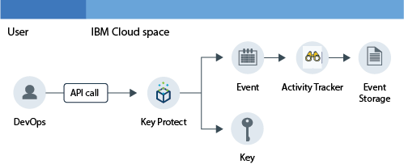
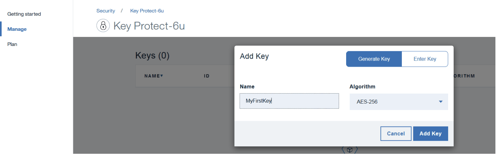

---

copyright:
  years: 2016, 2017

lastupdated: "2017-11-09"

---

{:shortdesc: .shortdesc}
{:new_window: target="_blank"}
{:codeblock: .codeblock}
{:screen: .screen}
{:pre: .pre}

# Monitoring Key Protect activity
{: #kp_at}

Use the {{site.data.keyword.cloudaccesstrailfull}} service to track how applications interact with the {{site.data.keyword.keymanagementservicelong_notm}} service in {{site.data.keyword.Bluemix}}. 
{:shortdesc}

## About Key Protect
{: #about}

{{site.data.keyword.keymanagementserviceshort}} is an encryption key management service. You can use the {{site.data.keyword.keymanagementserviceshort}} service to provision encrypted keys for apps across {{site.data.keyword.Bluemix_notm}}. For more information, see [Getting started with Key Protect](/docs/services/keymgmt/index.html#getting-started-with-key-protect).

To manage encrypted keys, you can create and delete keys through the {{site.data.keyword.Bluemix_notm}} UI or programmatically by using the [{{site.data.keyword.keymanagementserviceshort}} API](https://docs-api-keyprotect.ng.bluemix.net/#/){: new_window}.

## How it works
{: #how}

In the {{site.data.keyword.Bluemix_notm}}, to monitor the activity trail for the {{site.data.keyword.keymanagementserviceshort}} service, you must provision the {{site.data.keyword.cloudaccesstrailshort}} service in the same space where the {{site.data.keyword.keymanagementserviceshort}} service is provisioned. After both services are provisioned and running, activity events are generated and automatically collected in the {{site.data.keyword.cloudaccesstrailshort}} log when you create, read, or delete a key. 

Due to the sensitivity of the information for an encrypted key, when an event is generated as a result of an API call to the {{site.data.keyword.keymanagementserviceshort}} service, the event that is generated does not include detailed information about the key. The event includes a correlation ID that can be used to identify the key internally in your cloud environment. The correlation ID is a field that is returned as part of the **responseHeader.content** field. You use this information to correlate the sensitive data of the encrypted key with the information of the action reported through the event.

The following figure shows the different components and actions that occur when a user makes an API call to create a key:

## API methods
{: #methods}

The following table lists the {{site.data.keyword.keymanagementserviceshort}} API methods that generate an event when they are called:

<table>
  <caption>Table 1. API methods</caption>
  <tr>
    <th>Method</th>
	<th>Description</th>
  <tr>
  <tr>
    <td>GET /secrets </td>
	<td>Retrieve secrets</td>
  </tr>
  <tr>
    <td>POST /secrets </td>
	<td>Create a secret</td>
  </tr>
  <tr>
    <td>DELETE /secrets/{id}</td>
	<td>Delete a secret by ID</td>
  </tr>
  <tr>
    <td>GET /secrets/{id} </td>
	<td>Retrieve a secret by ID</td>
  </tr>  
</table>

**Note:** A secret is an encrypted key.

 	
 	
## Tutorial: Monitor Key Protect activity in the Cloud
{: #tutorial1}

Use this tutorial to learn how you can monitor a user's interaction with the Cloud service {{site.data.keyword.keymanagementservicelong_notm}}. 

In this tutorial, you create a security key in {{site.data.keyword.keymanagementserviceshort}} (KP). The KP Cloud service has been enabled to send events to {{site.data.keyword.cloudaccesstrailshort}} when a user creates a key either through the UI, the CLI, or the API. After the key is created, you can monitor the events through the {{site.data.keyword.cloudaccesstrailshort}} UI, and through Kibana.

This tutorial will show you how to:

1. [Provision the {{site.data.keyword.keymanagementserviceshort}} service](/docs/services/cloud-activity-tracker/tutorials/key_protect.html#step1)
2. [Create a security key in {{site.data.keyword.keymanagementserviceshort}} to generate {{site.data.keyword.cloudaccesstrailshort}} event data ](/docs/services/cloud-activity-tracker/tutorials/key_protect.html#step2)
3. [Verify through the {{site.data.keyword.Bluemix_notm}} UI that {{site.data.keyword.cloudaccesstrailshort}} events are generated ](/docs/services/cloud-activity-tracker/tutorials/key_protect.html#step3)

### Assumptions
{: #assumptions}

You have a {{site.data.keyword.Bluemix_notm}} user ID that has developer permissions to work in a space of a {{site.data.keyword.Bluemix_notm}} account where the {{site.data.keyword.cloudaccesstrailshort}} service is provisoned. 

### Step 1: Provision Activity Tracker
{: #step1}

You must provision the {{site.data.keyword.cloudaccesstrailshort}} service in the same region and space where the Cloud service whose activity you want to monitor is provisioned. After the {{site.data.keyword.cloudaccesstrailshort}} service is provisioned, events are collected automatically from selected Cloud services that are provisioned in that space. See [Supported cloud services](/docs/services/cloud-activity-tracker/cloud_services.html#cloud_services) for a list of services whose activity you can monitor through {{site.data.keyword.cloudaccesstrailshort}}.

**Note:** This tutorial shows how to use the {{site.data.keyword.cloudaccesstrailshort}} service to monitor a user's interaction with the Cloud service {{site.data.keyword.keymanagementservicelong_notm}}. The {{site.data.keyword.keymanagementserviceshort}} service is available in US South. Therefore, you must provision {{site.data.keyword.cloudaccesstrailshort}} in the US South region, in the same space where the  {{site.data.keyword.keymanagementserviceshort}} service is available. To see information on which region a service is available, see [Services by region](/docs/services/services_region.html#services_region).

Complete the following steps to provision an instance of the {{site.data.keyword.cloudaccesstraillong_notm}} service in {{site.data.keyword.Bluemix_notm}}:

1. Log in to your {{site.data.keyword.Bluemix_notm}} account.

    The {{site.data.keyword.Bluemix_notm}} dashboard can be found at: [http://bluemix.net ](http://bluemix.net){:new_window}.
    
	After you log in with your user ID and password, the {{site.data.keyword.Bluemix_notm}} UI opens.

2. Click **Catalog**. The list of the services that are available on {{site.data.keyword.Bluemix_notm}} opens.

3. Select the **Security** category to filter the list of services that is displayed.

4. Click the **Activity Tracker** tile. 

5. Configure the information that defines where the service is going to be provisioned. 

    Enter the data as indicated in the following table: 

    <table>
	  <caption>Table 1. Fields that are required to provision the {{site.data.keyword.cloudaccesstrailshort}} service</caption>
	  <tr>
	    <th width="50%">Field</th>
		<th width="50%">Value</th>
	  </tr>
	  <tr>
	    <td>Select region to deploy in:</td>
		<td>US South</td>
	  </tr>
	  <tr>
	    <td>Choose an organization:</td>
		<td>Select the organization where you plan to monitor activity.</td>
	  </tr>
	  <tr>
	    <td>Choose a space:</td>
		<td>Select the space in the organization that you have selected where you plan to monitor activity.</td>
	  </tr>
	</table>

6. Click **Create** to provision the {{site.data.keyword.cloudaccesstrailshort}} service in the space where you are logged in.
   

### Step 2: Provision Key Protect
{: #step2}
	
Complete the following steps to provision an instance of the {{site.data.keyword.keymanagementserviceshort}} service in the {{site.data.keyword.Bluemix_notm}} US South region:

1. Log in to your {{site.data.keyword.Bluemix_notm}} account.

    The {{site.data.keyword.Bluemix_notm}} dashboard can be found at: [http://bluemix.net ](http://bluemix.net){:new_window}
	
	After you log in with your user ID and password, the {{site.data.keyword.Bluemix_notm}} UI opens.

2. Click **Catalog**. The list of the services that are available on {{site.data.keyword.Bluemix_notm}} opens.

    Select the **Security** category to filter the list of services that is displayed.

3. Select the **Key Protect** tile.

4. Configure the information that defines where the service is going to be provisioned. 

    Enter the data as indicated in the following table: 

    <table>
	  <caption>Table 2. Fields that are required to provision the {{site.data.keyword.keymanagementserviceshort}} service</caption>
	  <tr>
	    <th width="50%">Field</th>
		<th width="50%">Value</th>
	  </tr>
	  <tr>
	    <td>Select region to deploy in:</td>
		<td>US South</td>
	  </tr>
	  <tr>
	    <td>Choose an organization:</td>
		<td>Select the organization that you chose to provision the {{site.data.keyword.cloudaccesstrailshort}} service.</td>
	  </tr>
	  <tr>
	    <td>Choose a space:</td>
		<td>Select the space that you chose to provision the {{site.data.keyword.cloudaccesstrailshort}} service.</td>
	  </tr>
	</table>

5. Click **Create** to provision the {{site.data.keyword.keymanagementserviceshort}} service in the space where you are logged in. This space must be the same as the space where you provisioned the {{site.data.keyword.keymanagementserviceshort}} service.

### Step 3: Create a security key in Key Protect to generate Activity Tracker event data 
{: # step3}

Complete the following steps to generate an {{site.data.keyword.cloudaccesstrailshort}} event:

1. From the {{site.data.keyword.Bluemix_notm}} dashboard, select the **Key Protect** service. The {{site.data.keyword.keymanagementserviceshort}} dashboard opens. Then, select the **Manage** tab.

2. Click **Add Key**. A new window opens.

    

3. Select **Generate key**, and complete the following steps:

    * Enter a name for the key, for example, *MyFirstKey*.

    * Choose an algorith for the key.

    * Click **Add key**. 

### Step 4: Verify through the UI that Activity Tracker events are generated 
{: #step4}

Verify that an event has been created:

1. From the {{site.data.keyword.Bluemix_notm}} Dashboard, select the {{site.data.keyword.cloudaccesstrailshort}} service. The service dashboard opens.

2. Configure the view to search for the {{site.data.keyword.keymanagementserviceshort}} events that have been generated when you provisioned the service and added a key.

    * Select **Space logs** for the field *View logs*.
    * Select **target.name** for the field *Search field*.
    * Enter **ibm-key-protect** in *Filter* field.
	
    The data that is displayed corresponds to {{site.data.keyword.keymanagementserviceshort}} events that are available for the last 24 hours. 

    

 	
 	
 	
 	

