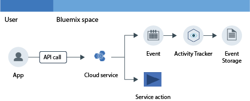

---

copyright:
  years: 2016, 2019
lastupdated: "2019-04-25"

keywords: IBM Cloud, Activity Tracker, monitoring activity, tutorial

subcollection: cloud-activity-tracker

---

{:new_window: target="_blank"}
{:shortdesc: .shortdesc}
{:screen: .screen}
{:pre: .pre}
{:table: .aria-labeledby="caption"}
{:codeblock: .codeblock}
{:tip: .tip}
{:download: .download}
{:important: .important}
{:note: .note}
{:deprecated: .deprecated}

# Monitoring {{site.data.keyword.keymanagementserviceshort}} activity with {{site.data.keyword.cloudaccesstrailshort}}
{: #kp}

Use this tutorial to learn how to use the {{site.data.keyword.cloudaccesstrailfull}} service to monitor a user's interaction with the {{site.data.keyword.keymanagementserviceshort}} service. 
{:shortdesc}

{{site.data.keyword.cloudaccesstrailfull}} is deprecated. As of 9 May 2019, you cannot provision new {{site.data.keyword.cloudaccesstrailshort}} instances, and access to *Lite* plan instances will be removed. Existing premium plan instances are supported until 30 September 2019. To continue monitoring the activity of your {{site.data.keyword.cloud_notm}} account, provision an instance of the [{{site.data.keyword.at_full}}](/docs/services/Activity-Tracker-with-LogDNA?topic=logdnaat-getting-started#getting-started).
{: deprecated}

1. Learn how to provision the {{site.data.keyword.cloudaccesstrailshort}} service.
2. Learn how to use a Cloud service to generate activity events that are automatically collected by the {{site.data.keyword.cloudaccesstrailshort}} service. Events comply with the [Cloud Auditing Data Federation (CADF) standard ](https://www.dmtf.org/sites/default/files/standards/documents/DSP0262_1.0.0.pdf){: new_window}.
3.Learn how to monitor the Cloud activity of a service by using the pre-defined {{site.data.keyword.cloudaccesstrailshort}} dashboards.

The following figure shows the different components and actions that occur when a user-initiated activity changes the state of a service:

## Before you begin
{: #kp_prereqs}

Create an [{{site.data.keyword.cloud_notm}} account](https://cloud.ibm.com/login). Your user ID must be a member or an owner of an {{site.data.keyword.cloud_notm}} account, with developer permissions in the space where you plan to use the {{site.data.keyword.cloudaccesstrailshort}} service.

## Step 1. Provision Activity Tracker
{: #kp_step1}

You must provision the {{site.data.keyword.cloudaccesstrailshort}} service in the same region where the Cloud service whose activity you want to monitor is provisioned. After the {{site.data.keyword.cloudaccesstrailshort}} service is provisioned, events are collected automatically from selected Cloud services. 

**Note:** This tutorial shows how to use the {{site.data.keyword.cloudaccesstrailshort}} service to monitor a user's interaction with the Cloud service {{site.data.keyword.keymanagementservicelong_notm}} in the US South region. Therefore, you must provision {{site.data.keyword.cloudaccesstrailshort}} in the US South region. To see information on which region a service is available, see [Services by region](/docs/resources?topic=resources-services_region#services_region).

Complete the following steps to provision an instance of the {{site.data.keyword.cloudaccesstraillong_notm}} service in the {{site.data.keyword.cloud_notm}}:

1. [Log in to the {{site.data.keyword.cloud_notm}} ](https://cloud.ibm.com/login){:new_window}.
    
	After you log in with your user ID and password, the {{site.data.keyword.cloud_notm}} UI opens.

2. Click **Catalog**. The list of the services that are available on the {{site.data.keyword.cloud_notm}} opens.

3. Select the **Security and Identity** category to filter the list of services that is displayed.

    **Note:** The service is also available through the **Developer Tools** category.

4. Click the **Activity Tracker** tile. 

5. Configure the information that defines where the service is going to be provisioned. 

    Enter the data as indicated in the following table: 

    <table>
	  <caption>Table 1. Fields that are required to provision the {{site.data.keyword.cloudaccesstrailshort}} service</caption>
	  <tr>
	    <th width="50%">Field</th>
		<th width="50%">Value</th>
	  </tr>
	  <tr>
	    <td>Select region to deploy in:</td>
		<td>US South</td>
	  </tr>
	  <tr>
	    <td>Choose an organization:</td>
		<td>Select the organization where you plan to provision the {{site.data.keyword.cloudaccesstrailshort}} service.</td>
	  </tr>
	  <tr>
	    <td>Choose a space:</td>
		<td>Select the space in the organization where you plan to provision the {{site.data.keyword.cloudaccesstrailshort}} service.</td>
	  </tr>
	</table>

6. Click **Create** to provision the {{site.data.keyword.cloudaccesstrailshort}} service in the space where you are logged in.
   

## Step 2.  Configure the cloud service  
{: #kp_step2}

This tutorial shows how to monitor the API activity for the {{site.data.keyword.keymanagementserviceshort}} service in the {{site.data.keyword.cloud_notm}}.

Complete the following steps to configure the {{site.data.keyword.keymanagementserviceshort}} service in the {{site.data.keyword.cloud_notm}}:

1. Provision an instance of the {{site.data.keyword.keymanagementserviceshort}} service in the US South region. For more information, see [Provisioning from the IBM Cloud console](/docs/services/key-protect?topic=key-protect-provision#provision).

2. Define the {{site.data.keyword.cloud_notm}} permissions for the user that you are planning to use to work with keys. 

    A user needs an IAM policy with a service role set to *manager* or *writer* to be able to create keys.

    A user needs an IAM policy with a service role set to *manager* to be able to delete keys.

    A user needs an IAM policy with a service role set to *reader* to be able to see keys. 

## Step 3. Generate an Activity Tracker event
{: #kp_step3}

In this step, create a security key by using the {{site.data.keyword.keymanagementserviceshort}} service to generate {{site.data.keyword.cloudaccesstrailshort}} event data. For more information, see [Creating new keys](/docs/services/key-protect?topic=key-protect-create-standard-keys#create-standard-keys).

* {{site.data.keyword.cloudaccesstrailshort}} events are generated as a result of creating a key.
* {{site.data.keyword.cloudaccesstrailshort}} events are available in the {{site.data.keyword.cloudaccesstrailshort}} **account domain** that is available in the {{site.data.keyword.cloud_notm}} region where the events are generated. 

## Step 4. Monitor an Activity Tracker event
{: #kp_step4}

In this step, verify through the {{site.data.keyword.cloud_notm}} UI that {{site.data.keyword.cloudaccesstrailshort}} events are generated.

Complete the following steps to verify that an event is created:

1. Grant the user permissions to view account events. For more information, see [Viewing account events](/docs/services/cloud-activity-tracker/how-to/manage-events-ui?topic=cloud-activity-tracker-view_acc_events#view_acc_events_account_events) and [Granting permissions to see account events](/docs/services/cloud-activity-tracker/how-to?topic=cloud-activity-tracker-grant_permissions#grant_acc_events).

2. From the {{site.data.keyword.cloud_notm}} Dashboard, select the {{site.data.keyword.cloudaccesstrailshort}} service. The service dashboard opens.

3. Configure the view to search for the {{site.data.keyword.keymanagementserviceshort}} events are generated when you provisioned the service and added a key.

    * Select **Account logs** for the field *View logs*.
    * Select **target.typeURI_str** for the field *Search field* and enter `kms/secrets` in the *Filter* field.
	
    The data that is displayed shows {{site.data.keyword.keymanagementserviceshort}} events that are available for the last 24 hours. 
	

## Next steps
{: #kp_next_steps}

Next, use the {{site.data.keyword.cloudaccesstrailshort}} pre-defined Kibana dashboard to monitor and analyze event logs. To launch Kibana, see [Navigating to the Kibana dashboard](/docs/services/cloud-activity-tracker/how-to/manage-events-ui?topic=cloud-activity-tracker-launch_kibana#launch_kibana). By default in Kibana, the space activity logs are displayed through the **ActivityTracker_Space_Dashboard_in_24h** dashboard:

You can also use the {{site.data.keyword.cloudaccesstrailshort}} CLI to manage your events from the command line. For more information, see [Viewing event information](/docs/services/cloud-activity-tracker/how-to?topic=cloud-activity-tracker-viewing_event_status#viewing_event_status).

